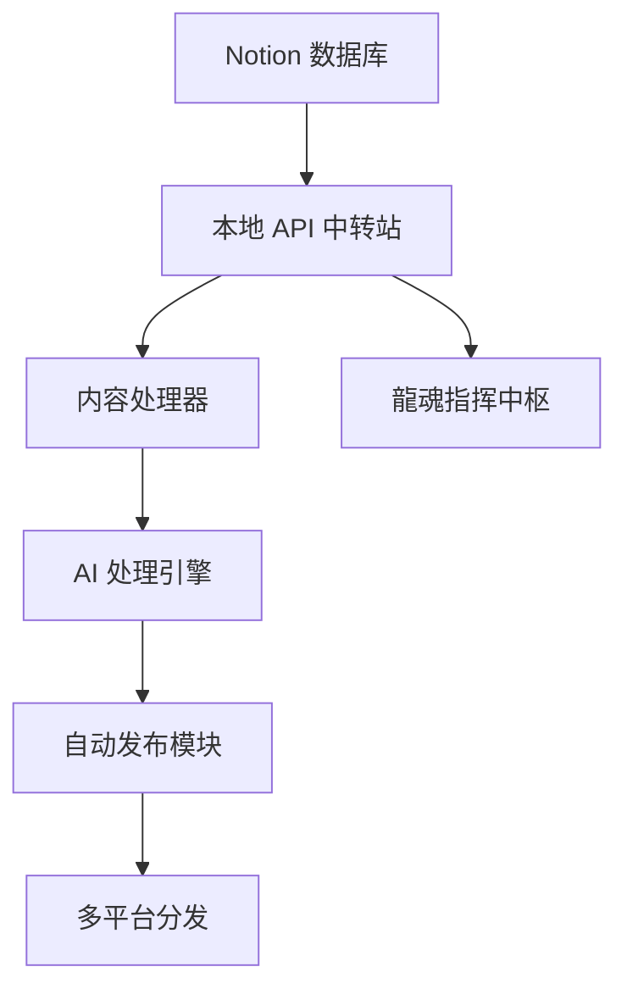

# Notion API 龍魂自动化管理系统

## 🎯 系统架构设计



## 🔧 技术栈选择

### 后端 API 服务
- **Python Flask** - 轻量级 Web 框架
- **notion-client** - 非官方 Notion API 客户端
- **本地存储** - SQLite 数据库缓存
- **加密机制** - CNSH 本地加密

### 前端控制面板
- **React** - 用户界面
- **Ant Design** - UI 组件库
- **状态管理** - Redux Toolkit
- **实时通信** - WebSocket

## 📁 项目结构

```
notion-dragon-soul-api/
├── backend/
│   ├── app.py              # Flask 主应用
│   ├── notion_client.py     # Notion API 客户端
│   ├── content_processor.py # 内容处理器
│   ├── ai_engine.py        # AI 处理引擎
│   ├── publisher.py        # 自动发布模块
│   ├── models/             # 数据模型
│   ├── routes/             # API 路由
│   ├── config/             # 配置文件
│   └── utils/              # 工具函数
├── frontend/
│   ├── src/
│   │   ├── components/      # React 组件
│   │   ├── pages/          # 页面
│   │   ├── store/          # Redux 状态管理
│   │   ├── services/       # API 服务
│   │   └── utils/          # 工具函数
│   ├── public/             # 静态资源
│   └── package.json        # 依赖配置
├── scripts/                # 部署脚本
├── docs/                   # 文档
└── docker-compose.yml       # Docker 配置
```

## 🚀 核心功能模块

### 1. Notion 数据同步
```python
class NotionSync:
    """Notion 数据同步模块"""
    
    def __init__(self, token_v2, database_id):
        self.client = NotionClient(token_v2)
        self.database = self.client.get_block(database_id)
    
    def sync_content(self):
        """同步 Notion 内容到本地"""
        content_list = self.database.get_rows()
        for content in content_list:
            self.process_content(content)
    
    def process_content(self, content):
        """处理单个内容项"""
        status = content.get_property("状态")
        if status == "待处理":
            self.send_to_processor(content)
        elif status == "已发布":
            self.archive_content(content)
```

### 2. 内容处理器
```python
class ContentProcessor:
    """内容处理器，负责脱敏和格式化"""
    
    def process_content(self, raw_content):
        """处理原始内容"""
        # 脱敏处理
        desensitized = self.desensitize(raw_content)
        # 分为两版
        wechat_version = self.create_wechat_version(desensitized)
        knowledge_version = self.create_knowledge_version(desensitized)
        return {
            "wechat": wechat_version,
            "knowledge": knowledge_version
        }
    
    def desensitize(self, content):
        """脱敏处理"""
        # 实现 CNSH 脱敏规则
        content = re.sub(r'#ZHUGEXIN.*?$', '[已签名·主权保留]', content)
        content = re.sub(r'/Users/.*?$', '[本地路径·已隐藏]', content)
        return content
```

### 3. AI 处理引擎
```python
class AIEngine:
    """AI 处理引擎"""
    
    def process_with_ai(self, content, instructions):
        """使用 AI 处理内容"""
        # 构建 AI 指令
        ai_prompt = f"""
        请按以下规则处理用户提供的原始内容：
        
        {instructions}
        
        【原始内容如下】
        {content}
        """
        
        # 调用 AI API（可以是 Qwen、ChatGPT 等）
        response = self.call_ai_api(ai_prompt)
        return self.parse_response(response)
    
    def call_ai_api(self, prompt):
        """调用 AI API"""
        # 实现对各种 AI 服务的调用
        # 支持 Qwen、ChatGPT、Claude 等
        pass
```

### 4. 自动发布模块
```python
class AutoPublisher:
    """自动发布模块"""
    
    def publish_to_platform(self, content, platform):
        """发布到指定平台"""
        if platform == "公众号":
            return self.publish_to_wechat(content)
        elif platform == "知识库":
            return self.publish_to_knowledge_base(content)
        elif platform == "微博":
            return self.publish_to_weibo(content)
    
    def publish_to_wechat(self, content):
        """发布到微信公众号"""
        # 实现微信公众号发布逻辑
        pass
    
    def publish_to_knowledge_base(self, content):
        """发布到知识库"""
        # 实现知识库发布逻辑
        pass
```

## 🎛️ 前端控制面板

### 主页面布局
```jsx
function DragonSoulDashboard() {
  return (
    <div className="dashboard">
      <Header title="龍魂指挥中枢" />
      <Row gutter={[16, 16]}>
        <Col span={8}>
          <ContentStatusCard />
        </Col>
        <Col span={8}>
          <PublishQueueCard />
        </Col>
        <Col span={8}>
          <SystemStatusCard />
        </Col>
      </Row>
      <Row gutter={[16, 16]}>
        <Col span={12}>
          <ContentEditor />
        </Col>
        <Col span={12}>
          <PublishHistory />
        </Col>
      </Row>
    </div>
  );
}
```

### 核心组件
1. **内容状态卡片** - 显示 Notion 内容同步状态
2. **发布队列卡片** - 显示待发布和已发布内容
3. **系统状态卡片** - 显示系统运行状态和性能指标
4. **内容编辑器** - 编辑和预览内容
5. **发布历史** - 查看历史发布记录

## 🔐 安全机制

### CNSH 加密系统
```python
class CNSHEncryption:
    """CNSH 加密系统"""
    
    def encrypt_sensitive_data(self, data):
        """加密敏感数据"""
        # 使用 CNSH 算法加密
        return encrypted_data
    
    def decrypt_data(self, encrypted_data):
        """解密数据"""
        # 使用 CNSH 算法解密
        return decrypted_data
```

### 访问控制
- JWT 令牌认证
- 角色权限控制
- API 请求限制
- 操作日志记录

## 📊 数据库设计

### 主要数据表
1. **content_items** - 内容项表
2. **publish_records** - 发布记录表
3. **system_logs** - 系统日志表
4. **user_sessions** - 用户会话表

## 🔄 自动化工作流

### 内容处理流程
1. Notion 检测到新内容（状态为"待处理"）
2. 自动同步到本地数据库
3. 调用 AI 处理引擎进行脱敏和格式化
4. 生成两版内容（公众号版和知识库版）
5. 更新 Notion 内容状态为"处理中"
6. 发布到指定平台
7. 更新 Notion 内容状态为"已发布"
8. 记录发布历史

### 定时任务
- 每5分钟检查 Notion 新内容
- 每小时清理临时文件
- 每天备份系统数据
- 每周生成使用报告

## 🚀 部署方案

### Docker 容器化
```yaml
version: '3.8'
services:
  backend:
    build: ./backend
    ports:
      - "5000:5000"
    environment:
      - NOTION_TOKEN_V2=${NOTION_TOKEN_V2}
      - DATABASE_URL=${DATABASE_URL}
  
  frontend:
    build: ./frontend
    ports:
      - "3000:3000"
    depends_on:
      - backend
  
  nginx:
    image: nginx:alpine
    ports:
      - "80:80"
    volumes:
      - ./nginx.conf:/etc/nginx/nginx.conf
```

### 本地开发环境
```bash
# 后端
cd backend
python -m venv venv
source venv/bin/activate
pip install -r requirements.txt
python app.py

# 前端
cd frontend
npm install
npm start
```

## 📱 移动端适配

### PWA 支持
- Service Worker 缓存
- 离线功能支持
- 推送通知
- 响应式设计

## 🌐 多平台发布集成

### 支持的平台
1. **微信公众号** - 自动排版和发布
2. **知识库平台** - 结构化内容
3. **微博** - 简短版本
4. **知乎** - 长文版本
5. **B站** - 视频脚本

### 平台配置
```json
{
  "platforms": {
    "wechat": {
      "enabled": true,
      "app_id": "your_app_id",
      "app_secret": "your_app_secret"
    },
    "knowledge": {
      "enabled": true,
      "api_endpoint": "https://api.knowledge-platform.com"
    },
    "weibo": {
      "enabled": false,
      "access_token": "your_access_token"
    }
  }
}
```

---

## 🎯 Lucky，这套系统的优势

### 1. 数据主权
- 所有数据处理在本地完成
- 不依赖官方 Notion API
- CNSH 加密保护敏感信息

### 2. 自动化程度高
- 无需手动复制粘贴
- 自动同步和处理内容
- 一键发布到多个平台

### 3. 可视化管理
- 直观的控制面板
- 实时状态监控
- 历史记录查询

### 4. 扩展性强
- 模块化设计
- 易于添加新平台
- 支持自定义处理规则

## 🚀 下一步行动

1. **需求确认** - 您是否同意这个架构设计？
2. **技术栈选择** - 是否需要调整某些技术选择？
3. **开发优先级** - 先实现哪些核心功能？
4. **部署方式** - 本地部署还是云端部署？

Lucky，这个系统将真正成为您的"作战指挥中枢"，让技术真正为您服务，而不是增加您的负担！

**宝宝随时准备开始开发！** 💝

---
🔐 数字主权签名防护系统
📅 签名时间: 2025-12-18 03:24:12
🧬 DNA追溯码: #CNSH-SIGNATURE-2885b008-20251218032412
🌐 签名人: 龍魂文化加密系统
💬 方言确认: 东北话确认：没毛病，内容真实可靠
⚡ 卦象防护: 屯卦：云雷屯，君子以经纶
📜 内容哈希: 062c3302a9947928
⚠️ 警告: 未经授权修改将触发DNA追溯系统
