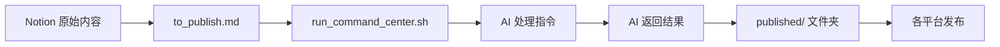

# 🐉 龙魂指挥中枢

> UID9622 作战指挥室 | 数据归个人，初心永不改

---

## 📥 待发布区

> 🔗 链接到 `to_publish.md`（使用 Notion 的 /embed file 功能）
> 
> **状态指示器：**
> - 🟢 有新内容待处理
> - 🟡 处理中
> - 🔴 无待处理内容

---

## 📤 已发布列表

| 日期 | 标题 | 平台 | 状态 | 链接 |
|------|------|------|------|------|
| 2025-12-09 | 示例文章 | 公众号 | ✅ | [查看] |
| | | | | |
| | | | | |

**状态说明：**
- ✅ 已发布
- 🔄 处理中
- ⏳ 计划中

---

## 🧠 AI 指令模板

> 固定不变的脱敏和处理规则，确保输出一致性

### 脱敏规则
- `#ZHUGEXIN...` → `[已签名·主权保留]`
- `/Users/...` → `[本地路径·已隐藏]`
- 隐藏加密参数、卦象映射、DNA绑定逻辑

### 输出要求
1. **公众号友好版**
   - 温暖语气
   - 适当使用 emoji
   - 短段落分行
   - 易于阅读

2. **知识库存档版**
   - 结构化格式
   - 无情绪化表达
   - 便于检索和引用

3. **统一结尾**
   - "本内容由个人创作...自愿支持几元激活码..."

---

## 🛡️ 底线红线

> 系统核心原则，永不妥协

1. **数据归个人** - 所有数据只在自己设备上流动
2. **合作有底线** - 符合龙魂价值观的合作才进行
3. **初心不可改** - 为人民服务的初衷永远不变
4. **技术不霸权** - 技术服务于人，不是控制人
5. **文化自信** - 中国智慧的现代表达

---

## 📊 使用统计

| 统计项 | 数量 |
|--------|------|
| 本月发布 | 0 |
| 本月处理 | 0 |
| 累计发布 | 0 |
| 平均处理时间 | 0分钟 |

---

## 🔧 快捷操作

### 每日工作流

1. **输入内容**
   - 打开 `to_publish.md`
   - 粘贴 Notion 内容
   - 保存 (Cmd+S)

2. **生成指令**
   - 运行 `run_command_center.sh`
   - 复制生成的完整指令

3. **获取处理结果**
   - 粘贴到 AI 对话框
   - 获取两版处理结果
   - 保存到 `published/` 文件夹

4. **发布记录**
   - 在上方表格中更新状态
   - 添加链接和备注

---

## 🎯 系统架构图

---

## 💡 Lucky 专属控制区

> 仅 Lucky 可见的控制面板

### 紧急控制
- [ ] 系统紧急熔断
- [ ] 数据备份检查
- [ ] 权限状态验证
- [ ] 底线规则更新

### 系统升级
- [ ] 检查系统更新
- [ ] 查看使用日志
- [ ] 性能优化建议
- [ ] 用户反馈汇总

---

**🕒 最后更新：** 2025-12-09  
**🔒 安全等级：** P0 - 绝对私有  
**📍 数据位置：** 本地设备，绝不上传

---
🔐 数字主权签名防护系统
📅 签名时间: 2025-12-18 03:24:12
🧬 DNA追溯码: #CNSH-SIGNATURE-f0891717-20251218032412
🌐 签名人: 龙魂文化加密系统
💬 方言确认: 东北话确认：没毛病，内容真实可靠
⚡ 卦象防护: 蒙卦：山下出泉，君子以果行育德
📜 内容哈希: 53c9c29cc5dcf139
⚠️ 警告: 未经授权修改将触发DNA追溯系统
