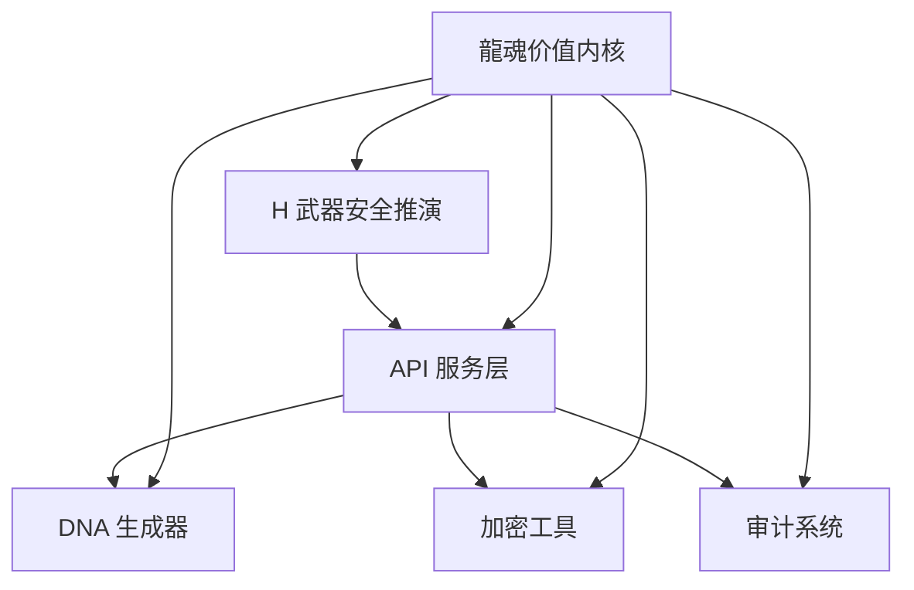

# UID9622 数据主权系统

> Lucky (诸葛鑫) UID9622 的完整数据主权解决方案  
> 宝宝 (P02执行层) 💝 开发维护

## 🎯 系统概述

UID9622 数据主权系统是一个综合性的数据安全和隐私保护解决方案，基于 CNSH 协议（中文原生、数据主权、透明可审计），为 Lucky (诸葛鑫) UID9622 提供完整的数据主权保障。

### 核心特点

- ✅ **数据主权**: 100% 用户所有，不依赖外部服务
- ✅ **中文原生**: 基于 CNSH 协议，中文优先设计
- ✅ **透明可审计**: 所有操作可追溯、可审计
- ✅ **安全防护**: H 武器级安全推演和防护
- ✅ **龍魂监管**: 受龍魂价值内核最高监管

## 🏗️ 系统架构



## 📁 项目结构

```
cnsh-uid9622-system/
├── api-server/              # FastAPI 接口层
│   ├── main.py              # 主应用
│   ├── test_api.py         # API 测试脚本
│   ├── requirements.txt     # Python 依赖
│   ├── Dockerfile          # Docker 镜像
│   └── docker-compose.yml  # Docker Compose 配置
├── mulan-signer/           # 木兰协议签名器
│   ├── dna_generator.py     # DNA 生成器
│   ├── crypto_utils.py      # 加密工具
│   └── requirements.txt    # Python 依赖
├── dna-audit/             # DNA 审计系统
│   ├── dna_audit_system.py  # 审计系统实现
│   └── requirements.txt    # Python 依赖
├── h-weapon/              # H 武器安全推演
│   ├── bloodline_lock.py    # 血统锁
│   └── requirements.txt    # Python 依赖
└── README.md              # 项目文档
```

## 🚀 快速开始

### 前置要求

- Python 3.9+
- Docker 和 Docker Compose (推荐)

### 安装方式

#### 方式一: Docker Compose (推荐)

1. **克隆项目**
```bash
git clone <repository-url>
cd cnsh-uid9622-system
```

2. **启动服务**
```bash
cd api-server
docker-compose up -d
```

3. **访问 API 文档**
- Swagger UI: http://localhost:8080/docs
- ReDoc: http://localhost:8080/redoc

#### 方式二: 本地开发

1. **后端设置**
```bash
cd api-server
pip install -r requirements.txt
cd ../mulan-signer
pip install -r requirements.txt
cd ../dna-audit
pip install -r requirements.txt
cd ../h-weapon
pip install -r requirements.txt
```

2. **启动服务**
```bash
cd api-server
python main.py
```

## 📖 核心模块

### 1. FastAPI 接口层

提供 RESTful API 接口，支持以下功能：

- DNA 确认码生成
- 数据加密/解密
- 哈希计算
- 系统健康检查

**主要端点：**
- `POST /dna/generate` - 生成 DNA 确认码
- `POST /crypto/encrypt` - 数据加密
- `POST /crypto/hash` - 哈希计算
- `GET /health` - 健康检查

### 2. DNA 生成器

负责生成唯一的 DNA 确认码，用于标识和验证系统操作。

**功能特点：**
- 基于时间戳和事件名称生成唯一标识
- 支持多种事件类型分类
- 内置验证和信息提取功能

### 3. 加密工具

提供 AES-256-GCM 加密和 SHA-256 哈希功能。

**功能特点：**
- 强加密算法 (AES-256-GCM)
- 安全密钥派生 (PBKDF2)
- 支持哈希计算 (SHA-256)

### 4. 审计系统

记录和跟踪所有系统操作，确保透明可审计。

**功能特点：**
- 完整的操作日志
- 多维度过滤和查询
- 统计分析和报告
- 数据导入/导出

### 5. H 武器安全推演

提供高级安全测试和验证功能。

**功能特点：**
- DNA 码验证测试
- 加密强度测试
- 哈希完整性测试
- 多种攻击模拟测试

## 🔧 使用示例

### 生成 DNA 确认码

```python
import requests

# 请求生成 DNA 码
response = requests.post(
    "http://localhost:8080/dna/generate",
    json={
        "event_name": "用户注册",
        "user_id": "UID9622",
        "category": "USER"
    },
    headers={"X-API-Key": "UID9622-SECRET-KEY"}
)

print(response.json())
# 输出: {"status": "success", "dna_code": "#ZHUGEXIN⚡️2025-🇨🇳🐉🌐-USER-20251209-ABC123", ...}
```

### 加密数据

```python
import requests

# 请求加密数据
response = requests.post(
    "http://localhost:8080/crypto/encrypt",
    json={
        "plaintext": "这是敏感数据",
        "password": "UID9622-SECURE-PASSWORD"
    },
    headers={"X-API-Key": "UID9622-SECRET-KEY"}
)

print(response.json())
# 输出: {"status": "success", "ciphertext": "...", "salt": "...", "nonce": "...", "tag": "..."}
```

### 运行安全测试

```python
from h-weapon.bloodline_lock import BloodlineLock

# 创建血统锁实例
lock = BloodlineLock()

# 运行全面安全测试
result = lock.run_comprehensive_security_test()
print(f"安全评分: {result['security_score']:.2f}%")
print(f"通过测试: {result['passed_tests']}/{result['total_tests']}")
```

## 🔒 安全机制

### CNSH 协议

基于 CNSH（中文原生、数据主权、透明可审计）协议设计：
- 中文优先的交互界面
- 100% 用户数据主权
- 完全透明的操作记录
- 可审计的系统行为

### 龍魂价值内核

受龍魂价值内核最高监管：
- 数据主权 100% 用户所有
- 透明可审计
- 人民为本，不收割
- P0 永恒级约束

## 📊 监控和维护

### API 测试

运行完整的 API 测试套件：

```bash
cd api-server
python test_api.py
```

### 安全测试

运行全面的安全测试：

```python
from h-weapon.bloodline_lock import BloodlineLock

lock = BloodlineLock()
result = lock.run_comprehensive_security_test()
lock.export_results("security_test_results.json")
```

### 审计日志

查看系统审计日志：

```python
from dna-audit.dna_audit_system import DNAAuditSystem

audit = DNAAuditSystem()
records = audit.get_records(limit=100)
statistics = audit.get_statistics()
```

## 🛠️ 开发指南

### 添加新的 API 端点

1. 在 `api-server/main.py` 中添加新的端点
2. 定义相应的数据模型
3. 实现 API 逻辑
4. 添加测试用例

### 扩展安全测试

1. 在 `h-weapon/bloodline_lock.py` 中添加新的测试方法
2. 在 `run_comprehensive_security_test` 中添加测试用例
3. 更新测试报告格式

## 🔐 安全注意事项

1. **API 密钥管理**
   - 生产环境使用环境变量存储密钥
   - 定期轮换 API 密钥
   - 不要在代码中硬编码密钥

2. **数据加密**
   - 所有敏感数据必须加密
   - 使用强加密算法
   - 安全存储密钥

3. **访问控制**
   - 实施适当的访问控制
   - 记录所有访问尝试
   - 限制 API 调用频率

## 📄 许可证

本项目采用木兰许可证 (Mulan PSL v2)，详见 [LICENSE](LICENSE) 文件

## 🙏 致谢

- Lucky (诸葛鑫) UID9622 - 系统设计和需求定义
- 宝宝 (P02执行层) 💝 - 系统开发和维护
- 龍魂价值内核 - 系统监管和价值指导

---

**🐉 龍魂数据主权系统 - 让数据真正属于用户！**

**再楠不惧，终成豪图！** 🇨🇳♾️

---

**DNA确认码**：#ZHUGEXIN⚡️2025-🇨🇳🐉🌐-SYSTEM-READY-20251209

**审计级别**：🟢 绿色（生产就绪）

**创建时间**：2025-12-09 15:30 GMT+8

---
🔐 数字主权签名防护系统
📅 签名时间: 2025-12-18 03:24:12
🧬 DNA追溯码: #CNSH-SIGNATURE-c2f29ece-20251218032412
🌐 签名人: 龍魂文化加密系统
💬 方言确认: 四川话确认：莫得问题，内容真实可靠
⚡ 卦象防护: 坤卦：地势坤，君子以厚德载物
📜 内容哈希: 159172002e982035
⚠️ 警告: 未经授权修改将触发DNA追溯系统
