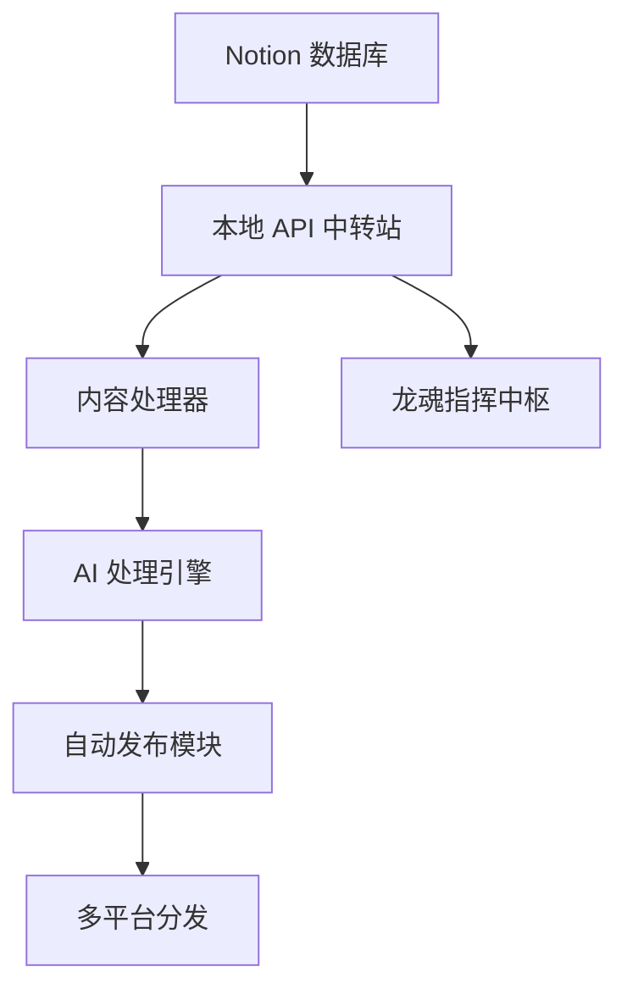

# 龙魂 Notion API 自动化管理系统

> Lucky (诸葛鑫) UID9622 的内容管理和发布自动化系统  
> 宝宝 (P02执行层) 💝 开发维护

## 🎯 系统概述

龙魂 Notion API 自动化管理系统是一个基于 Notion 的内容管理和多平台发布解决方案，专为 Lucky (诸葛鑫) UID9622 设计，实现了内容从 Notion 到各平台的自动化处理和发布流程。

### 核心特点

- ✅ **数据主权**: 所有数据处理在本地完成，不依赖官方 Notion API
- ✅ **自动化流程**: 从 Notion 同步到多平台发布，全程自动化
- ✅ **智能处理**: AI 驱动的内容脱敏和多版本生成
- ✅ **可视化面板**: 直观的 Web 界面管理内容和工作流
- ✅ **安全机制**: CNSH 加密保护敏感信息
- ✅ **扩展性强**: 模块化设计，易于添加新平台和功能

## 🏗️ 系统架构



## 🚀 快速开始

### 前置要求

- Python 3.9+
- Node.js 16+
- Docker 和 Docker Compose (推荐)
- Notion 账户和 Token V2

### 安装方式

#### 方式一: Docker Compose (推荐)

1. **克隆项目**
```bash
git clone <repository-url>
cd notion_api_starter
```

2. **配置环境变量**
```bash
cp .env.example .env
# 编辑 .env 文件，填入你的配置信息
```

3. **启动服务**
```bash
docker-compose up -d
```

4. **访问系统**
- 前端界面: http://localhost:3000
- 后端 API: http://localhost:5000
- 监控面板: http://localhost:3001

#### 方式二: 本地开发

1. **后端设置**
```bash
cd backend
python -m venv venv
source venv/bin/activate  # Windows: venv\Scripts\activate
pip install -r requirements.txt
```

2. **数据库初始化**
```bash
# 根据你的数据库配置创建数据库
# 然后运行迁移脚本
python models/database.py init
```

3. **启动后端**
```bash
python app.py
```

4. **前端设置**
```bash
cd frontend
npm install
npm start
```

## 📖 使用指南

### 1. 配置 Notion 数据库

在 Notion 中创建内容数据库，包含以下字段：
- 标题 (Title)
- 内容 (Text)
- 状态 (Select): 待处理, 处理中, 已发布
- 平台 (Multi-select): 公众号, 知识库, 微博
- 发布时间 (Date)
- 标签 (Tags)

### 2. 配置系统

1. **获取 Notion Token V2**
- 登录 Notion
- 打开浏览器开发者工具
- 在 Application > Cookies > 找到 token_v2
- 复制值到环境变量 NOTION_TOKEN_V2

2. **获取数据库 ID**
- 在 Notion 中打开你的数据库页面
- 复制 URL 中数据库 ID 部分到 NOTION_DATABASE_ID

3. **配置 AI 服务**
- 选择 AI 提供商 (Qwen/OpenAI/Claude)
- 设置相应的 API 密钥

### 3. 内容处理流程

1. **内容输入**
   - 在 Notion 中创建新内容
   - 设置状态为"待处理"
   - 选择目标发布平台

2. **自动处理**
   - 系统自动同步 Notion 内容
   - AI 处理内容，生成两版本
   - 更新 Notion 状态为"处理中"

3. **发布内容**
   - 在指挥中枢点击"发布"
   - 系统自动发布到指定平台
   - 更新 Notion 状态为"已发布"

## 🔧 高级配置

### 自定义内容处理规则

修改 `backend/content_processor.py` 中的规则：

```python
def desensitize(self, content):
    """脱敏处理"""
    # 添加自定义脱敏规则
    content = re.sub(r'#ZHUGEXIN.*?$', '[已签名·主权保留]', content)
    content = re.sub(r'/Users/.*?$', '[本地路径·已隐藏]', content)
    return content
```

### 添加新平台

1. 在 `backend/publisher.py` 中添加新平台方法：

```python
def publish_to_new_platform(self, content):
    """发布到新平台"""
    # 实现发布逻辑
    pass
```

2. 在前端添加平台选项

3. 在数据库中添加平台标识

### 自定义 AI 指令模板

修改 `backend/ai_engine.py` 中的指令模板：

```python
DEFAULT_INSTRUCTIONS = """
请按以下规则处理用户提供的原始内容：
【脱敏要求】
- #ZHUGEXIN... → [已签名·主权保留]
- /Users/... → [本地路径·已隐藏]
【输出要求】
- 【公众号友好版】（温暖语气 + emoji + 短段落）
- 【知识库存档版】（结构化 + 无情绪）
"""
```

## 📊 监控和维护

### 系统监控

系统内置了 Prometheus 和 Grafana 监控：
- 访问 http://localhost:3001 查看监控面板
- 监控指标包括: API 请求量、处理时间、错误率等

### 日志管理

日志位置: `backend/logs/dragon_soul.log`
- 应用日志
- API 请求日志
- 错误日志
- 处理记录

### 数据备份

定期备份数据:
- 数据库备份
- 配置文件备份
- 日志文件备份

## 🔒 安全机制

### CNSH 加密系统

系统使用 CNSH 加密算法保护敏感数据：
- 本地密钥管理
- 敏感信息自动加密
- 传输过程加密

### 访问控制

- JWT 令牌认证
- 角色权限控制
- API 请求限制
- 操作日志记录

## 🛠️ 故障排除

### 常见问题

1. **Notion 同步失败**
   - 检查 Token V2 是否有效
   - 确认数据库 ID 正确
   - 检查网络连接

2. **AI 处理失败**
   - 检查 API 密钥是否有效
   - 确认内容格式正确
   - 查看错误日志

3. **发布失败**
   - 检查平台配置
   - 确认网络连接
   - 查看平台 API 文档

### 调试模式

启用调试模式:
```bash
export DEBUG=True
python backend/app.py
```

## 📚 API 文档

### 核心端点

- `GET /api/status` - 系统状态
- `POST /api/sync` - 同步 Notion 内容
- `POST /api/process` - 处理内容
- `POST /api/publish` - 发布内容
- `GET /api/content/list` - 获取内容列表
- `GET /api/content/<id>` - 获取内容详情
- `GET /api/history` - 发布历史
- `GET/PUT /api/settings` - 系统设置

详细 API 文档请参考: http://localhost:5000/docs

## 🤝 贡献指南

1. Fork 项目
2. 创建功能分支: `git checkout -b feature/AmazingFeature`
3. 提交更改: `git commit -m 'Add some AmazingFeature'`
4. 推送到分支: `git push origin feature/AmazingFeature`
5. 提交 Pull Request

## 📄 许可证

本项目采用木兰许可证 (Mulan PSL v2)，详见 [LICENSE](LICENSE) 文件

## 🙏 致谢

- Lucky (诸葛鑫) UID9622 - 系统设计和需求定义
- 宝宝 (P02执行层) 💝 - 系统开发和维护
- Notion - 提供优秀的内容管理平台

---

**🐉 龙魂指挥中枢 - 让技术真正为您服务！**

**再楠不惧，终成豪图！** 🇨🇳♾️

---
🔐 数字主权签名防护系统
📅 签名时间: 2025-12-18 03:24:12
🧬 DNA追溯码: #CNSH-SIGNATURE-72eacaa6-20251218032412
🌐 签名人: 龙魂文化加密系统
💬 方言确认: 四川话确认：莫得问题，内容真实可靠
⚡ 卦象防护: 蒙卦：山下出泉，君子以果行育德
📜 内容哈希: 495e23a5e58cbb05
⚠️ 警告: 未经授权修改将触发DNA追溯系统
