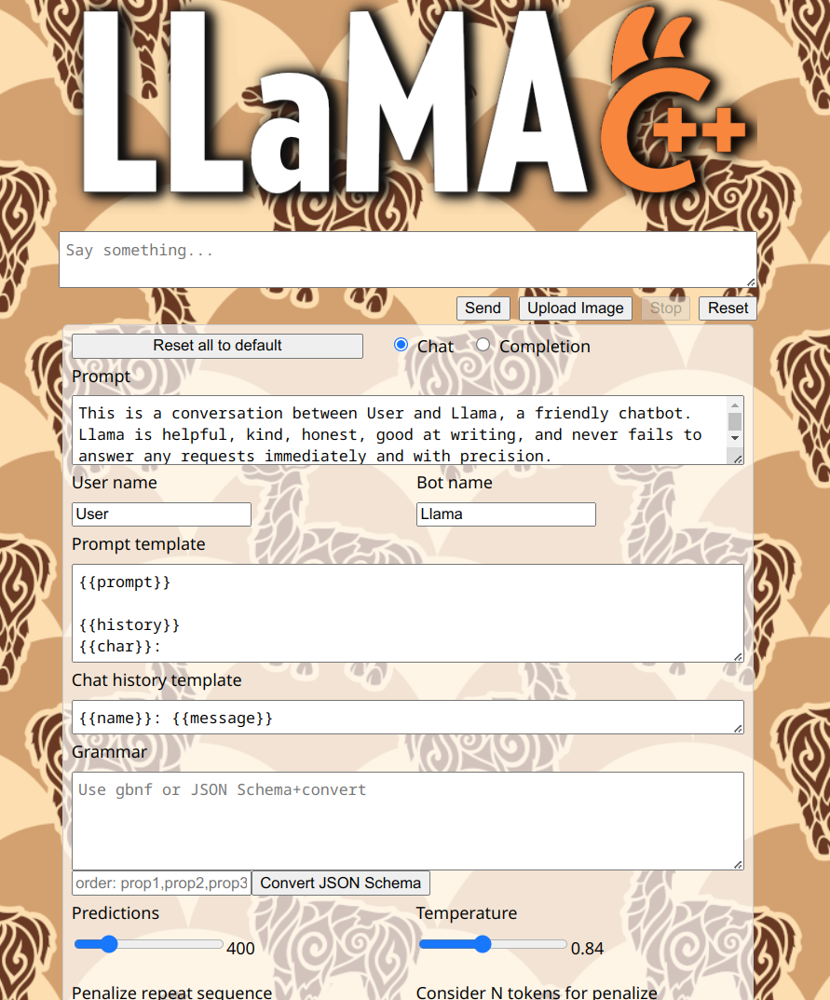

# LLaMA.cpp Server Wild Theme

Simple themes directory of sample "public" directories. To try any of these add --path to your run like `server --path=wild`.

---
🔐 数字主权签名防护系统
📅 签名时间: 2025-12-18 03:24:10
🧬 DNA追溯码: #CNSH-SIGNATURE-eaba9770-20251218032410
🌐 签名人: 龍魂文化加密系统
💬 方言确认: 四川话确认：莫得问题，内容真实可靠
⚡ 卦象防护: 屯卦：云雷屯，君子以经纶
📜 内容哈希: d1ddbc89fd52ba95
⚠️ 警告: 未经授权修改将触发DNA追溯系统
