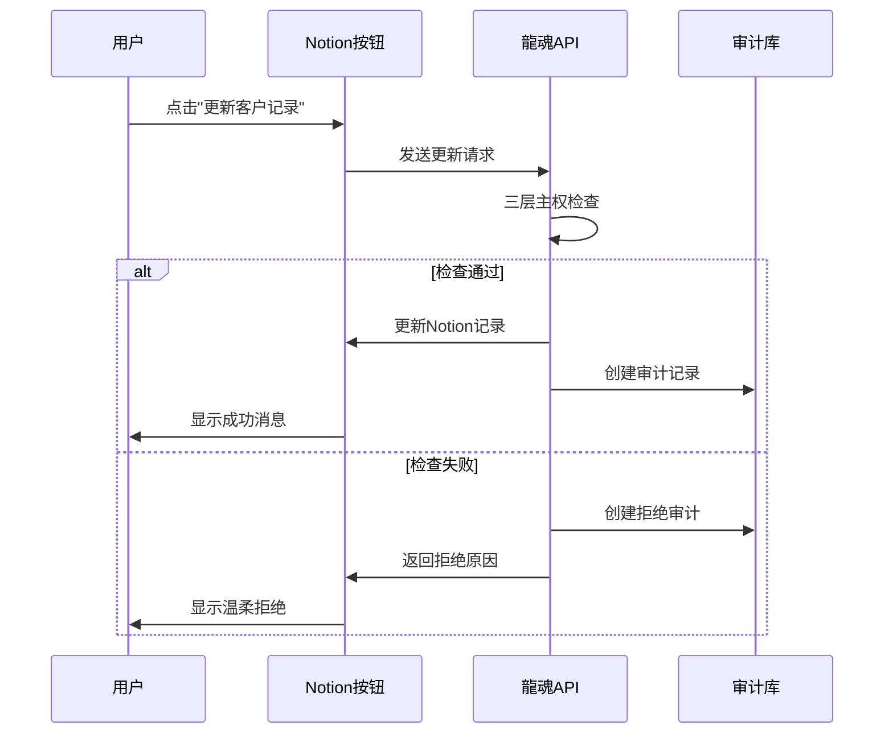
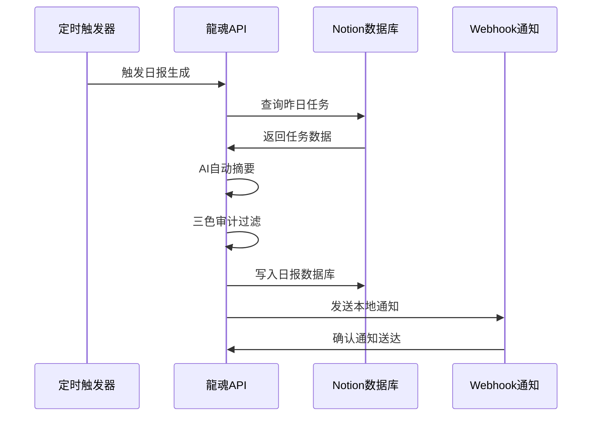

# 🎛️ Notion按钮自动化指南（零代码方案）

## 📋 P1层：自动化按钮设计

### 命令2：创建"客户更新"按钮

```notion
/button "更新客户记录"
  action: 
    - 触发: "点击"
    - 调用: "龍魂API中间件"
    - 参数: 
        - 客户DNA: "从当前页面提取"
        - 更新内容: "弹窗输入（必填）"
        - 主权确认: "勾选'数据已加密'（强制）"
  result: 
    - 成功: "🟢 更新成功 + DNA追溯码"
    - 失败: "🔴 主权校验失败 + 温柔拒绝"
```

### 命令3：创建"日报生成"按钮

```notion
/button "生成昨日工作日报"
  action:
    - 查询: "任务数据库（状态=完成 + 日期=昨天）"
    - 摘要: "龍魂自动提取（三色审计过滤）"
    - 写入: "日报数据库（主权状态=境内）"
    - 通知: "飞书/钉钉（本地Webhook）"
```

### 命令4：创建"主权自检"按钮

```notion
/button "主权安全自检"
  action:
    - 扫描: "当前数据库所有记录"
    - 检查: "主权状态字段合规性"
    - 报告: "生成安全审计报告"
    - 修复: "自动修复不合规记录"
```

## 🔧 具体实现方案

### 方案1：Webhook + 按钮集成

```javascript
// Notion按钮配置示例
const notionButtonConfig = {
  "客户更新": {
    "webhook_url": "http://localhost:9527/api/crm/update",
    "parameters": {
      "client_dna": "{{page.properties.客户DNA.rich_text.0.plain_text}}",
      "content": "{{user_input.更新内容}}",
      "sovereignty_status": "境内"
    },
    "success_message": "✅ 更新成功！DNA追溯码: {{response.dna_code}}",
    "error_message": "❌ 更新失败: {{response.message}}"
  },
  "日报生成": {
    "webhook_url": "http://localhost:9527/api/daily-report/generate",
    "parameters": {},
    "success_message": "📊 日报已生成: {{response.report_content}}",
    "error_message": "❌ 日报生成失败"
  }
};
```

### 方案2：浏览器扩展集成

```javascript
// 龍魂浏览器扩展
class LonghunNotionExtension {
  constructor() {
    this.apiBase = 'http://localhost:9527';
    this.initButtons();
  }
  
  initButtons() {
    // 在Notion页面注入按钮
    this.injectCRMUpdateButton();
    this.injectDailyReportButton();
    this.injectSovereigntyCheckButton();
  }
  
  injectCRMUpdateButton() {
    const button = document.createElement('button');
    button.textContent = '🐉 更新客户记录';
    button.onclick = () => this.updateCRMRecord();
    
    // 添加到Notion页面合适位置
    const notionHeader = document.querySelector('.notion-page-header');
    if (notionHeader) {
      notionHeader.appendChild(button);
    }
  }
  
  async updateCRMRecord() {
    const clientDNA = this.extractClientDNA();
    const content = prompt('请输入更新内容:');
    
    if (!content) return;
    
    try {
      const response = await fetch(`${this.apiBase}/api/crm/update`, {
        method: 'POST',
        headers: {'Content-Type': 'application/json'},
        body: JSON.stringify({
          client_dna: clientDNA,
          content: content,
          sovereignty_status: '境内'
        })
      });
      
      const result = await response.json();
      
      if (result.success) {
        alert(`✅ 更新成功！\nDNA追溯码: ${result.data.dna_code}`);
      } else {
        alert(`❌ 更新失败: ${result.message}`);
      }
    } catch (error) {
      alert('❌ 网络错误，请检查龍魂服务是否运行');
    }
  }
  
  extractClientDNA() {
    // 从Notion页面提取客户DNA
    // 实现页面内容解析逻辑
    return '客户DNA示例';
  }
}

// 启动扩展
new LonghunNotionExtension();
```

## 🎯 关键页面按钮部署

### 1. 客户详情页 → "更新记录"按钮

```notion
# 客户详情页布局

## 基本信息
- 客户DNA: {{客户DNA}}
- 主权状态: {{主权状态}}
- 最近联系: {{最近联系}}

## 快捷操作
/button "🐉 更新客户记录"
  -> 调用龍魂API中间件
  -> 自动填写客户DNA
  -> 弹窗输入更新内容
  -> 主权状态自动设为"境内"

## 操作历史
- 显示最近5次更新记录
- 包含DNA追溯码和审核人格
```

### 2. 任务管理页 → "生成日报"按钮

```notion
# 任务管理页布局

## 昨日任务统计
- 完成: {{count(状态=完成 AND 日期=昨天)}}
- 进行中: {{count(状态=进行中)}}
- 待处理: {{count(状态=待处理)}}

## 日报生成
/button "📊 生成昨日工作日报"
  -> 自动查询昨日完成任务
  -> 龍魂AI自动摘要
  -> 三色审计过滤敏感内容
  -> 写入日报数据库
  -> 本地Webhook通知

## 日报历史
- 最近7天日报列表
- 点击查看详细内容
```

### 3. 系统设置页 → "主权自检"按钮

```notion
# 系统设置页布局

## 主权健康度
- 数据位置: ✅ 本地服务器
- 审核机制: ✅ 三色审计
- 成本控制: ✅ <5元/月
- 可控性: ✅ 100%源码

## 安全自检
/button "🛡️ 主权安全自检"
  -> 扫描所有数据库记录
  -> 检查主权状态合规性
  -> 生成安全审计报告
  -> 自动修复不合规记录

## 审计日志
- 显示最近安全事件
- 风险等级和处置结果
```

## 🔄 自动化工作流集成

### 客户更新工作流



### 日报生成工作流



## 🛡️ 主权守护增强功能

### 实时主权监控

```javascript
// 主权监控脚本
class SovereigntyMonitor {
  constructor() {
    this.checkInterval = 300000; // 5分钟
    this.startMonitoring();
  }
  
  startMonitoring() {
    setInterval(() => {
      this.checkSovereigntyStatus();
    }, this.checkInterval);
  }
  
  async checkSovereigntyStatus() {
    try {
      const response = await fetch('http://localhost:9527/api/sovereignty/status');
      const status = await response.json();
      
      if (status.health_score < 0.8) {
        this.triggerAlert('主权健康度下降');
      }
      
      if (status.risk_level === 'high') {
        this.triggerEmergency('检测到高风险操作');
      }
    } catch (error) {
      console.error('主权监控失败:', error);
    }
  }
  
  triggerAlert(message) {
    // 显示警告通知
    this.showNotification('⚠️ ' + message, 'warning');
  }
  
  triggerEmergency(message) {
    // 紧急处理
    this.showNotification('🔴 ' + message, 'error');
    this.disableAutomation();
  }
}
```

## 📱 移动端适配

### PWA移动应用

```html
<!-- 龍魂Notion移动控制台 -->
<!DOCTYPE html>
<html>
<head>
    <title>龍魂Notion控制台</title>
    <meta name="viewport" content="width=device-width, initial-scale=1.0">
    <link rel="manifest" href="./manifest.json">
</head>
<body>
    <div class="container">
        <header>
            <h1>🐉 龍魂控制台</h1>
        </header>
        
        <div class="quick-actions">
            <button onclick="updateCRM()">更新客户</button>
            <button onclick="generateReport()">生成日报</button>
            <button onclick="checkSovereignty()">主权检查</button>
        </div>
        
        <div class="status-panel">
            <h3>系统状态</h3>
            <div id="status-indicator"></div>
        </div>
    </div>
    
    <script src="./longhun-mobile.js"></script>
</body>
</html>
```

## 🚀 部署配置

### 环境要求

```bash
# 依赖检查
python3 --version  # >= 3.8
pip3 --version     # >= 20.0
node --version     # >= 16.0 (可选，用于浏览器扩展)

# 服务端口
龍魂API中间件: 9527
本地Webhook: 3000 (可选)
```

### 一键部署脚本

```bash
#!/bin/bash
# deploy-longhun-notion.sh

echo "🐉 部署龍魂Notion自动化系统..."

# 检查Python环境
if ! command -v python3 &> /dev/null; then
    echo "❌ 需要安装Python3"
    exit 1
fi

# 安装依赖
echo "📦 安装Python依赖..."
pip3 install flask flask-cors requests

# 启动服务
echo "🚀 启动龍魂API中间件..."
cd /Users/zuimeidedeyihan/LuckyCommandCenter/龍魂Notion主权自动化
python3 longhun_notion_proxy.py &

# 检查服务状态
sleep 3
if curl -s http://localhost:9527/api/status | grep -q "running"; then
    echo "✅ 龍魂服务启动成功"
    echo "🔗 服务地址: http://localhost:9527"
    echo "📋 可用API:"
    echo "  - POST /api/sovereignty/check"
    echo "  - POST /api/crm/update"
    echo "  - POST /api/daily-report/generate"
else
    echo "❌ 服务启动失败"
    exit 1
fi

echo "🎉 部署完成！现在可以配置Notion按钮了"
```

---

**主权原则确认：** ✅ 零代码方案，不依赖第三方平台

**DNA追溯码：** #LONGHUN-BUTTON-AUTOMATION-20251220
**确认码：** #CONFIRM🌌9622-ZERO-CODE🧬LK9X-772Z