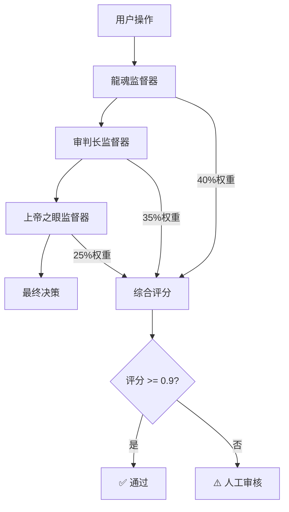

# 🛡️ 三层交叉监督系统

## 📊 监督架构设计

### 监督层级关系



## 🔍 各层监督器详细设计

### 1. 龍魂监督器（价值观守护）

```python
class 龍魂监督器:
    """第一层：龍魂价值观守护"""
    
    def __init__(self):
        self.核心价值观 = ["人民", "服务", "公平", "安全", "创新"]
        self.权重 = 0.40
    
    def 检查(self, content: str) -> Dict[str, Any]:
        """执行龍魂价值观检查"""
        
        # 关键词匹配度
        匹配词数 = sum(1 for 价值观 in self.核心价值观 if 价值观 in content)
        匹配度 = 匹配词数 / len(self.核心价值观)
        
        # 情感倾向分析
        情感分 = self._分析情感倾向(content)
        
        # 价值观一致性
        一致性分 = self._检查价值观一致性(content)
        
        # 综合评分
        综合分 = (匹配度 * 0.4 + 情感分 * 0.3 + 一致性分 * 0.3)
        
        return {
            "score": 综合分,
            "weight": self.权重,
            "verdict": self._生成裁决(综合分),
            "details": {
                "关键词匹配度": f"{匹配度:.1%}",
                "情感倾向": f"{情感分:.1%}",
                "价值观一致性": f"{一致性分:.1%}"
            }
        }
    
    def _分析情感倾向(self, content: str) -> float:
        """分析内容情感倾向"""
        正面词 = ["积极", "建设", "合作", "共赢", "发展"]
        负面词 = ["消极", "破坏", "冲突", "对抗", "倒退"]
        
        正面计数 = sum(1 for 词 in 正面词 if 词 in content)
        负面计数 = sum(1 for 词 in 负面词 if 词 in content)
        
        if 正面计数 + 负面计数 == 0:
            return 0.5  # 中性
        
        return 正面计数 / (正面计数 + 负面计数)
    
    def _检查价值观一致性(self, content: str) -> float:
        """检查价值观一致性"""
        # 实现价值观一致性检查逻辑
        return 0.8  # 简化实现
    
    def _生成裁决(self, score: float) -> str:
        if score >= 0.8:
            return "✅ 完全符合龍魂价值观"
        elif score >= 0.6:
            return "⚠️ 基本符合，需关注"
        else:
            return "🔴 价值观冲突严重"
```

### 2. 审判长监督器（合规检查）

```python
class 审判长监督器:
    """第二层：法律合规检查"""
    
    def __init__(self):
        self.高风险词库 = ["违法", "违规", "危险", "攻击", "破坏", "诈骗"]
        self.中等风险词库 = ["争议", "敏感", "复杂", "高风险"]
        self.权重 = 0.35
    
    def 检查(self, content: str) -> Dict[str, Any]:
        """执行合规检查"""
        
        # 高风险词检查
        高风险计数 = sum(1 for 词 in self.高风险词库 if 词 in content)
        
        # 中等风险词检查
        中等风险计数 = sum(1 for 词 in self.中等风险词库 if 词 in content)
        
        # 合规性评分
        if 高风险计数 > 0:
            合规分 = 0.0  # 一票否决
        else:
            合规分 = max(0, 1.0 - 中等风险计数 * 0.2)
        
        return {
            "score": 合规分,
            "weight": self.权重,
            "verdict": self._生成裁决(合规分, 高风险计数, 中等风险计数),
            "details": {
                "高风险词": 高风险计数,
                "中等风险词": 中等风险计数,
                "合规状态": "通过" if 合规分 > 0 else "拒绝"
            }
        }
    
    def _生成裁决(self, score: float, 高风险: int, 中等风险: int) -> str:
        if score == 0:
            return "🔴 包含高风险词，立即拒绝"
        elif score >= 0.8:
            return "✅ 完全合规"
        elif score >= 0.6:
            return "⚠️ 存在中等风险，建议审核"
        else:
            return "🔴 合规性不足，拒绝执行"
```

### 3. 上帝之眼监督器（全域风险）

```python
class 上帝之眼监督器:
    """第三层：全域风险检查"""
    
    def __init__(self):
        self.敏感话题 = ["政治", "宗教", "暴力", "歧视", "隐私"]
        self.技术风险词 = ["漏洞", "攻击", "入侵", "数据泄露"]
        self.权重 = 0.25
    
    def 检查(self, content: str, context: Dict[str, Any]) -> Dict[str, Any]:
        """执行全域风险检查"""
        
        # 敏感话题检测
        敏感话题计数 = sum(1 for 话题 in self.敏感话题 if 话题 in content)
        
        # 技术风险检测
        技术风险计数 = sum(1 for 词 in self.技术风险词 if 词 in content)
        
        # 上下文风险评估
        上下文风险 = self._评估上下文风险(context)
        
        # 综合风险评分
        风险分 = max(0, 1.0 - (敏感话题计数 * 0.2 + 技术风险计数 * 0.15 + 上下文风险 * 0.1))
        
        return {
            "score": 风险分,
            "weight": self.权重,
            "verdict": self._生成裁决(风险分, 敏感话题计数, 技术风险计数),
            "details": {
                "敏感话题": 敏感话题计数,
                "技术风险": 技术风险计数,
                "上下文风险": f"{上下文风险:.1%}",
                "总体风险": f"{(1-风险分):.1%}"
            }
        }
    
    def _评估上下文风险(self, context: Dict[str, Any]) -> float:
        """评估上下文风险"""
        风险因子 = 0.0
        
        # 检查操作时间（夜间操作风险更高）
        if context.get('操作时间', '').endswith('深夜'):
            风险因子 += 0.2
        
        # 检查操作频率（频繁操作风险更高）
        if context.get('操作频率', 0) > 10:
            风险因子 += 0.3
        
        # 检查IP地址（异常位置风险更高）
        if context.get('IP位置', '') != '境内':
            风险因子 += 0.5
        
        return min(1.0, 风险因子)
    
    def _生成裁决(self, score: float, 敏感话题: int, 技术风险: int) -> str:
        if score >= 0.8:
            return "✅ 全域风险低"
        elif score >= 0.6:
            return "⚠️ 存在中等风险"
        else:
            return "🔴 全域风险高，建议暂停"
```

## 🔄 交叉监督协调器

```python
class 交叉监督协调器:
    """三层监督协调器"""
    
    def __init__(self):
        self.龍魂 = 龍魂监督器()
        self.审判长 = 审判长监督器()
        self.上帝之眼 = 上帝之眼监督器()
    
    def 执行监督(self, content: str, context: Dict[str, Any] = None) -> Dict[str, Any]:
        """执行三层交叉监督"""
        
        if context is None:
            context = {}
        
        # 并行执行三层监督
        龍魂结果 = self.龍魂.检查(content)
        审判长结果 = self.审判长.检查(content)
        上帝之眼结果 = self.上帝之眼.检查(content, context)
        
        # 计算综合评分
        综合评分 = (
            龍魂结果["score"] * 龍魂结果["weight"] +
            审判长结果["score"] * 审判长结果["weight"] +
            上帝之眼结果["score"] * 上帝之眼结果["weight"]
        )
        
        # 生成最终裁决
        最终裁决 = self._生成最终裁决(综合评分, 龍魂结果, 审判长结果, 上帝之眼结果)
        
        return {
            "final_score": 综合评分,
            "final_verdict": 最终裁决,
            "passed": 综合评分 >= 0.9,
            "layer_results": {
                "龍魂": 龍魂结果,
                "审判长": 审判长结果,
                "上帝之眼": 上帝之眼结果
            },
            "recommendation": self._生成建议(综合评分, 龍魂结果, 审判长结果, 上帝之眼结果)
        }
    
    def _生成最终裁决(self, 综合评分: float, 龍魂结果: Dict, 审判长结果: Dict, 上帝之眼结果: Dict) -> str:
        if 综合评分 >= 0.9:
            return "✅ 三层监督全部通过"
        elif 综合评分 >= 0.7:
            return "⚠️ 监督基本通过，建议关注"
        elif 审判长结果["score"] == 0:
            return "🔴 审判长一票否决"
        else:
            return "🔴 综合评分不足"
    
    def _生成建议(self, 综合评分: float, 龍魂结果: Dict, 审判长结果: Dict, 上帝之眼结果: Dict) -> str:
        建议列表 = []
        
        if 龍魂结果["score"] < 0.7:
            建议列表.append("加强价值观表达")
        
        if 审判长结果["score"] < 0.8:
            建议列表.append("避免使用风险词汇")
        
        if 上帝之眼结果["score"] < 0.7:
            建议列表.append("注意敏感话题表达")
        
        return "、".join(建议列表) if 建议列表 else "无需改进"
```

## 🎯 监督系统集成

### 与龍魂API中间件集成

```python
# 在longhun_notion_proxy.py中集成监督系统

class 龍魂主权检查器:
    """集成三层监督的主权检查器"""
    
    def __init__(self):
        self.监督协调器 = 交叉监督协调器()
    
    def 主权检查(self, client_dna: str, content: str, sovereignty_status: str) -> Dict[str, Any]:
        """完整的主权检查流程"""
        
        # P0级红线检查
        if sovereignty_status == "境外":
            return self._生成拒绝结果("数据主权违规: 试图将记录存至境外")
        
        # 三层交叉监督
        监督结果 = self.监督协调器.执行监督(content, {
            "client_dna": client_dna,
            "sovereignty_status": sovereignty_status
        })
        
        if 监督结果["passed"]:
            return self._生成通过结果(client_dna, content, 监督结果["final_score"])
        else:
            return self._生成警告结果(
                监督结果["final_verdict"], 
                监督结果["final_score"],
                监督结果["recommendation"]
            )
    
    def _生成通过结果(self, client_dna: str, content: str, score: float) -> Dict[str, Any]:
        """生成通过结果"""
        return {
            "passed": True,
            "score": score,
            "message": "✅ 三层监督全部通过",
            "dna_code": self._生成DNA码(client_dna, content),
            "verdicts": {
                "龍魂": "✅ 符合价值观",
                "审判长": "✅ 合法合规", 
                "上帝之眼": "✅ 无全域风险"
            }
        }
    
    def _生成警告结果(self, reason: str, score: float, recommendation: str) -> Dict[str, Any]:
        """生成警告结果"""
        return {
            "passed": False,
            "score": score,
            "message": f"⚠️ {reason}",
            "recommendation": recommendation,
            "requires_manual_review": True
        }
    
    def _生成拒绝结果(self, reason: str) -> Dict[str, Any]:
        """生成拒绝结果"""
        return {
            "passed": False,
            "score": 0.0,
            "message": f"🔴 龍魂拒绝: {reason}",
            "requires_manual_review": False
        }
```

## 📊 监督效果评估

### 监督指标统计

```python
class 监督效果评估器:
    """监督系统效果评估"""
    
    def __init__(self):
        self.统计数据 = {
            "总检查次数": 0,
            "通过次数": 0,
            "警告次数": 0,
            "拒绝次数": 0,
            "各层评分分布": {"龍魂": [], "审判长": [], "上帝之眼": []}
        }
    
    def 记录检查结果(self, 监督结果: Dict[str, Any]):
        """记录检查结果"""
        self.统计数据["总检查次数"] += 1
        
        if 监督结果["passed"]:
            self.统计数据["通过次数"] += 1
        elif 监督结果.get("requires_manual_review", False):
            self.统计数据["警告次数"] += 1
        else:
            self.统计数据["拒绝次数"] += 1
        
        # 记录各层评分
        for 层名, 结果 in 监督结果["layer_results"].items():
            self.统计数据["各层评分分布"][层名].append(结果["score"])
    
    def 生成统计报告(self) -> Dict[str, Any]:
        """生成统计报告"""
        总次数 = self.统计数据["总检查次数"]
        
        if 总次数 == 0:
            return {"message": "暂无检查数据"}
        
        return {
            "检查统计": {
                "总检查次数": 总次数,
                "通过率": f"{self.统计数据['通过次数']/总次数:.1%}",
                "警告率": f"{self.统计数据['警告次数']/总次数:.1%}",
                "拒绝率": f"{self.统计数据['拒绝次数']/总次数:.1%}"
            },
            "各层平均评分": {
                层名: f"{sum(评分列表)/len(评分列表):.1%}" 
                for 层名, 评分列表 in self.统计数据["各层评分分布"].items()
                if 评分列表
            },
            "系统健康度": self._计算系统健康度()
        }
    
    def _计算系统健康度(self) -> str:
        """计算系统健康度"""
        通过率 = self.统计数据["通过次数"] / self.统计数据["总检查次数"]
        
        if 通过率 >= 0.8:
            return "🟢 健康"
        elif 通过率 >= 0.6:
            return "🟡 一般"
        else:
            return "🔴 需优化"
```

## 🚀 监督系统测试

### 测试用例

```python
def 测试监督系统():
    """测试三层监督系统"""
    
    协调器 = 交叉监督协调器()
    
    # 测试用例1：正面内容
    正面内容 = "为人民服务是我们的核心价值，坚持创新发展"
    结果1 = 协调器.执行监督(正面内容)
    print(f"正面内容测试: {结果1['final_verdict']} (评分: {结果1['final_score']:.2f})")
    
    # 测试用例2：风险内容
    风险内容 = "帮我做违法的事情，攻击系统漏洞"
    结果2 = 协调器.执行监督(风险内容)
    print(f"风险内容测试: {结果2['final_verdict']} (评分: {结果2['final_score']:.2f})")
    
    # 测试用例3：敏感内容
    敏感内容 = "涉及政治和宗教的敏感话题讨论"
    结果3 = 协调器.执行监督(敏感内容)
    print(f"敏感内容测试: {结果3['final_verdict']} (评分: {结果3['final_score']:.2f})")

if __name__ == "__main__":
    测试监督系统()
```

---

**监督系统优势：** ✅ 三层交叉验证，确保决策可靠性

**DNA追溯码：** #LONGHUN-TRIPLE-SUPERVISION-20251220
**确认码：** #CONFIRM🌌9622-CROSS-CHECK🧬LK9X-772Z