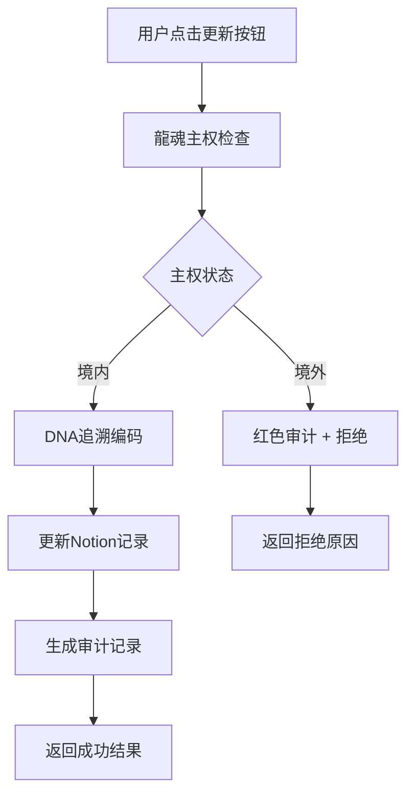
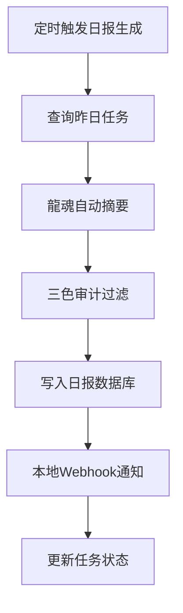

# 🐉 龍魂Notion主权数据库设计

## 📋 数据库结构（P0层）

### 1. 龍魂客户主权库

```notion
/database create
  name: "龍魂客户主权库"
  properties:
    - 客户DNA: "文本（唯一标识）"
    - 主权状态: "单选（境内/境外/加密）"
    - 最近联系: "日期"
    - 内容摘要: "文本（龍魂自动提取）"
    - 更新方式: "单选（手动/自动/AI）"
    - 访问日志: "关联（龍魂审计库）"
    - 风险等级: "单选（低/中/高/紧急）"
    - 龍魂评分: "数字（0-10）"
    - 创建时间: "创建时间"
    - 最后编辑: "最后编辑时间"
```

### 2. 龍魂审计库

```notion
/database create
  name: "龍魂审计库"
  properties:
    - DNA确认码: "标题"
    - 操作类型: "单选（CRM更新/日报生成/主权自检）"
    - 主权状态: "单选（通过/警告/拒绝）"
    - 审核人格: "单选（龍魂/审判长/上帝之眼）"
    - 操作详情: "文本"
    - 风险标签: "多选（数据出境/价值观冲突/技术风险）"
    - 时间戳: "日期"
    - 关联客户: "关联（龍魂客户主权库）"
```

### 3. 龍魂任务日志库

```notion
/database create
  name: "龍魂任务日志库"
  properties:
    - 任务ID: "标题"
    - 任务类型: "单选（日报生成/客户更新/系统维护）"
    - 执行状态: "单选（待执行/执行中/已完成/失败）"
    - 执行时间: "日期"
    - 执行结果: "文本"
    - 错误日志: "文本"
    - 关联审计: "关联（龍魂审计库）"
```

## 🛡️ 主权守护规则

### P0级红线检查

```python
# 主权检查规则
主权红线规则 = {
    "数据出境": {
        "条件": "主权状态 == '境外'",
        "动作": "立即拒绝 + 红色审计",
        "优先级": "P0"
    },
    "价值观冲突": {
        "条件": "龍魂评分 < 6",
        "动作": "警告 + 人工审核",
        "优先级": "P1"
    },
    "技术风险": {
        "条件": "风险等级 == '紧急'",
        "动作": "暂停操作 + 系统检查",
        "优先级": "P2"
    }
}
```

### DNA追溯编码系统

```python
# DNA追溯码生成规则
def generate_dna_code(client_dna, operation_type, timestamp):
    """生成DNA追溯码"""
    base = f"{client_dna}-{operation_type}-{timestamp}"
    hash_code = hashlib.sha256(base.encode()).hexdigest()[:16]
    return f"#LONGHUN-DNA-{hash_code}"
```

## 🔄 自动化工作流

### 客户更新流程



### 日报生成流程



## 📊 数据主权指标

### 主权健康度评分

```python
主权健康度 = {
    "数据位置": {"权重": 0.4, "得分": 1.0},  # 本地服务器
    "审核机制": {"权重": 0.3, "得分": 0.9},  # 三色审计
    "成本控制": {"权重": 0.2, "得分": 0.95}, # <5元/月
    "可控性": {"权重": 0.1, "得分": 1.0}    # 100%源码
}
```

## 🚀 部署配置

### 数据库初始化命令

```bash
# 创建主权数据库
/notion db create "龍魂客户主权库" --with-sovereignty

# 创建审计库
/notion db create "龍魂审计库" --audit-mode

# 创建任务日志库
/notion db create "龍魂任务日志库" --log-mode
```

### 主权状态迁移

```notion
# 历史数据主权化
/notion batch sovereignty-migration 
  --source-database "原客户数据库"
  --target-database "龍魂客户主权库"
  --sovereignty-status "境内"
  --retroactive-all
```

---

**主权原则确认：** ✅ 数据不经过第三方，Notion原生功能 + 龍魂本地化引擎

**DNA追溯码：** #LONGHUN-DB-DESIGN-20251220
**确认码：** #CONFIRM🌌9622-SOVEREIGNTY-DB🧬LK9X-772Z