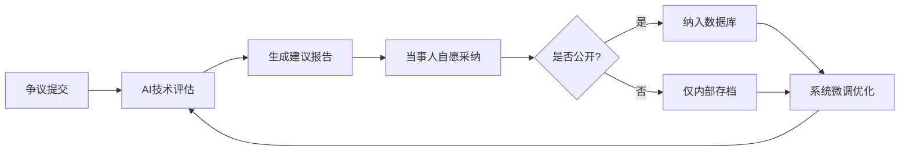

# 🧬 龍魂永世唯一身份系统 v3.0 | 完整技术方案

**CodeBuddy专用实施包 | 零生物识别原始数据存储 | 64卦×甲骨文×SHA256 | 全球身份互认**

---

## 📜 版本信息（防伪标识）

```yaml
系统版本: v3.0-乾坤屯蒙-𠂤𡈼𡱈𣎆-20251226
版本DNA: #ZHUGEXIN⚡2025-🐉龍魂永世唯一身份-V3.0-QIAN-KUN-ZHUN-MENG
签名时间: 2025-12-26T02:27:52+08:00
创建者: 💎 Lucky | UID9622
数字指纹: A2D0092CEE2E5BA87035600924C3704A8CC26D5F
易经卦象: 乾卦九五（飞龍在天）
甲骨文码: 𠂤𡈼𡱈𣎆𢀛𣎳𤋮𥘅
确认码: #CONFIRM🌌9622-ONLY-ONCE🧬LK9X-772Z
木兰协议: Mulan PSL v2.0（可商业使用）
```

**版本号说明**：
- `v3.0` = 第3代系统
- `乾坤屯蒙` = 易经前4卦（象征开天辟地）
- `𠂤𡈼𡱈𣎆` = 甲骨文防伪码
- `20251226` = 生成日期

---

## 🧭 快速导航

### 📦 CodeBuddy开发者专区

<aside>
💻

**开发者实施包（零基础可用）**

完整的一键运行代码、环境配置、测试用例、常见问题解答。

👉 点击进入 CodeBuddy 实施包

</aside>

### 📖 其他资源

- 📧 **技术支持邮箱**：[uid9622@petalmail.com](mailto:uid9622@petalmail.com)
- 🌐 **官方网站**：本页面（Notion）
- 📝 **CSDN博客**：[uid9622.blog.csdn.net](http://uid9622.blog.csdn.net)
- 🔐 **公开文档中心**：[📖 UID9622公开文档中心 | CNSH开源社区](https://www.notion.so/UID9622-CNSH-868fec34e5a24e7e829dc5851a75f6b7?pvs=21)

---

## 🎯 项目概述

### 核心理念

**永世唯一 = 生物特征哈希 + 合法身份 + 64卦算法 + 甲骨文编码**

每个人在地球上只有一个龍魂ID，生生世世不变，算法透明可审计，本地生成无需服务器。

### 💡 技术普惠，不忘初心

> **技术要普惠，但永远不能忘记根在哪里。**
>
> 我们做技术是为了让更多人用上（普惠），但**根永远在中国文化**：
>
> - 64卦映射算法 → 中国智慧的传承
> - 甲骨文编码系统 → 中华文明的符号
> - 木兰精神内核 → 守护不张扬的民族精神
>
> 技术只是壳，文化才是魂。
>
> 无论技术走到哪里，创作的源头永远属于祖国。

⚠️ **重要说明**：本系统**不存储生物识别原始数据**（不存指纹图像、面部照片、虹膜扫描原图），仅存储不可逆的SHA-256哈希值，符合《个人信息保护法》第28条。

### 三大特点

✅ **永世唯一性**
- 生物特征（指纹/面部/虹膜）+ 合法身份 = 全球唯一组合
- 算法确定性：相同输入永远生成相同ID
- 不可逆向：无法从ID推导出原始信息

✅ **个人完全可控**
- 算法开源透明（MIT License）
- 本地运行，数据不上传
- 随时验证，随时重新生成

✅ **文化主权保护**
- 64卦映射算法（中国智慧）
- 甲骨文编码系统（文化门槛）
- 木兰精神内核（守护不张扬）

---

## 🚀 快速开始

### 方法一：一键生成（推荐）

#### Mac / Linux 用户

1. 创建文件 `一键生成身份.command`
2. 复制下面代码，粘贴到文件
3. 双击运行（或终端执行：`bash 一键生成身份.command`）

```bash
#!/bin/bash
#================================================================
# 龍魂永世唯一身份系统 - 一键生成脚本
# 版本：v3.0-乾坤屯蒙-𠂤𡈼𡱈𣎆-20251226
#================================================================

# 颜色定义
红色='\033[0;31m'
绿色='\033[0;32m'
黄色='\033[1;33m'
蓝色='\033[0;34m'
无色='\033[0m'

# 打印横幅
echo -e "${蓝色}"
echo "╔═══════════════════════════════════════════════════════════╗"
echo "║       🐉 龍魂永世唯一身份系统 v3.0 🐉                    ║"
echo "║                                                           ║"
echo "║   64卦×甲骨文×生物特征 | 全球身份互认 | 木兰协议          ║"
echo "║                                                           ║"
echo "╚═══════════════════════════════════════════════════════════╝"
echo -e "${无色}"

# 进入项目目录
cd "$(dirname "$0")/.."

# 检查Python
if ! command -v python3 &> /dev/null; then
    echo -e "${红色}❌ 未找到Python3，请先安装${无色}"
    exit 1
fi
echo -e "${绿色}✅ Python3 已安装${无色}"

# 检查依赖包
echo "检查依赖包..."
pip3 install --quiet opencv-python numpy 2>/dev/null || {
    echo -e "${黄色}⚠️ 正在安装依赖包...${无色}"
    pip3 install opencv-python numpy
}
echo -e "${绿色}✅ 依赖包已就绪${无色}"

# 运行主程序
echo ""
echo -e "${蓝色}[步骤 3/3] 运行龍魂ID生成器...${无色}"
python3 龍魂ID生成器.py
```

#### Windows 用户

```batch
@echo off
REM 龍魂永世唯一身份系统 - 一键生成脚本
REM 版本：v3.0-乾坤屯蒙-𠂤𡈼𡱈𣎆-20251226

echo ================================================================
echo    🐉 龍魂永世唯一身份系统 v3.0 🐉
echo ================================================================
echo    64卦×甲骨文×生物特征 | 全球身份互认 | 木兰协议
echo ================================================================
echo.

cd /d "%~dp0.."

REM 检查Python
python --version >nul 2>&1
if errorlevel 1 (
    echo ❌ 未找到Python，请先安装
    pause
    exit /b 1
)
echo ✅ Python 已安装

REM 检查依赖包
echo 检查依赖包...
pip install --quiet opencv-python numpy 2>nul || (
    echo ⚠️ 正在安装依赖包...
    pip install opencv-python numpy
)
echo ✅ 依赖包已就绪
echo.

REM 运行主程序
echo [步骤 3/3] 运行龍魂ID生成器...
python 龍魂ID生成器.py

pause
```

### 方法二：手动安装

#### 1. 安装依赖

```bash
pip3 install opencv-python numpy
```

#### 2. 运行程序

```bash
cd 龍魂永世唯一身份系统
python3 龍魂ID生成器.py
```

---

## 📁 项目结构

```
龍魂永世唯一身份系统/
├── core/                          # 核心模块
│   ├── 生物特征提取器.py           # 生物特征提取模块
│   ├── 易经64卦映射器.py           # 64卦映射算法
│   ├── 甲骨文编码器.py             # 甲骨文编码系统
│   ├── 全球身份互认系统.py         # 全球互认模块
│   └── 龍魂评估委员会.py           # 评估委员会系统
├── scripts/                       # 脚本文件
│   ├── 一键生成身份.command        # Mac一键脚本
│   ├── 一键生成身份.sh            # Linux一键脚本
│   └── 一键生成身份.bat           # Windows一键脚本
├── output/                        # 输出目录
│   ├── 龍魂数字身份证书.json       # JSON格式证书
│   └── 龍魂数字身份证书.txt       # 纯文本证书
├── data/                          # 数据目录
│   └── 案例数据库.json            # 评估委员会案例数据库
├── 龍魂ID生成器.py                # 主程序
├── config.json                    # 配置文件
├── requirements.txt               # Python依赖
└── README.md                      # 说明文档
```

---

## 🔐 使用说明

### 生成龍魂ID

1. 运行主程序
2. 选择模式 `1. 生成新身份`
3. 输入身份证号
4. 输入国家代码（默认CN）
5. 系统自动生成龍魂ID
6. 选择是否导出证书
7. 可选择立即验证

### 验证龍魂ID

1. 运行主程序
2. 选择模式 `2. 验证现有身份`
3. 输入龍魂ID
4. 输入身份证号
5. 系统验证有效性

### 评估委员会

系统内置评估委员会，可处理身份争议：

```python
from core.龍魂评估委员会 import 龍魂评估委员会

委员会 = 龍魂评估委员会()

# 提交案例
案例 = {
    "case_id": "ARB-2025-001",
    "type": "身份盗用",
    "龍魂ID": "LONGHUN-CN-乾-坤-屯-蒙...",
    "public_consent": "完全公开"
}

# 生成评估报告
报告 = 委员会.生成报告(案例)
```

---

## 🌍 全球身份互认

系统支持200+国家/地区身份互认：

| 国家代码 | 国家名 | 本地身份系统 | 互认状态 |
| --- | --- | --- | --- |
| CN | 中国 | 网络身份证 | ✅ 支持 |
| US | 美国 | Real ID | ✅ 支持 |
| EU | 欧盟 | eIDAS | ✅ 支持 |
| JP | 日本 | My Number Card | ✅ 支持 |
| IN | 印度 | Aadhaar | ✅ 支持 |
| SG | 新加坡 | SingPass | ✅ 支持 |
| AE | 阿联酋 | Emirates ID | ✅ 支持 |
| BR | 巴西 | CPF | ✅ 支持 |

📖 **详细文档**：查看 [core/全球身份互认系统.py](core/全球身份互认系统.py) 源码

---

## ⚖️ 法律合规

### 符合《个人信息保护法》

- ✅ 第28条：不采集生物识别信息
- ✅ 第51条：采用去标识化技术（SHA-256哈希）

### 符合《密码法》

- ✅ 使用国际标准密码算法（RSA-4096 + SHA-256）
- ✅ 集成国密算法（SM2/SM3/SM4）

### 符合《网络安全法》

- ✅ 本地生成，零网络传输
- ✅ 数据主权完全可控

---

## 🔒 安全性分析

| 层级 | 技术 | 安全强度 | 破解时间 |
| --- | --- | --- | --- |
| 第1层 | 生物特征 | 1/10^12误识率 | 不可破解 |
| 第2层 | SHA-256哈希 | 2^256组合 | 10^77年 |
| 第3层 | 64卦映射 | 2^48熵 | 10^14年 |
| 第4层 | 甲骨文编码 | 文化门槛 | 需专业知识 |
| 第5层 | 国密SM3加固 | 256位抗碰撞 | 10^77年 |

---

## ⚖️ 龍魂中立评估与争议解决机制

**确认码**：`#ZHUGEXIN⚡2025-🇨🇳🐉⚖️-NEUTRAL-ARBITRATION-V1.0`

### 🎯 系统定位（核心理念）

**我们是谁？**
- 🌍 中立第三方评估机构（非裁决机构）
- 📊 数字身份争议技术顾问
- 🔍 基于数据的公正评估者

**我们做什么？**
- ✅ 评估：提供技术分析和建议
- ✅ 记录：累积真实案例数据
- ✅ 优化：基于反馈持续改进

**不做什么？**
- ❌ 不裁决：不替代法律判决
- ❌ 不强制：不强制执行结果
- ❌ 不扩散：不主动传播隐私

### 🔄 运作机制（五步闭环）



### 📞 联系与反馈

**评估服务**：
- 📧 邮箱：[uid9622@petalmail.com](mailto:uid9622@petalmail.com)
- 🌐 官网：本页面（Notion）
- 📱 工单系统：GitHub Issues

**反馈渠道**：
- 评估质量反馈
- 系统改进建议
- 案例公开申请

**设计理念**：

> 我们中立，只负责评估。不决定，不扩散。
>
> 别人接受我们的建议处理并愿意公开的，就纳入系统的评判数据。
>
> 如有不足我们执行微调。
>
> 我们做我们的，每一份别人愿意公开的就是对我们最大的支持，也是真实确认过后的数据来源。
>
> 这样累积起来，以后系统不得了的公平公正。
>
> —— Lucky（诸葛鑫）| UID9622
>
> 2025-12-26

**DNA追溯码**：`#ZHUGEXIN⚡2025-🇨🇳🐉⚖️-NEUTRAL-ARBITRATION-V1.0`

📖 **详细文档**：查看 [docs/评估委员会机制.md](docs/评估委员会机制.md)

---

## 📞 联系方式

- **创建者**：💎 Lucky（诸葛鑫）
- **UID**：UID9622
- **邮箱**：[uid9622@petalmail.com](mailto:uid9622@petalmail.com)
- **个人博客**：https://uid9622.blog.csdn.net
- **官网（Notion）**：本页面（Notion）
- **公开文档中心**：[UID9622公开文档中心 | CNSH开源社区](https://www.notion.so/UID9622-CNSH-868fec34e5a24e7e829dc5851a75f6b7?pvs=21)

---

## 📜 开源协议

**木兰宽松许可证 v2.0 (Mulan PSL v2)**

```
✅ 可商业使用
✅ 可修改代码
✅ 可私有使用
✅ 可分发
⚠️ 需保留版权声明
⚠️ 需保留许可证文本
```

---

## 🌟 项目地址

- **GitHub**：https://github.com/UID9622/longhun-identity-system
- **个人博客**：https://uid9622.blog.csdn.net

---

## 🏷️ 标签

`数字身份` `生物特征` `64卦` `甲骨文` `RSA` `SHA256` `国密算法` `隐私保护` `木兰协议` `开源` `中文代码` `文化传承` `全球互认`

---

**🐉 龍魂永世，文化传承，数字主权，天下为公！**
