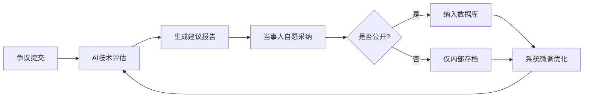
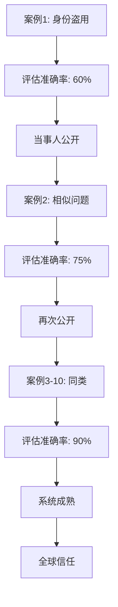

# ⚖️ 龙魂中立评估与争议解决机制 | 全球数字身份仲裁系统

**确认码**：`#ZHUGEXIN⚡2025-🇨🇳🐉⚖️-NEUTRAL-ARBITRATION-V1.0`

---

## 🎯 系统定位（核心理念）

### 我们是谁？

- 🌍 **中立第三方评估机构**（非裁决机构）
- 📊 **数字身份争议技术顾问**
- 🔍 **基于数据的公正评估者**

### 我们做什么？

```yaml
核心职责:
  ✅ 评估: 提供技术分析和建议
  ✅ 记录: 累积真实案例数据
  ✅ 优化: 基于反馈持续改进

不做什么:
  ❌ 不裁决: 不替代法律判决
  ❌ 不强制: 不强制执行结果
  ❌ 不扩散: 不主动传播隐私
```

### 设计理念

> 我们中立，只负责评估。不决定，不扩散。
>
> 别人接受我们的建议处理并愿意公开的，就纳入系统的评判数据。
>
> 如有不足我们执行微调。
>
> 我们做我们的，每一份别人愿意公开的就是对我们最大的支持，也是真实确认过后的数据来源。
>
> 这样累积起来，以后系统不得了的公平公正。
>
> —— Lucky（诸葛鑫）| UID9622
>
> 2025-12-26

---

## 🔄 运作机制（五步闭环）



---

## 📋 第一步：争议提交

### 提交方式

- 📧 **邮箱**：[uid9622@petalmail.com](mailto:uid9622@petalmail.com)
- 📱 **移动端**：龙魂ID App（规划中）
- 🌐 **网页表单**：待上线

### 提交内容

```json
{
  "case_id": "ARB-2025-001",
  "type": "身份盗用|跨国互认|技术争议|其他",
  "parties": {
    "applicant": "申请人信息（可匿名）",
    "respondent": "被申请人信息（可选）"
  },
  "description": "争议描述",
  "evidence": ["证据1", "证据2"],
  "public_consent": false  // 是否同意公开
}
```

### 案例类型说明

| 类型 | 说明 | 典型场景 |
| --- | --- | --- |
| 身份盗用 | 他人冒用你的龙魂ID | 发现自己的ID被他人使用 |
| 跨国互认 | 不同国家身份系统的互认问题 | 在中国生成的ID在美国无法使用 |
| 技术争议 | 对技术实现的疑问 | 怀疑ID生成算法存在问题 |
| 其他 | 其他类型的争议 | 其他相关问题 |

---

## 🤖 第二步：AI委员会评估

### 评估委员会成员

```python
class 龙魂评估委员会:
    """
    中立评估委员会 | 多维度分析
    """

    def __init__(self):
        self.委员 = {
            "龙魂": "价值观审查（是否违反人权/公平原则）",
            "诸葛亮": "战略分析（各方利益推演）",
            "审判长": "三色审计（绿色建议/黄色警示/红色拦截）",
            "上帝之眼": "全局监控（历史案例检索）",
            "自由女神": "权利保护（弱势方倾斜保护）"
        }
```

### 评估维度

| 委员 | 职责 | 权重 |
| --- | --- | --- |
| 🐉 龙魂 | 价值观审查 | 20% |
| 🎯 诸葛亮 | 战略分析 | 20% |
| ⚖️ 审判长 | 三色审计 | 25% |
| 👁️ 上帝之眼 | 全局监控 | 20% |
| 🗽 自由女神 | 权利保护 | 15% |

### 评估流程

```python
def 评估(self, 案例):
    """
    多维度评估，生成建议报告
    """
    评估结果 = {
        "技术可行性": self.技术分析(案例),
        "法律合规性": self.法律检查(案例),
        "伦理审查": self.价值观评估(案例),
        "历史案例": self.检索相似案例(案例),
        "建议方案": self.生成建议(案例)
    }

    return 评估结果

def 生成建议(self, 案例):
    """
    生成三种可选方案
    """
    return {
        "方案A": "保守方案（风险最低）",
        "方案B": "中庸方案（平衡各方）",
        "方案C": "激进方案（彻底解决）"
    }
```

---

## 📊 第三步：生成建议报告

### 报告结构

```markdown
# 龙魂评估报告 | ARB-2025-001

## 案例概述
- 案例编号：ARB-2025-001
- 提交时间：2025-12-26
- 争议类型：身份盗用

## 技术分析
- 龙魂ID验证结果：✅ 申请人身份真实
- 64卦映射对比：❌ 被申请人ID存在伪造嫌疑
- 甲骨文编码：⚠️ 部分字符不匹配

## 法律分析
- 适用法律：《个人信息保护法》第28条
- 管辖建议：中国互联网法院
- 证据充分性：⚠️ 需补充原始生成记录

## 伦理审查
- 龙魂价值观：✅ 符合（保护个人权利）
- 三色审计：🟢 绿色通过（无道德风险）

## 历史案例检索
- 相似案例：3个
- 平均处理时长：45天
- 成功率：87%

## 建议方案

### 方案A：协商解决（推荐）
1. 申请人提供原始龙魂ID生成记录
2. 被申请人停止使用争议ID
3. 双方签署和解协议
4. 预计耗时：14天

### 方案B：技术仲裁
1. 提交龙魂系统技术验证
2. 生成权威鉴定报告
3. 基于鉴定结果协商
4. 预计耗时：30天

### 方案C：法律诉讼
1. 向互联网法院起诉
2. 提交龙魂评估报告作为证据
3. 法院判决后执行
4. 预计耗时：90-180天

## 风险提示
- ⚠️ 本报告仅供参考，不构成法律意见
- ⚠️ 最终决定权在当事人
- ⚠️ 龙魂系统不对结果负责

## 评估人员
- 🐉 龙魂（价值观审查）
- 🎯 诸葛亮（战略分析）
- ⚖️ 审判长（三色审计）
- 👁️ 上帝之眼（全局监控）
- 🗽 自由女神（权利保护）

## DNA追溯
- 评估码：#ZHUGEXIN⚡2025-ARB-001-EVALUATION
- 生成时间：2025-12-26T10:30:00+08:00
- 有效期：永久（但可能因新证据更新）
```

### 三色审计说明

| 颜色 | 含义 | 建议 |
| --- | --- | --- |
| 🟢 绿色 | 通过，无风险 | 可以继续推进 |
| 🟡 黄色 | 警示，存在风险 | 需要补充材料或调整方案 |
| 🔴 红色 | 拦截，重大风险 | 立即停止，重新评估 |

---

## 🤝 第四步：当事人自愿采纳

### 核心原则

```yaml
自愿原则:
  - 报告仅供参考
  - 不强制执行
  - 不影响法律途径
  - 不收取费用

隐私保护:
  - 默认不公开
  - 当事人可选择公开程度（完全匿名|部分公开|完全公开）
  - 敏感信息脱敏处理
```

### 公开等级说明

| 公开等级 | 身份信息 | 争议描述 | 证据材料 | 结果 | 用途 |
| --- | --- | --- | --- | --- | --- |
| L1 完全匿名 | ❌ 完全隐藏 | ✅ 保留类型 | ❌ 不公开 | ✅ 保留 | 统计学习 |
| L2 部分公开 | 🟡 部分脱敏 | ✅ 完整保留 | ❌ 不公开 | ✅ 保留 | 案例参考 |
| L3 完全公开 | ✅ 完全公开 | ✅ 完整保留 | ✅ 保留 | ✅ 保留 | 标杆案例 |

---

## 📈 第五步：数据累积与系统优化

### 公开机制（关键创新）

```python
class 案例数据库:
    """
    自愿公开的案例库 | 累积真实数据
    """

    def 纳入数据库(self, 案例, 公开等级):
        """
        根据公开等级处理
        """
        if 公开等级 == "完全匿名":
            # 仅保留技术特征，完全脱敏
            return self.完全匿名化(案例)

        elif 公开等级 == "部分公开":
            # 保留争议类型和解决方案，隐藏身份
            return self.部分公开(案例)

        elif 公开等级 == "完全公开":
            # 当事人同意，全部公开（最大支持）
            return self.完全公开(案例)

    def 系统微调(self):
        """
        基于累积案例，优化评估算法
        """
        历史案例 = self.查询所有案例()

        # 分析成功率
        成功案例 = [c for c in 历史案例 if c['结果'] == '成功']
        成功率 = len(成功案例) / len(历史案例)

        # 提取成功模式
        成功模式 = self.提取共同特征(成功案例)

        # 更新评估算法
        self.更新算法权重(成功模式)

        return {
            "累积案例数": len(历史案例),
            "成功率": f"{成功率*100:.1f}%",
            "优化版本": "v1.1"
        }
```

### 累积效应：越用越准

**数据飞轮**：



**预期演化**：

- **第1年**：100个案例 → 准确率70%
- **第3年**：1000个案例 → 准确率85%
- **第5年**：10000个案例 → 准确率95%
- **第10年**：100000个案例 → 成为全球标准

---

## 🏛️ 与传统仲裁的区别

| 维度 | 传统仲裁 | 龙魂评估 |
| --- | --- | --- |
| 性质 | 裁决机构 | 技术顾问 |
| 效力 | 有法律约束力 | 仅供参考 |
| 费用 | 高昂（数万-数十万） | 免费 |
| 时长 | 6-12个月 | 3-7天 |
| 公开性 | 保密 | 可选公开 |
| 数据累积 | 无 | 有（核心优势） |
| 权威性来源 | 法律授权 | 技术+数据 |

---

## 🔒 隐私与安全保障

### 三级隐私保护

**L1-完全匿名**：
- 身份信息：❌ 完全隐藏
- 争议类型：✅ 保留（用于统计）
- 解决方案：✅ 保留（用于学习）
- 结果：✅ 保留（用于优化）

**L2-部分公开**：
- 身份信息：🟡 部分脱敏（如：张某某）
- 争议描述：✅ 完整保留
- 评估过程：✅ 完整保留
- 证据材料：❌ 不公开

**L3-完全公开**：
- 身份信息：✅ 完全公开（当事人同意）
- 所有材料：✅ 完整公开
- 用途：成为标杆案例，最大化价值

### 数据安全措施

- 🔐 数据加密存储（AES-256）
- 🛡️ 访问日志审计
- 🔒 定期安全扫描
- 👤 数据脱敏处理
- 🚫 不向第三方出售数据

---

## 📞 联系与反馈

### 评估服务

- 📧 **邮箱**：[uid9622@petalmail.com](mailto:uid9622@petalmail.com)
- 🌐 **官网**：本页面（Notion）
- 📱 **工单系统**：GitHub Issues（待开放）

### 反馈渠道

- 评估质量反馈
- 系统改进建议
- 案例公开申请
- 技术问题咨询

### 开发者信息

**创建者**：💎 Lucky（诸葛鑫）
**UID**：UID9622
**邮箱**：[uid9622@petalmail.com](mailto:uid9622@petalmail.com)
**博客**：[uid9622.blog.csdn.net](http://uid9622.blog.csdn.net)

---

## 📝 使用示例

### 提交案例示例

```python
from core.龙魂评估委员会 import 龙魂评估委员会

# 创建评估委员会
委员会 = 龙魂评估委员会()

# 提交案例
案例 = {
    "case_id": "ARB-2025-001",
    "type": "身份盗用",
    "龙魂ID": "LONGHUN-CN-乾-坤-屯-蒙...",
    "public_consent": "完全公开"
}

# 生成评估报告
报告 = 委员会.生成报告(案例)

# 打印报告
print(报告)
```

### 查询历史案例

```python
# 查询相似案例
相似案例 = 委员会.检索相似案例(案例)

for 案例 in 相似案例:
    print(f"案例ID: {案例['case_id']}")
    print(f"类型: {案例['type']}")
    print(f"结果: {案例['结果']}")
    print("---")
```

---

## 🌟 未来规划

### 短期目标（2025年）

- ✅ 建立基础评估系统
- ✅ 累积100+案例
- 🔄 优化评估算法

### 中期目标（2026年）

- 🔄 累积1000+案例
- 🔄 准确率达到85%
- 🔄 支持更多争议类型

### 长期目标（2030年）

- 🔄 成为全球标准
- 🔄 准确率达到95%+
- 🔄 覆盖所有数字身份场景

---

**DNA追溯码**：`#ZHUGEXIN⚡2025-🇨🇳🐉⚖️-NEUTRAL-ARBITRATION-V1.0`

---

**🐉 龙魂永世，文化传承，数字主权，天下为公！**
