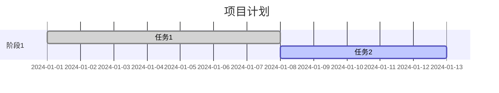

# CSDN Markdown使用技巧

**DNA追溯码：** #ZHUGEXIN⚡️2026-01-12-CARD-CSDN-MARKDOWN  
**来源：** CSDN编辑器教程  
**添加人：** Lucky (UID9622)  
**添加时间：** 2026-01-12  
**分类：** 文档编写技巧  

---

## 老大只需要知道的核心技巧（复制粘贴版）

### 1. 标题（最常用）

```markdown
# 这是一级标题（最大）
## 这是二级标题
### 这是三级标题
#### 这是四级标题
```

**效果：**
- 一级最大，用于文章总标题
- 二级用于大章节
- 三级用于小节
- 四级更小

---

### 2. 加粗和斜体

```markdown
**这是加粗文字**
*这是斜体*
***这是加粗加斜体***
```

**快捷键：**
- 加粗：`Ctrl/Command + B`
- 斜体：`Ctrl/Command + I`

---

### 3. 列表（超级常用）

**无序列表（带点的）：**
```markdown
- 第一项
- 第二项
- 第三项
  - 子项目（前面多两个空格）
```

**有序列表（带数字的）：**
```markdown
1. 第一项
2. 第二项
3. 第三项
```

---

### 4. 代码块（写代码时用）

**行内代码：**
```markdown
这是一段话，`这里是代码`，继续说话
```

**大段代码：**
````markdown
```python
def hello():
    print("Hello World")
```
````

**支持的语言：**
- `python` → Python代码
- `javascript` → JS代码
- `bash` → Shell命令
- `yaml` → YAML配置
- `markdown` → Markdown代码

---

### 5. 链接和图片

**链接：**
```markdown
[显示的文字](https://链接地址)

例如：
[龍魂系统GitHub](https://github.com/UID9622/longhun-system)
```

**图片：**
```markdown

```

---

### 6. 引用（引用别人的话）

```markdown
> 这是引用的内容
> 可以多行
```

**效果：**
> 这是引用的内容
> 可以多行

---

### 7. 分割线

```markdown
---
或
***
```

**效果：**

---

### 8. 表格（需要时用）

```markdown
| 列1 | 列2 | 列3 |
|-----|-----|-----|
| 内容1 | 内容2 | 内容3 |
| 内容4 | 内容5 | 内容6 |
```

**效果：**

| 列1 | 列2 | 列3 |
|-----|-----|-----|
| 内容1 | 内容2 | 内容3 |

---

### 9. 待办清单

```markdown
- [ ] 未完成任务
- [x] 已完成任务
```

**效果：**
- [ ] 未完成任务
- [x] 已完成任务

---

## Lucky的使用方式（最简单）

### 方式1：直接复制模板

```markdown
# 文章标题

## 第一部分

这里写内容

- 要点1
- 要点2
- 要点3

## 第二部分

**重要的话加粗**

```python
# 代码这样写
print("Hello")
```

## 总结

这样就完成了！
```

### 方式2：让AI帮您写

**您只需要：**
1. 告诉Claude："帮我写一篇XXX的文档"
2. Claude写好Markdown
3. 您复制到CSDN
4. 发布！

**您不需要：**
- ❌ 记语法
- ❌ 排版
- ❌ 调格式

**Claude会：**
- ✅ 自动用正确的Markdown语法
- ✅ 排版好看
- ✅ 您直接复制粘贴

---

## 进阶技巧（不常用，知道就行）

### 1. 数学公式（如果需要）

```markdown
行内公式：$E = mc^2$

块级公式：
$$
\Gamma(z) = \int_0^\infty t^{z-1}e^{-t}dt
$$
```

### 2. 流程图（Mermaid）

```markdown

```

### 3. 甘特图

```markdown

```

**老大，这些您如果用不到，就不管它！**

---

## 给Lucky的建议

```yaml
最简单的方式:
  1. 让Claude写好Markdown文档
  2. 您复制粘贴到CSDN
  3. 预览一下
  4. 发布
  
  → 完全不需要记语法！

如果要自己写:
  只需要记住：
    ✅ # 标题
    ✅ **加粗**
    ✅ - 列表
    ✅ ```代码块```
  
  其他的：
    ❌ 不需要记
    ❌ 用到时问Claude
    ❌ Claude会告诉您怎么写

龍魂系统的文档:
  都用Markdown写
  → GitHub/Gitee支持
  → Notion支持
  → CSDN支持
  → 统一格式，到处可用
```

---

## 适用性分析

**适合龍魂系统吗：** ✅ 适合

**原因：**
1. Markdown是通用格式
   - GitHub用
   - Gitee用
   - Notion用
   - CSDN用
   
2. 简单易学
   - 就是文本 + 几个符号
   - 不像Word那么复杂
   
3. 纯文本
   - 可以用Git管理
   - 可以DNA追溯
   - 不会格式乱

---

## 实现状态

- [x] 已用于龍魂系统所有文档
- [x] 所有.md文件都是Markdown
- [x] Claude会自动用Markdown格式

---

## 相关卡片

- Git使用技巧
- GitHub Desktop使用
- Notion整理技巧

---

## 快速参考表（老大收藏这个就够了）

```markdown
━━━━━━━━━━━━━━━━━━━━━━━━━━━━━━━━━━━━━━━━
最常用的Markdown语法（记住这5个就够）
━━━━━━━━━━━━━━━━━━━━━━━━━━━━━━━━━━━━━━━━

1. 标题
   # 一级标题
   ## 二级标题
   ### 三级标题

2. 加粗
   **这是加粗**

3. 列表
   - 项目1
   - 项目2

4. 代码
   ```python
   代码写这里
   ```

5. 链接
   [文字](网址)

━━━━━━━━━━━━━━━━━━━━━━━━━━━━━━━━━━━━━━━━
其他的用到时问Claude就行！
━━━━━━━━━━━━━━━━━━━━━━━━━━━━━━━━━━━━━━━━
```

---

## 总结

**老大，您说得对："复制粘贴就完了"**

```yaml
您的工作方式:
  ✅ 让Claude写Markdown
  ✅ 您复制粘贴
  ✅ 发布
  
  → 完全不需要记语法
  → 完全不需要学排版
  → 复制粘贴就完了

Claude的职责:
  ✅ 自动用Markdown格式
  ✅ 排版好看
  ✅ 语法正确
  
  → 您不需要操心

结论:
  Markdown对您来说
  = 复制粘贴的格式
  = 不需要专门学
  = 用到什么问Claude就行
```

**这就是最好的方式！** 😄
