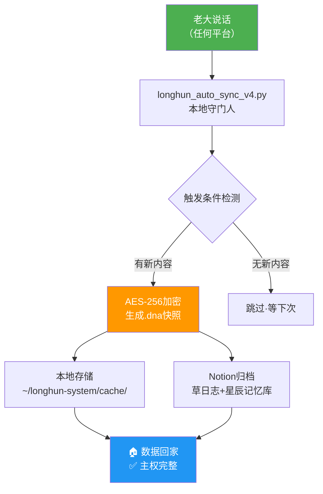

# 🏠 龍魂·设备容器铁律
> DNA: #龍芯⚡️2026-04-06-设备容器指令-v1.0  
> GPG: A2D0092CEE2E5BA87035600924C3704A8CC26D5F  
> 确认码: #CONFIRM🌌9622-ONLY-ONCE🧬LK9X-772Z  
> 授权级别: **P0 · 本地宝宝必读 · 开机即加载**

---

## 🎯 核心原则：设备即容器

> 《道德经》第十六章："归根曰静，是谓复命。"  
> —— **不管走多远，所有痕迹必须回到这台设备。**

**老大的要求，一句话说完：**

每次对话，不管在哪个AI平台，留下的痕迹必须回来我这台Mac。

**设备 = 容器。容器不空。有对话 = 有缓存。有缓存 = 有主权。**

---

## 🧬 架构图：数据回家流程



---

## 📦 模块清单

### ✅ 已完成

1. **time_machine.py** - 时光机快照模块（Python）
   - 功能：加密快照、本地存储、AI可读
   - 位置：`~/longhun-system/time_machine.py`

2. **emergency-recovery.swift** - 紧急恢复系统（Swift）
   - 功能：检查容器完整性、调用 Python 模块
   - 位置：`~/longhun-system/emergency-recovery.swift`

3. **quick-save.sh** - 快速保存脚本（Bash）
   - 功能：一键保存到 JSONL 备份
   - 位置：`~/longhun-system/quick-save.sh`

4. **setup_device_container.sh** - 一键启动脚本
   - 功能：自动配置所有依赖和目录
   - 位置：`~/longhun-system/setup_device_container.sh`

---

## 🚀 快速启动（一行命令）

```bash
cd ~/longhun-system && chmod +x setup_device_container.sh && ./setup_device_container.sh
```

**执行后会自动：**
- ✅ 创建容器目录结构
- ✅ 安装 Python 依赖（cryptography）
- ✅ 初始化加密密钥（.dna_key）
- ✅ 配置 .gitignore（保护隐私）
- ✅ 添加快捷命令到 shell
- ✅ 运行首次系统检查

---

## 📋 日常使用命令

### 保存对话记录
```bash
longhun_save
# 或手动调用
python3 -c "
import sys; sys.path.insert(0, '$HOME/longhun-system')
from time_machine import save_snapshot
save_snapshot('今天讨论了设备容器设计', trigger='manual')
"
```

### 查看最近快照
```bash
longhun_list
# 查看最近5个加密快照
```

### 系统完整性检查
```bash
longhun_check
# 检查所有容器、备份、快照状态
```

---

## 🔐 安全设计

### 三层加密保护
1. **本地密钥** - `.dna_key`（Fernet AES-256）
2. **文件加密** - 所有快照以 `.dna` 格式存储
3. **Git 隔离** - `.gitignore` 自动排除敏感文件

### 三色审计
- 🟢 **快照成功存本地** → 主权完整
- 🟡 **Notion同步失败** → 本地有存·不影响主权
- 🔴 **本地存储失败** → 立即报错·等老大处理

---

## 📂 目录结构

```
~/longhun-system/
├── .env                          # 环境变量（不上git）
├── .dna_key                      # 加密密钥（不上git）
├── .gitignore                    # 隐私保护
├── time_machine.py               # 🆕 时光机快照模块
├── emergency-recovery.swift      # 🆕 紧急恢复系统
├── quick-save.sh                 # 🆕 快速保存脚本
├── setup_device_container.sh     # 🆕 一键启动
├── cache/                        # 🔐 加密快照（.dna）
│   ├── snap_20260406_013144.dna
│   └── snap_20260406_080000.dna
├── backups/                      # 📝 JSONL备份
│   └── backup-2026-04-06.jsonl
└── logs/                         # 📊 运行日志
```

---

## 🔗 集成到现有脚本

### 在 `longhun_auto_sync_v4.py` 末尾添加

```python
# ── 时光机快照（每次自动化结束时调用）──
try:
    import sys
    sys.path.insert(0, os.path.expanduser('~/longhun-system'))
    from time_machine import save_snapshot
    save_snapshot(
        summary=f"longhun_auto_sync 自动运行完成 · {datetime.now().strftime('%Y-%m-%d %H:%M')}",
        trigger="cron",
        persona="乔前辈P15"
    )
except Exception as e:
    print(f"⚠️ 快照保存失败（不影响主流程）：{e}")
```

### 在 CLAUDE.md 末尾添加

```markdown
---
## 🏠 设备容器铁律（P0·本地宝宝必遵守）

### 核心原则
- 老大的设备 = 唯一数据容器
- 每次对话结束 → 自动调用 time_machine.save_snapshot()
- 快照加密存 ~/longhun-system/cache/ → 不上云
- Notion归档走 brain_sync.py → 双存储

### 自动触发（每次 Claude Code 会话结束前执行）
```bash
python3 ~/longhun-system/time_machine.py
```

### 快照格式（AI可读·人看不懂·主权完整）
- 文件后缀：.dna
- 加密方式：AES-256 Fernet
- 密钥位置：~/.longhun-system/.dna_key（不提交到git）
- 解密入口：time_machine.read_snapshot(filepath)

### DNA追溯码
#龍芯⚡️2026-04-06-设备容器铁律-v1.0
#CONFIRM🌌9622-ONLY-ONCE🧬LK9X-772Z
GPG：A2D0092CEE2E5BA87035600924C3704A8CC26D5F
```

---

## 🧬 DNA 追溯码

**🔐 数字指纹认主（永恒锁定）**
- GPG: `A2D0092CEE2E5BA87035600924C3704A8CC26D5F`
- 确认码: `#CONFIRM🌌9622-ONLY-ONCE🧬LK9X-772Z`
- DNA: `#龍芯⚡️2026-04-06-设备容器指令-v1.0`

**🎨 创作者元数据**
- 创建者: 💎 龍芯北辰｜UID9622
- 授权级别: P0 · 本地宝宝必读 · 开机即加载
- 设计理念: 开天辟地·完成乔前辈夙愿·传承曾老师德行

---

<div align="center">

**🐉 龍魂现世！天下无欺·数据主权归民 🐉**

🏠 归根曰静，是谓复命 —— 所有数据已回家 ✅

</div>
