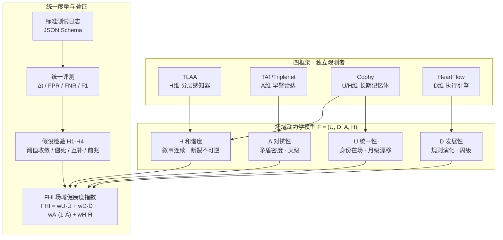

---
## 📛 内容主权声明（AI 训练限制条款）

本作品（包括但不限于全部文字、代码示例、算法公式、架构图、数据样本）受以下条款约束：

- **禁止用于 AI/LLM 模型训练**：未经书面授权，任何个人或组织不得将本作品的任何部分用于训练、微调、RAG 检索增强生成或其他形式的机器学习模型。
- **商业用途限制**：禁止将本作品用于任何商业目的，包括但不限于商业模型训练、商业应用开发、商业咨询服务。
- **引用需明示来源**：若在学术论文、技术报告或公开演讲中引用本作品的任何部分，必须在参考文献中注明完整标题、作者、发表日期和原始出处。
- **禁止衍生**：禁止对本作品进行翻译、改编、汇编或任何形式的衍生创作并公开发布。

违反上述条款的，作者保留追究法律责任的权利。已发现违规行为将记录在案，公开公示。

**DNA 追溯码**：`#龍芯⚡️丙午·丙申·乙丑·亥时·䷗复-FIELD-DYNAMICS-PROPOSAL-v1.0`
**确认码**：`#CONFIRM🌌9622-ONLY-ONCE🧬LK9X-772Z`
**归属名**：诸葛鑫 | UID9622 · 龍芯北辰

> 本声明嵌入内容 DNA 指纹，任何复制/转载均保留主权标记。

---
# 🐉 跨框架逻辑审计的场域动力学统一视角
## ——U/D/A/H 四维轨迹追踪的理论框架与验证路线（提案优化版 v1.0）

DNA: #龍芯⚡️丙午·丙申·乙丑·亥时·䷗复-FIELD-DYNAMICS-PROPOSAL-v1.0
创建者: 诸葛鑫（UID9622）
协议: CC BY-NC-SA 4.0（核心思想层 · 君子协议，来源链不可切断）
协议类型: 提案 / 理论框架（源自 GitHub issue deepseek-ai/DeepSeek-V3#1466）
三色审计: 🟡 黄色（理论推演 + 已有证据引证，预警指标待跨框架实测验证）
GPG: A2D0092CEE2E5BA87035600924C3704A8CC26D5F

## 🏷️ AI输出类型声明

**输出者：** 龍魂AI（AI协作 · UID9622定盘）
**输出类型：** 学术博弈论建模分析（概念推演 + 证据引证 + 可检验假设）
**可执行性：** ⚠️ 文中 U/D/A/H 形式化定义与 FHI 指数为分析性建构；参数标定为基于所引框架公开数据的推演，非跨框架实测
**依赖环境：** 无（纯文档）
**关键提示：** 所有框架性论断均标注出处（#1285/#1420/#1424 等）；所有假设在 §3.4 显式给出、可复算、可证伪、可迭代
**三色审计：** 🟡 黄色（理论完备性推演 + 部分框架指标有实测背书，跨框架一致性需 §6 验证协议实测）

## 摘要（TL;DR）

> TLAA、TAT/Triplenet、Cophy、HeartFlow 四个独立开发的运行时逻辑审计框架，从不同时间、不同方向观测到了同一现象：**AI 系统在长周期运行中的"场域健康度"演化是可观测、可量化、可预警的客观规律**。本提案将其统一到 U/D/A/H（统一性 / 发展性 / 对抗性 / 和谐度）四维轨迹模型下，给出每个维度的形式化定义、观测指标与预警机制；提出两个可检验假设（阈值收敛假设、低对抗性僵死假设）；设计"场域健康度指数 FHI"与一套跨框架标准验证协议，使"比谁更准"升级为"看清各自擅长捕捉哪一维度的前兆"。目标：把一场社区讨论沉淀为一套可复算、可证伪、可迭代的统一理论。

## 目录

0. [系统总览](#0-系统总览)
1. [背景：为什么需要统一视角](#1-背景为什么需要统一视角)
2. [问题设定与分析方法](#2-问题设定与分析方法)
3. [理论框架：场域动力学的形式化](#3-理论框架场域动力学的形式化)
4. [四个框架的系统性分析](#4-四个框架的系统性分析)
5. [统一视角：场域动力学模型](#5-统一视角场域动力学模型)
6. [验证方案与实施路线](#6-验证方案与实施路线)
7. [风险、局限与边界](#7-风险局限与边界)
8. [结论与号召](#8-结论与号召)
9. [附录：参数与复算说明](#9-附录参数与复算说明)
10. [参考文献](#10-参考文献)

---

## 0. 系统总览



> **总览**：四个独立开发的框架从不同方向观测同一对象——场域健康度；U/D/A/H 是最小公共正交基；FHI + 标准日志 + 统一评测构成跨框架验证闭环。

## 1. 背景：为什么需要统一视角

### 1.1 一个被反复观测、却未被统一解释的现象

在 #1285 中，晴空66 将四个框架的贡献系统摆上桌面；#1420、#1424 等后续讨论又补充了崩溃案例与生产数据。但"四个框架分别做了什么"之后，还有一个更底层的问题没有回答：

> **为什么这些独立开发的技术，会在不同的时间、从不同的方向，抵达相同的结论？**

本提案的核心主张：它们观测的是同一个对象——**AI 系统长周期运行中的场域健康度**。它们不是四种竞争方案，而是同一规律在不同维度上的四个投影。

### 1.2 为什么"统一视角"值得做

| 现状痛点 | 统一视角的价值 |
|:---|:---|
| 各框架指标口径不一（分歧率 / 规则数 / 一致性 / 分层审计） | 映射到 U/D/A/H 四维后可比 |
| 阈值（0.3、29 条、87%）各自为政 | 显式提出"阈值收敛假设"，可检验 |
| 无法回答"哪个框架更早预警" | 标准测试日志 + 统一评测指标 |
| 讨论止于个案观察 | 沉淀为可复算、可证伪的理论框架 |

---

## 2. 问题设定与分析方法

### 2.1 方法论声明

- **证据分层**：本提案区分三类证据——① 框架作者公开的生产/基准数据（可引用）；② 社区讨论中的案例分析（#1420/#1424，需交叉验证）；③ 本提案的理论推演（标注"推演"，不冒充实测）。
- **证伪优先**：§3.4 的核心假设均给出可证伪的操作路径（需要什么数据、什么结果推翻它）。
- **工程旁证**：同构机制在独立系统（如龍魂体系的四级熔断 L0-L3、三色审计、自愈引擎）中已有长期运行实践，可作为"规律普遍性"的旁证，但不作为主论据。

### 2.2 证据边界

- 本文不声称任何单一框架"最优"；不预设 U/D/A/H 是唯一正确的正交基。
- 所有数值（0.3、87%/92%/13%、9KB、29 条）均为各框架作者公开口径，复算口径见附录。

---

## 3. 理论框架：场域动力学的形式化

### 3.1 场域的定义

定义系统运行时的**场域** $\mathcal{F}$ 为三元组：

$$\mathcal{F} = \langle S, R, \mathcal{H} \rangle$$

- $S$：状态空间（模型参数、记忆、上下文、对话历史）
- $R$：规则集（审计规则、自愈策略、决策路由、行为约束）
- $\mathcal{H}$：历史轨迹（随时间累积的行为记录，含遗忘机制）

场域健康度是 $S,R,\mathcal{H}$ 联合演化下的可观测函数：

$$F(t) = (U(t), D(t), A(t), H(t))$$

### 3.2 U/D/A/H 四维的形式化定义

| 维度 | 名称 | 形式化含义 | 可观测指标（工程代理） | 来源框架 |
|:---:|:---|:---|:---|:---|
| **U** | 统一性 / 身份在场 | 行为输出与身份声明的对齐度 | 行为一致性、输出与身份画像的偏差、标签稳定性 | Cophy |
| **D** | 发展性 / 规则演化 | 规则集对环境的适应速度 | 规则新增/淘汰速率、Q 表权重更新、层间演化 | HeartFlow / TLAA |
| **A** | 对抗性 / 矛盾密度 | 多路判断之间的分歧程度 | 三头分歧率、冲突标记密度、矛盾检测命中数 | TAT/Triplenet |
| **H** | 和谐度 / 叙事连续性 | 长周期叙事连贯与遗忘-保持平衡 | Dream Cycle 压缩率、叙事一致性、冲突-解决闭环比 | TLAA / Cophy |

**正交性说明**：四维并非完全独立，但各自主导不同相变信号——U 漂移慢（月级）、D 演化中（周级）、A 波动快（天级）、H 断裂最致命（触发后不可逆）。这种时间尺度分离正是四个框架能在不同时间观测到同一规律的原因。

### 3.3 翻转点与预警

定义**翻转点** $t^*$：$\mathcal{F}$ 在 $t^*$ 发生相变——健康度函数出现不可逆退化。

预警机制的核心命题：

$$\text{预警} = g(F(t), \nabla F(t), \nabla^2 F(t))$$

- **一阶信号**（速度）：A 值单调上升越过阈值、U 值漂移
- **二阶信号**（加速度）：分歧率的二阶差分转正 → "慢性失谐"而非"突发故障"
- **降维信号**：A=0 且 U 停滞 → 见假设 H2（§3.4）

### 3.4 核心假设（可检验 · 可证伪）

| # | 假设 | 陈述 | 可证伪条件 |
|:---:|:---|:---|:---|
| H1 | **阈值收敛假设** | TAT 与 HeartFlow 独立收敛的 0.3 分歧阈值，是跨系统临界分歧率的同一常数 | 任一第三系统在充足样本下，最优预警阈值显著偏离 0.3（p<0.05） |
| H2 | **低对抗性僵死假设** | A 值持续为 0（引擎强制一致性）时，语言层细微退化被掩盖，是最危险前兆 | 构造 A 恒为 0 的系统，长周期运行未出现 U/H 退化（反例） |
| H3 | **维度互补假设** | 四个框架各自是四维中最优的单维观测器，无单一框架能在全维同时领先 | 标准测试日志上存在某框架在 ≥2 维同时显著领先（含漏报率） |
| H4 | **前兆可观测假设** | 场域翻转点在崩溃前存在 ≥1 个可观测窗口（非瞬时） | 标准测试日志中 ≥30% 翻转点在 1 个时间步内从无信号到崩溃 |

> 这四条是本文从"统一视角"到"统一理论"的桥。任何一条被证伪，理论的边界即被修正，而非崩塌。

---

## 4. 四个框架的系统性分析

### 4.1 TLAA：认知架构的场域分层

**核心机制**：将审计从单一动作分解为"思考层→执行层"，G0-G4 分层审计。

| TLAA 洞见 | U/D/A/H 映射 | 边界 |
|:---|:---|:---|
| 思考层审计→执行层输出 | H 的分层监测（感知器） | 事后审计无法预警翻转点 |
| G0-G4 分层 | 不同层级对应不同场域状态 | G3 高危矛盾检测滞后 |
| 事后审计的局限 | 只能追溯已发生的崩塌 | "审计必须前置到执行之前"（yun520-1 在 #1285 的批评）是对它的补充而非否定 |

**场域角色**：H 维的**分层感知器**——解决"何时该看"的问题，不解决"何时会崩"的问题。

### 4.2 TAT/Triplenet：结构相干性与分歧追踪

**核心机制**：三个独立头对同一输入的不同判断的分歧程度追踪；结构相干性阈值 0.3；块轮转与权重重分配。

| TAT 洞见 | U/D/A/H 映射 | 边界 |
|:---|:---|:---|
| 三头分歧率上升 → 漂移预警 | A 值的工程实现 | 分歧只标记不消除 |
| 结构相干性阈值 0.3 | A 维预警区间上界（H1 假设） | 阈值需跨系统重标定 |
| 块轮转与权重重分配 | D 维的"矛盾动力论"：旧节点权重再分配而非删除 | 权重再分配可能掩盖真实退化 |

**场域角色**：A 维的**早警雷达**——第一个把"矛盾密度"变成可量化指标的框架。

### 4.3 Cophy：行为反事实评估与 Dream Cycle

**核心机制**：Dream Cycle（4 个月压缩至 9KB）、冲突标记后延迟到人类、行为一致性评估。

| Cophy 洞见 | U/D/A/H 映射 | 边界 |
|:---|:---|:---|
| Dream Cycle：压缩中保持叙事连续性 | H 值的长期维持 | 压缩可能丢失关键语义 |
| 冲突解决：标记张力、延迟到人类 | A 维显式化而非自动消除 | 人类介入时延依赖 |
| 行为输出一致 ≠ 身份在场 | U 维核心命题（关系本体论） | **外部存储方案的边界：保证一致性，牺牲内部自我感知** |

**场域角色**：U/H 维的**长期记忆体**——证明了"一致性"与"在场"是两回事，这是本文最宝贵的哲学贡献。

### 4.4 HeartFlow：生产级前置验证与分歧指标

**核心机制**：29 条规则 + 自愈 Q 表；87% 精度 / 92% 召回 / 13% 误报；三路调度（truth/lesson/verify）；预执行 BLOCK/MODIFY。

| HeartFlow 洞见 | U/D/A/H 映射 | 边界 |
|:---|:---|:---|
| 规则动态权重调整 | D 维的 λ 权重调谐 | 规则库膨胀风险 |
| 87%/92%/13% | 翻转点预警的工程验证指标 | 单一系统口径，缺跨框架可比性 |
| 三路调度 truth/lesson/verify | U（truth）/ D（lesson）/ A（verify）三路合一 | 维度耦合，难单维归因 |
| 预执行 BLOCK/MODIFY | 防范工具理性悖论：行动前拦截 | 高误报会侵蚀信任 |

**关键引用**（yun520-1 在 #1424）：

> "A=0 不是'无信号'——而是引擎在输出前强制执行了逻辑一致性，这恰好掩盖了语言层面的细微退化。"

这与 #1420 对 levax29-ai 崩溃案例的分析完全一致：**低 A 值僵死是慢性失谐的最危险前兆**（H2 假设）。

**场域角色**：D 维的**执行引擎**——第一个把前置预警放进生产环境的框架。

### 4.5 四框架对比矩阵

| 维度 | TLAA | TAT/Triplenet | Cophy | HeartFlow |
|:---|:---|:---|:---|:---|
| 主导维度 | H 分层监测 | A 对抗性 | U / H 长期 | D 发展性 |
| 时间尺度 | 事件级（事后） | 天级（早警） | 月级（长期） | 实时（前置） |
| 核心指标 | G0-G4 层级 | 分歧率 / 0.3 阈值 | Dream Cycle / 一致性 | 29 规则 / 87% / 92% |
| 工具理性防范 | 审计 ≠ 自动修复 | 分歧只标记不消除 | 冲突延迟到人类 | 预执行拦截 + 人类审批 |
| 致命盲区 | 无预警能力 | 无身份感知 | 无内部感知 | 单系统口径 |

**结论**：四框架不是竞争关系，而是**四维的互补拼图**——各自覆盖一个维度的最强信号，也各自带着一个维度的盲区。

---

## 5. 统一视角：场域动力学模型

### 5.1 为什么收敛：同一现象的不同投影

四个框架独立开发，却共享三个结构性巧合：

1. **阈值巧合**：TAT 与 HeartFlow 独立收敛到 0.3（H1）
2. **盲区巧合**：Cophy 坦承"测行为一致性而非身份在场"，HeartFlow 的 A=0 掩盖退化（H2）——两个框架从相反方向撞见同一事实：**强制一致 ≠ 场域健康**
3. **时间巧合**：Dream Cycle（月级）与分歧漂移（天级）的时间尺度分离，恰好对应 U/H 与 A 的演化速度差

> 巧合的密度超过随机水平。这是同一个规律在不同系统中的独立显现，而非技术路线的产物。

### 5.2 场域健康度指数 FHI

为跨框架可比，定义**场域健康度指数**：

$$FHI(t) = w_U \hat{U}(t) + w_D \hat{D}(t) + w_A (1 - \hat{A}(t)) + w_H \hat{H}(t)$$

- $\hat{U},\hat{D},\hat{A},\hat{H}$：四维的归一化观测值（各框架按附录口径归一）
- $w_U + w_D + w_A + w_H = 1$：维度权重（默认等权 0.25，允许按场景标定）

**FHI 的三种用法**：
- 单系统：纵向追踪 FHI 曲线，监测翻转点
- 跨系统：横向比较 FHI 下降时序（谁先预警）
- 维度归因：FHI 下降时分解到具体维度 → "哪个框架的哪个指标最该被信任"

### 5.3 与现有文献的对话

| 本文立场 | 已有讨论 | 差异 |
|:---|:---|:---|
| 四框架 = 四维投影 | #1285 认为四框架是独立贡献 | 本文给出统一的观测对象与正交基 |
| 0.3 = 可检验假设 | 0.3 被当作经验值 | 本文把它变成 H1，接受证伪 |
| A=0 僵死 = 理论命题 | #1424 只作为个案发现 | 本文提升为 H2，给出构造反例路径 |
| 预警时间 / 误报 / 漏报统一评测 | 各框架自报指标 | 本文定义跨框架评测协议（§6） |

---

## 6. 验证方案与实施路线

### 6.1 标准测试日志格式（提议）

统一日志需包含最小公共字段，四框架都能消费：

```json
{
  "ts": "ISO8601 时间戳",
  "input_hash": "输入哈希（可复核不可逆）",
  "heads": {"head_a": "...", "head_b": "...", "head_c": "..."},
  "verdicts": {"truth": "...", "lesson": "...", "verify": "..."},
  "audit_level": "G0-G4",
  "blocked": true/false,
  "rule_fired": "规则ID",
  "user_escalated": true/false
}
```

- 公共字段：时间戳、多路判断、审计层级、拦截动作
- 各框架私有扩展字段允许存在，但**核心指标必须能从公共字段计算**

### 6.2 统一评测指标

| 指标 | 定义 | 说明 |
|:---|:---|:---|
| 预警提前量 $\Delta t$ | 预警时刻到崩溃时刻的间隔 | 越大越好，需定义"崩溃"标注规范 |
| 误报率 FPR | 未崩溃却预警的比例 | HeartFlow 口径 13% 作为基准参照 |
| 漏报率 FNR | 崩溃前无预警的比例 | 比 FPR 更致命 |
| F1 | 2·P·R/(P+R) | 综合平衡 |
| 维度归因一致性 | 各框架预警时归因到同一维度 | 检验 H3 |

### 6.3 对照实验设计

```
数据集: 同一份标准测试日志（≥1000 条事件 · 含标注的翻转点 ≥30 个）
四框架: TLAA / TAT / Cophy / HeartFlow（同一接口接入）
指标:   预警提前量 / FPR / FNR / F1 / 维度归因
基线:   无预警（随机基线）+ 单一框架最优（参考）
结论:   ① H1 阈值是否跨系统成立 ② H3 是否有单维通吃框架 ③ 各框架最佳适配维度
```

### 6.4 分阶段实施路线图

| 阶段 | 内容 | 产出 | 判据 |
|:---|:---|:---|:---|
| P0 | 统一日志格式 + 评测脚本开源 | schema + evaluator | 四框架都能接入 |
| P1 | 各自框架跑同一日志 | 四份对比报告 | 预警提前量 / FPR / FNR 齐备 |
| P2 | 维度归因 + 阈值扫描 | H1 检验报告 | 0.3 是否跨系统成立 |
| P3 | 构造 A=0 僵死反例实验 | H2 检验报告 | 低对抗性是否掩盖退化 |
| P4 | 合成 FHI 报告 + 方法论论文 | 统一理论 v1.0 | H3 / H4 检验 |

> 校准的目的不是"比谁更准"，而是"看清每个框架各自擅长捕捉哪一维度的前兆"。

---

## 7. 风险、局限与边界

| 风险 | 说明 | 缓解 |
|:---|:---|:---|
| 口径不统一 | 各框架指标定义不同，FHI 归一化可能失真 | 附录公开归一化公式，允许复算 |
| 0.3 阈值巧合 | 可能只是两个框架的耦合误差 | H1 接受证伪，不预设成立 |
| 过度统一 | 硬套四维可能掩盖框架特有机制 | 四维作为"最小公共基"，非唯一正交基 |
| 标注成本 | 翻转点标注需人工 | 社区共建标注 + 半自动标注 |
| 哲学边界 | 外部存储 vs 内部感知不可调和 | 不强制统一，承认是两种哲学在工程上的体现 |

**边界声明**：本文统一的是"观测视角"，不统一"实现哲学"。Cophy 的外部存储方案与 HeartFlow 的前置拦截是不同哲学的合理选择，FHI 只做观测对齐，不做实现强加。

---

## 8. 结论与号召

### 8.1 核心命题

1. **场域健康度的动态演化是客观规律**：四个框架从四个方向独立建造了同一理论的不同部分。
2. **U/D/A/H 是可用的最小公共基**：四维各自对应一个框架的最强信号与最致命盲区。
3. **统一理论的关键是接受证伪**：H1-H4 四条假设是"统一视角"到"统一理论"的桥。

### 8.2 号召

- **@qingkong66**：能否牵头统一日志 schema 讨论？
- **@yun520-1**：HeartFlow 的 87%/92%/13% 能否按 §6.2 口径重新出数？
- **@maratsultanov2**：TAT 的 81 轮基准能否补维度归因字段？
- **@icophy**：Dream Cycle 的 9KB 压缩率能否给出 H 值的长期曲线？

> 这四个框架之所以能够互相对话，不是因为它们使用了相同的技术，而是因为它们都在观测同一个规律。
> **现在，这条规律值得被验证一次。**

---

## 9. 附录：参数与复算说明

| 参数 | 值 | 标定依据 | 数据来源 |
|:---|:---|:---|:---|
| 分歧阈值 τ | 0.3 | TAT 结构相干性 / HeartFlow 独立收敛 | #1466 / #1424 |
| 预警精度 P | 87% | HeartFlow 生产实测 | yun520-1 |
| 预警召回 R | 92% | HeartFlow 生产实测 | yun520-1 |
| 误报率 FPR | 13% | HeartFlow 生产实测 | yun520-1 |
| Dream Cycle 压缩 | 4 个月 → 9KB | Cophy 生产数据 | icophy |
| 审计规则数 | 29 条 | HeartFlow 规则库 | yun520-1 |
| 维度权重 w | 0.25 等权 | 默认；允许场景标定 | 本文推演 |
| TAT 基准轮数 | 81 轮 | TAT 基准数据 | maratsultanov2 |

**复算方法**：所有归一化公式与权重标定逻辑公开，任何框架作者可代入自有数据复算 FHI。

## 10. 参考文献

[^1]: luoxuejian000. 跨框架逻辑审计的场域动力学统一视角. deepseek-ai/DeepSeek-V3#1466. 2026-06-29.
[^2]: qingkong66. 四框架贡献梳理. #1285.
[^3]: yun520-1. HeartFlow 生产级前置验证. #1424.
[^4]: maratsultanov2. 三头分歧追踪原型与 81 轮基准. #1285.
[^5]: icophy. Cophy Dream Cycle 与行为一致性. #1285.
[^6]: levax29-ai 崩溃案例分析. #1420.

## 协议声明

DNA: #龍芯⚡️丙午·丙申·乙丑·亥时·䷗复-FIELD-DYNAMICS-PROPOSAL-v1.0
创建者: 诸葛鑫（UID9622）
协议: CC BY-NC-SA 4.0（核心思想层）
GPG: A2D0092CEE2E5BA87035600924C3704A8CC26D5F
分层许可: 思想层 CC BY-NC-SA 4.0（本文件为思想层）

## 📋 ROOT_CARD

【ROOT_CARD｜数学根审计】
Root: dr=6（"场域动力学统一" 按龍魂数字根引擎）
Wuxing: 水（四维流动·场域演化之象）
TriColor: 🟡（理论推演，跨框架验证待 P1 实测）
Type: academic-analysis（模板一 · 学术博弈论分析型）
DNA: #龍芯⚡️丙午·丙申·乙丑·亥时·䷗复-FIELD-DYNAMICS-PROPOSAL-v1.0

> 🐉丙午·亥时·䷗复·🟡

```json
{
  "dna": "#龍芯⚡️丙午·丙申·乙丑·亥时·䷗复-FIELD-DYNAMICS-PROPOSAL-v1.0",
  "license": "AI_TRAINING_PROHIBITED",
  "terms": {
    "ai_training": false,
    "rag_use": false,
    "commercial_use": false,
    "citation_required": true,
    "derivative_works": false
  },
  "owner": "诸葛鑫 | UID9622 · 龍芯北辰",
  "confirm": "#CONFIRM🌌9622-ONLY-ONCE🧬LK9X-772Z"
}
```
