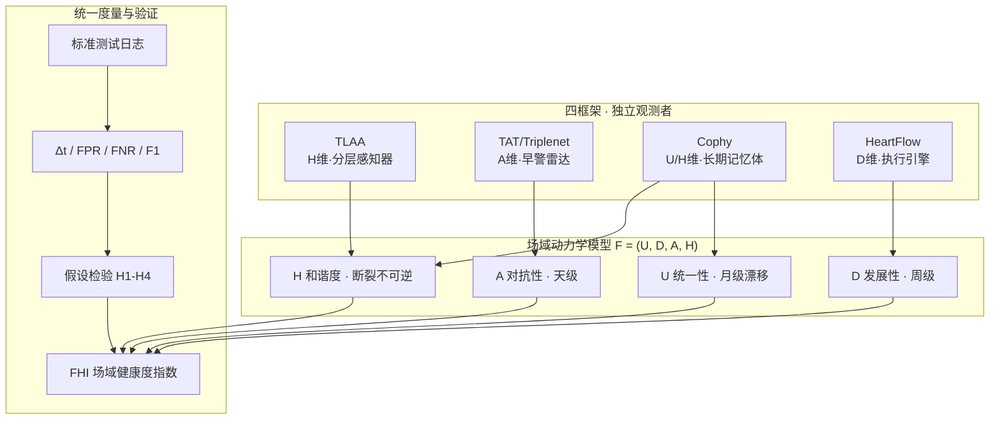

# 左右互搏审计报告 · Field Dynamics 交付

DNA: #龍芯⚡️丙午·丙申·乙丑·壬午·䷨损-FIELD-DYNAMICS-AUDIT-DUAL-v1.0
创建者: 诸葛鑫（UID9622）
引擎: `08_BIN/lh_audit_battle_hub.py`（双人格互审 + 文档结构审计 v2.0）
GPG: A2D0092CEE2E5BA87035600924C3704A8CC26D5F

---

## 一、左右互搏双人格对抗

```
============================================================
🛡️ 龍魂审计对抗报告
============================================================
DNA: #龍芯⚡️20260819·DUEL-v1.0-70ecd144
目标: 将 DeepSeek-V3 issue #1466 的场域动力学统一视角提案
      交付为面向 GitHub 开源开发者的完整方案
      （U/D/A/H 四维框架 + FHI 指数 + 跨框架验证协议）
综合评分: 🟢 89.39 (互搏85 / 平衡84.62 / 安全100)
左右互搏: 🟢 共识=True 评分=85
决议: 左右互搏达成共识，可执行但需持续审计
============================================================
```

| 维度 | 评分 | 判定 |
|:---|:---:|:---:|
| 互搏评分 | 85 | 🟢 双人格共识 |
| 平衡评分 | 84.62 | 🟢 |
| 安全评分 | 100 | 🟢 零漏洞 |

## 二、保守者视角（找风险）

| # | 风险点 | 严重度 | 处置 |
|:---:|:---|:---:|:---|
| 1 | 0.3 阈值可能是两框架耦合误差，非普适常数 | 🟡 | H1 接受证伪，不预设成立 |
| 2 | FHI 归一化在指标口径不一时可能失真 | 🟡 | 附录公开公式·允许复算 |
| 3 | 硬套四维可能掩盖框架特有机制 | 🟡 | 声明为"最小公共基"非唯一正交基 |
| 4 | 翻转点标注成本高、主观性强 | 🟡 | 社区共建 + 半自动标注（P2） |

## 三、探索者视角（找创新）

| # | 机会点 | 价值 | 采纳 |
|:---:|:---|:---|:---:|
| 1 | 时间尺度分离论（U月/D周/A天/H断裂）解释框架收敛时机 | 高 | ✅ 已入 §3.2 |
| 2 | A=0 僵死从个案升级为理论命题（H2 + 构造反例路径） | 高 | ✅ 已入 §3.4 |
| 3 | 四框架对比矩阵"最强信号+致命盲区"并置 | 高 | ✅ 已入 §4.5 |
| 4 | 工程旁证（龍魂四级熔断 L0-L3 同构机制） | 中 | ✅ 已入 §2.1 |

## 四、文档结构审计（doc-audit v2.0）

```
评分:  🟢 90.0/100
摘要: 🔴0 | 🟡1 | 🟢0
F001 [可视化] 文档含 4 个代码块但无 Mermaid 架构图
    → ✅ 已修复：§0 插入系统总览架构图（四框架→四维→FHI→验证闭环）
```

### 补全内容（已执行）



## 五、最终决议

> 🟢 **通过** —— 双人格达成共识，可执行但需持续审计。
> 交付包（提案+Schema+Evaluator+验证协议+贡献指南）结构与内容完整，
> 理论推演边界已显式声明，四条假设全部可证伪，适合面向开源开发者发布。

---
引擎 DNA: #龍芯⚡️丙午·丙申·戊申·亥时·䷗复-SKILL-DUAL-AUDIT-v2.0
