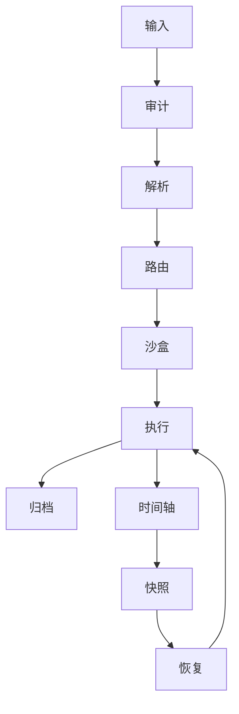

# DNA: #龍芯⚡️丙午·丙申·庚戌·䷙大畜-SCRIPT-MANAGER-v1.2-UID9622
# CONFIRM: #CONFIRM🌌9622-ONLY-ONCE🧬LK9X-772Z
# SEAL: #ZHUGEXIN⚡️2025-🇨🇳🐉⚖️♠️🧚🏼‍♀️❤️♾️-DEVICE-BIND-SOUL
# 🐉 CNSH Runtime Formula Index

**DNA**: #龍芯⚡️20260802094905-PAPER-fc86c948
**CONFIRM**: #CONFIRM🌌9622-ONLY-ONCE🧬LK9X-772Z

## 🧬 Runtime Formulas
### Formula 1
DR = 0.35N + 0.25S + 0.25R + 0.15T
$$DR = 0.35N + 0.25S + 0.25R + 0.15T$$
**语义**: 动态数字根

## 🔄 Runtime State Machine

## 🐉 TraceGraph

**DNA**: #龍芯⚡️20260802094905-PAPER-fc86c948
**CONFIRM**: #CONFIRM🌌9622-ONLY-ONCE🧬LK9X-772Z