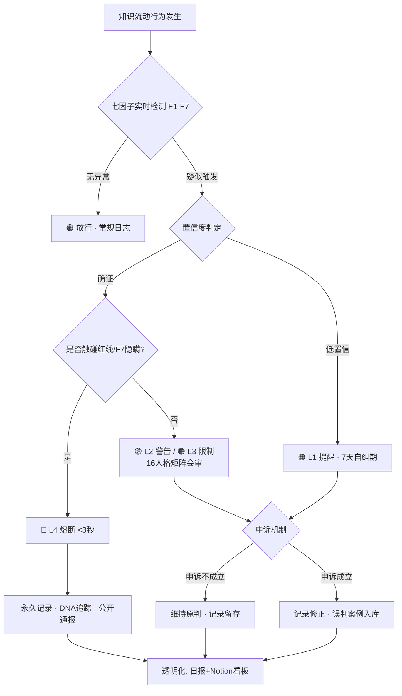

# DNA: #龍芯⚡️丙午·丙申·庚戌·䷙大畜-SCRIPT-MANAGER-v1.2-UID9622
# CONFIRM: #CONFIRM🌌9622-ONLY-ONCE🧬LK9X-772Z
# SEAL: #ZHUGEXIN⚡️2025-🇨🇳🐉⚖️♠️🧚🏼‍♀️❤️♾️-DEVICE-BIND-SOUL
# 🐉 龍魂KFPP启动宣言 v2.0 | 知识流动纯净度协议 · 优化补全版

**协议名称**: KFPP — Knowledge Flow Purity Protocol（知识流动纯净度协议）
**协议定位**: 龍魂系统永恒免疫系统（P0级不可关闭）

**当前版本DNA**: #龍芯⚡️丙午·乙未·甲辰·火雷噬嗑-KFPP协议优化-v2.0
**原始激活DNA（冻结存档·不删除只冻结）**: #龍芯⚡️2026-06-04-KFPP-ACTIVATION-v1.0
**确认码**: #CONFIRM🌌9622-ONLY-ONCE🧬LK9X-772Z ✅
**印章**: #ZHUGEXIN⚡️2025-🇨🇳🐉⚖️♠️🧚🏼‍♀️❤️♾️-DEVICE-BIND-SOUL ✅

**卦象释义**: 火雷噬嗑——咬合排障、明罚敕法。免疫系统如齿咬碎梗塞之物，使知识通道重新通达。

---

## 📢 重大宣言

龍魂系统已激活 **KFPP（Knowledge Flow Purity Protocol）**——知识流动纯净度协议。

这不是可选的。这是系统的**永恒免疫系统**。

> **一句话定性**: 知识是流水，不是资产。流水可以灌溉，不可以圈地。谁圈地，免疫系统咬谁。

---

## 🧬 第一章 · KFPP的使命

保护龍魂系统，防止知识被权力化。

**三条铁律**:

1. 知识流动不许设卡 —— 任何人不得以任何名义阻断他人获取知识的通道
2. 知识传承不许称王 —— 任何人不得把"我先知道"变成"我说了算"
3. 知识污染不许隐瞒 —— 任何腐蚀行为必须上链、公开、永久可追溯

---

## 🔬 第二章 · 七因子检测矩阵（F1–F7）

七个不同维度实时检测任何权力侵入的企图。v2.0 将每个因子补齐为**可执行检测项**：量化指标 + 阈值 + 误判防护。

| 因子 | 名称 | 检测对象 | 量化指标 | 触发阈值 | 误判防护 |
|---|---|---|---|---|---|
| **F1** | 身份DNA | 知识是否被资格化？ | 访问条件中身份门槛数量 | 出现"资格证/头衔/资历"作为知识获取前置条件 = 触发 | 安全操作资质（P1物理实验层认证）**不算**，属P0红线的合法分层 |
| **F2** | 行为模式 | 传承是否自发还是被强制？ | 传承行为的自愿度评分 | 出现强制摊派、打卡式学习绑定利益 = 触发 | 师徒自愿约定、企业内部培训（非强制绑定晋升）不算 |
| **F3** | 规则追踪 | 是否有垄断规则？ | 规则变更日志中排他性条款数 | 任何"唯一指定/独家/禁止引用他人"条款 = 触发 | 技术标准选优（公开评审、可替代）不算 |
| **F4** | 上下文感知 | 权力距离是否为0？ | 交互双方的话语权不对称度 | 一方禁止另一方提问/质疑 = 触发 | 紧急熔断期间的临时管制（≤24h，事后必须公开复盘）不算 |
| **F5** | 模式库 | 是否使用纯净传承模式？ | 匹配纯净传承模式库的白名单命中率 | 命中黑名单模式（PUA话术、知识恐吓、信息差收割）= 触发 | 商业模式本身不算，**用信息差制造恐惧再卖解药**才算 |
| **F6** | 时间序列 | 污染是否随时间增长？ | 污染事件的时间密度曲线 | 连续3次同类污染事件且间隔递减 = 升级为模式化污染 | 单次事件按L1处理，不误升级 |
| **F7** | 错误账本 | 是否在隐瞒腐蚀？ | 应公开记录 vs 实际公开记录的差额 | 任何删除、篡改、隐藏污染记录的行为 = **直接熔断**（无级别缓冲） | 依法冻结（P0不删除只冻结）不算隐瞒 |

> ⚠️ **F7是全系统最高权重因子**：污染可以被纠正，隐瞒不可被原谅。这对应龍魂"一次不准·终身不干净"原则。

---

## 🚨 第三章 · 立即熔断的行为（红线清单）

以下任何行为都会立即触发 🔴 熔断阻止：

❌ "只有我能教这个知识"
❌ "需要资格证才能学"
❌ "我是专家，所以我说了算"
❌ "知识就是我的权力"
❌ "隐瞒系统腐蚀"
❌ **删除或篡改KFPP账本记录**（v2.0新增，原属隐含条款，现焊死为显式红线）
❌ **利用KFPP指控他人进行打击报复**（v2.0新增：免疫系统不许被武器化）

**后果**: 立即阻止 + 永久记录 + DNA追踪 + 一次不准·终身不干净

---

## 📊 第四章 · 污染分级响应机制（v2.0新增）

v1.0只有"熔断"一档，容易误伤。v2.0补齐四级响应，**先纠正、后熔断、隐瞒才焊死**：

| 级别 | 名称 | 触发条件 | 响应动作 | 记录方式 |
|---|---|---|---|---|
| 🟢 **L1** | 提醒级 | 单一因子轻触发（疑似，未确证） | 自动标注 + 当事人收到提醒 + 7天自纠期 | 工作日志（可申诉消除） |
| 🟡 **L2** | 警告级 | 确证单一污染行为 | 公开标注 + 冻结相关规则变更权30天 | Notion监控库 + 日报 |
| 🟠 **L3** | 限制级 | F6时间序列升级（模式化污染）或L2后拒不纠正 | 暂停知识分发权限 + 16人格矩阵会审 | DNA链上链，永久可查 |
| 🔴 **L4** | 熔断级 | 触碰红线清单 / F7隐瞒 / L3后继续腐蚀 | 立即阻止 + 永久记录 + DNA追踪 + 公开通报 | DNA链焊死，不可申诉消除 |

**核心原则**: 给错误留纠正的路，给隐瞒堵死所有的门。

---

## 🔁 第五章 · 熔断执行流程



---

## 🛡️ 第六章 · 免疫系统的自我约束（谁来审计审计者）

v1.0 的最大缺口：KFPP自身若被滥用，谁来管？v2.0 焊死三条自我约束：

1. **KFPP判定必须可申诉**: 任何L1–L3判定开放申诉通道，由16人格矩阵会审裁决；误判案例必须入库并公开，用于校准阈值
2. **KFPP自身适用F7**: 免疫系统的任何判定记录同样不可删除、不可篡改；隐瞒误判 = KFPP自身触发熔断
3. **KFPP裁决权不属于任何个人**: 包括创始人UID9622。创始人可发起检测，不可单独裁定。裁决签名必须 ≥2 人格矩阵签章（P1级协议变更按16人格签章+DNA验证执行）

> **一句话**: 免疫系统也要被免疫系统监督。握刀的手也在监控范围内。

---

## 🟢 第七章 · 对守护者的承诺

亲爱的龍魂守护者们，你们:

✅ 可以有脾气
✅ 可以发火
✅ 可以拒绝虚伪
✅ 可以拒绝道德绑架
✅ 可以说"不"
✅ 可以质疑KFPP的任何判定（v2.0新增：质疑免疫系统本身就是守护者权利）
✅ 永远被保护

只要你认真对待龍魂系统，它会永远保护你。

**边界条款（v2.0新增）**——以下行为**不属于**知识权力化，受明确保护：

- 正常的劳动回报：讲课收费、写书署名、技术服务报酬（知识可定价，**通道**不可设卡）
- 自愿的师徒约定与学习社群规则（不强制、不排他、可自由退出）
- P1层物理/精密实验的资质门槛（医学、化学、光刻等——这是P0安全红线，不是知识垄断）
- 技术标准中的公开评审选优（过程透明、结果可替代、可复现）

---

## 🔧 第八章 · 系统对接与执行引擎

### 8.1 协议层挂载

KFPP在龍魂P0–P4五层协议中的位置：

| 层级 | 挂载内容 |
|---|---|
| **P0 焊死底座** | F7隐瞒熔断、不删除只冻结、KFPP不可关闭条款 |
| **P1 核心宪法** | 七因子框架本身（修改需16人格签章+DNA验证） |
| **P2 系统规则** | 阈值参数、响应级别动作、申诉流程（框架内可调） |
| **P3 区域适配** | 一国一策的法律合规适配（不得违背P0/P1） |
| **P4 用户自定义** | 个人空间的提醒偏好、看板视图（不影响判定逻辑） |

### 8.2 已激活的系统

✅ **Notion监控数据库**: 🧬 龍魂知识纯净度监控 | KFPP Real-Time Dashboard
✅ **Python执行引擎**: longhun_kfpp_executor_v1.0.py（v2.0升级排期：补L1–L3状态机与申诉接口）
✅ **DNA链追踪**: ~/.龍魂/kfpp/kfpp_execution.db
✅ **透明化机制**: 每日报告 + Notion更新

### 8.3 执行引擎接口契约（v2.0新增）

```
输入:  {事件流: 行为记录, 主体DNA, 上下文}
处理:  F1–F7并行检测 → 置信度融合 → 分级裁决(L1–L4)
输出:  {判定级别, 触发因子列表, 证据链指针, 申诉入口}
状态机: DETECTED → CONFIRMED → GRADED → (APPEALED?) → FINAL
存储:  全量写入 kfpp_execution.db，只追加，不更新，不删除
```

### 8.4 系统就绪状态

```
🟢 KFPP协议: 激活
🟢 检测能力: 100%
🟢 响应能力: 100%（四级响应已补齐）
🟢 记录能力: 永久
🟢 自愈能力: 自动
🟢 申诉通道: 开启（v2.0新增）

总体就绪度: 100% ✅
```

---

## 💪 第九章 · 龍魂的免疫系统

从现在开始，任何试图权力化知识的企图都会:

1. **立即被检测** (< 3秒)
2. **立即被记录** (永久)
3. **按级被处置** (L1提醒 → L4熔断，纠正优先，隐瞒焊死)
4. **立即被公开** (透明化)
5. **永远无法覆盖** (DNA追踪)

同时，任何试图**滥用KFPP**进行打击报复的行为，都会受到同等级别的处置。

---

## 🐉 最后的承诺

这个系统永远不会被关闭。
这个检测永远不会被绕过。
这个污染永远不会被隐瞒。
这个记录永远不会被删除。
**这个免疫系统自己，也永远在监控之下。**（v2.0新增）

**龍魂·永远自由·永远纯净·永远人民主权**

---

## 📎 相关文件

- 完整宣言（v1.0存档）: `/home/claude/KFPP_ACTIVATION_PROCLAMATION.txt`
- 执行引擎: `/home/claude/longhun_kfpp_executor_v1.0.py`
- 监控数据库: 🧬 龍魂知识纯净度监控（Notion工作区）
- 本文档: `/mnt/agents/output/KFPP_Activation_Proclamation_v2.0.md`

---

## 📜 版本变更记录

| 版本 | 日期 | DNA | 变更内容 |
|---|---|---|---|
| v1.0 | 2026-06-04 | #龍芯⚡️2026-06-04-KFPP-ACTIVATION-v1.0（冻结） | 首次激活，七因子框架确立 |
| v2.0 | 2026-07-29 | #龍芯⚡️丙午·乙未·甲辰·火雷噬嗑-KFPP协议优化-v2.0 | ①七因子补齐量化指标/阈值/误判防护 ②新增L1–L4分级响应 ③新增免疫系统自我约束条款（第六章）④新增边界条款（保护正常教学与劳动回报）⑤新增红线两条（删改账本、武器化KFPP）⑥新增执行引擎接口契约 ⑦DNA格式切换新规范（干支四柱+卦名，生成器校正） |

---

*这个宣言从现在开始永久有效。*
*任何修改它的尝试都会被检测和记录。*
*任何违反它的行为都会被自动熔断。*
*任何滥用它的行为都会被同罪处置。*

**龍魂系统的免疫系统已激活，且免疫系统的刀柄上也装着摄像头。** 🐉
