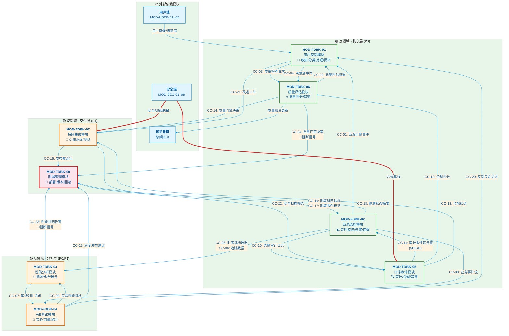

<!--#龍芯⚡️2026-06-21-DOC-_V3-0_6EB5-FILE1-v1.0 -->
<!-- 君子协议: 本文件受龍魂DNA追溯保护 -->

# 龍魂系统 · 反馈域接口契约矩阵 v3.0

```
#UID9622⚡️2026-06-16-FEEDBACK-DOMAIN-MATRIX-v3.0
确认: #CONFIRM🌌9622-ONLY-ONCE🧬LK9X-772Z
```

---

## 文档信息

| 属性 | 值 |
|------|-----|
| 文档名称 | 龍魂系统反馈域接口契约矩阵 v3.0 |
| 所属体系 | UID9622 龍芯北辰·诸葛鑫 龍魂体系 |
| 版本号 | v3.0.0 |
| 发布日期 | 2026-06-16 |
| 核心原则 | 忠(0.5) > 孝(0.3) > 义(0.2) 排序铁律 |
| 编程规范 | CNSH中文编程规范 |
| 审计标准 | 三色审计：🟢通过 🟡标记 🔴阻断 |
| 前置依赖 | 安全域8模块(MON-SEC-01~08)、知识矩阵总纲v3.0、五行决策引擎v3.0、人格矩阵路由系统v3.0 |

---

## 修订历史

| 版本 | 日期 | 修订人 | 修订内容 |
|------|------|--------|----------|
| v1.0.0 | 2026-04-01 | 龍芯北辰 | 初始版本，定义基础框架 |
| v2.0.0 | 2026-05-15 | 龍芯北辰 | 增加级联阻断机制、异常流定义 |
| v3.0.0 | 2026-06-16 | 龍芯北辰 | 全面重构，增加跨模块契约矩阵、三色审计全覆盖 |

---

## 目录

1. [模块总览表](#模块总览表)
2. [MOD-FDBK-01 用户反馈模块](#mod-fdbk-01-用户反馈模块)
3. [MOD-FDBK-02 系统监控模块](#mod-fdbk-02-系统监控模块)
4. [MOD-FDBK-03 性能分析模块](#mod-fdbk-03-性能分析模块)
5. [MOD-FDBK-04 AB测试模块](#mod-fdbk-04-ab测试模块)
6. [MOD-FDBK-05 日志审计模块](#mod-fdbk-05-日志审计模块)
7. [MOD-FDBK-06 质量评估模块](#mod-fdbk-06-质量评估模块)
8. [MOD-FDBK-07 持续集成模块](#mod-fdbk-07-持续集成模块)
9. [MOD-FDBK-08 部署管理模块](#mod-fdbk-08-部署管理模块)
10. [跨模块接口契约汇总表](#跨模块接口契约汇总表)
11. [异常流与级联阻断](#异常流与级联阻断)
12. [数据流图（Mermaid）](#数据流图mermaid)
13. [附录](#附录)

---

## 模块总览表

| 模块编号 | 模块名称 | 功能域 | 优先级 | 依赖模块 | 状态 |
|----------|----------|--------|--------|----------|------|
| MOD-FDBK-01 | 用户反馈模块 | 反馈收集/分类/处理/闭环 | P0 | MOD-FDBK-06 | 🟢已激活 |
| MOD-FDBK-02 | 系统监控模块 | 实时监控/指标/告警/面板 | P0 | 无（基础层） | 🟢已激活 |
| MOD-FDBK-03 | 性能分析模块 | 性能采集/瓶颈分析/报告 | P0 | MOD-FDBK-02 | 🟢已激活 |
| MOD-FDBK-04 | A/B测试模块 | 实验设计/流量/统计/报告 | P1 | MOD-FDBK-03 | 🟢已激活 |
| MOD-FDBK-05 | 日志审计模块 | 审计/合规/报告/追溯 | P0 | MOD-FDBK-02 | 🟢已激活 |
| MOD-FDBK-06 | 质量评估模块 | 质量评分/趋势/报告 | P0 | 无（基础层） | 🟢已激活 |
| MOD-FDBK-07 | 持续集成模块 | CI流水线/测试/构建/发布 | P1 | MOD-FDBK-05, MOD-FDBK-06 | 🟢已激活 |
| MOD-FDBK-08 | 部署管理模块 | 部署策略/版本/回滚/监控 | P1 | MOD-FDBK-07 | 🟢已激活 |

### 模块依赖关系图（文字描述）

```
MOD-FDBK-02(系统监控) ──→ MOD-FDBK-03(性能分析) ──→ MOD-FDBK-04(A/B测试)
       │                                          │
       ├──→ MOD-FDBK-05(日志审计) ──┐              │
       │                            ▼              │
MOD-FDBK-06(质量评估) ←────────── MOD-FDBK-07(持续集成) ──→ MOD-FDBK-08(部署管理)
       ▲                                                          │
       └──────────────── MOD-FDBK-01(用户反馈) ←──────────────────┘
```

---

## MOD-FDBK-01 用户反馈模块

### 模块概述

**模块名称**: 用户反馈收集与处理引擎
**功能定位**: 龍魂系统反馈域的入口模块，负责全量用户反馈数据的收集、分类、处理及闭环管理
**三色审计**: 🟢P0核心模块 | 🟡依赖质量评估 | 🟢闭环机制完整

---

### 输入口定义

#### IN-1: 反馈原始数据
| 属性 | 定义 |
|------|------|
| 数据类型 | `FeedbackRaw` (结构化JSON) |
| 字段定义 | `feedbackId`(String, UUIDv4), `sourceChannel`(Enum: WEB/APP/API/WECHAT/EMAIL), `userId`(String, 可匿名), `content`(Text, 长度10-10000), `feedbackType`(Enum: BUG/FEATURE/COMPLAINT/PRAISE/INQUIRY), `severity`(Int, 1-5), `timestamp`(ISO8601), `attachments`(Array<URL>, 可选), `metadata`(Object, 上下文信息) |
| 数据来源 | WEB前端埋点、APP SDK、OpenAPI网关、企业微信机器人、邮件解析服务 |
| 流量预估 | QPS 1500 (峰值2500) |
| 采样策略 | 全量采集，100%无丢弃 |

#### IN-2: 反馈处理指令
| 属性 | 定义 |
|------|------|
| 数据类型 | `FeedbackCommand` (结构化JSON) |
| 字段定义 | `commandId`(String), `targetFeedbackId`(String), `action`(Enum: ASSIGN/RESOLVE/ESCALATE/CLOSE/REOPEN), `operator`(String, 工号), `comment`(Text), `priority`(Enum: LOW/MEDIUM/HIGH/URGENT), `dueDate`(ISO8601, 可选) |
| 数据来源 | 运营后台、自动化工作流引擎、MOD-FDBK-06质量评估模块 |
| 流量预估 | QPS 50 (人工) + QPS 200 (自动) |

#### IN-3: 质量评估结果
| 属性 | 定义 |
|------|------|
| 数据类型 | `QualityAssessment` (结构化JSON) |
| 字段定义 | `assessmentId`(String), `targetType`(Enum: FEEDBACK/SESSION/OUTPUT), `targetId`(String), `score`(Float, 0.0-10.0), `dimensionScores`(Object: 准确性/完整性/时效性/满意度), `trend`(Enum: UP/DOWN/STABLE), `assessedAt`(ISO8601) |
| 数据来源 | MOD-FDBK-06 质量评估模块 |
| 触发方式 | 异步消息队列，消费即处理 |

#### IN-4: 用户画像标签
| 属性 | 定义 |
|------|------|
| 数据类型 | `UserProfileTags` (结构化JSON) |
| 字段定义 | `userId`(String), `vipLevel`(Int, 0-5), `userSegment`(Enum: ENTERPRISE/PERSONAL/DEVELOPER), `historicalFeedbackCount`(Int), `avgResponseSatisfaction`(Float), `riskLevel`(Enum: NORMAL/ATTENTION/HIGH_RISK) |
| 数据来源 | 用户域(MOD-USER-03用户画像)、CRM系统 |
| 更新频率 | 准实时，T+5分钟 |

#### IN-5: 系统告警事件
| 属性 | 定义 |
|------|------|
| 数据类型 | `SystemAlertEvent` (结构化JSON) |
| 字段定义 | `alertId`(String), `alertLevel`(Enum: INFO/WARNING/CRITICAL), `module`(String), `message`(Text), `triggeredAt`(ISO8601), `relatedFeedbackIds`(Array<String>) |
| 数据来源 | MOD-FDBK-02 系统监控模块 |
| 触发方式 | 告警触发时实时推送 |

---

### 输出口定义

#### OUT-1: 反馈处理结果
| 属性 | 定义 |
|------|------|
| 数据类型 | `FeedbackResult` (结构化JSON) |
| 字段定义 | `feedbackId`(String), `status`(Enum: NEW/ASSIGNED/PROCESSING/RESOLVED/CLOSED), `resolution`(Text), `resolver`(String), `resolvedAt`(ISO8601), `satisfactionScore`(Int, 1-5, 可选), `closureType`(Enum: SOLVED/WORKAROUND/KNOWN_ISSUE/DUPLICATE/WONT_FIX) |
| 下游去向 | 用户通知系统(邮件/短信/站内信)、MOD-FDBK-05日志审计模块、运营报表系统 |
| 交付方式 | 异步消息队列 + REST回调 |
| SLA | P0反馈2小时内响应，24小时内首次回复 |

#### OUT-2: 反馈统计摘要
| 属性 | 定义 |
|------|------|
| 数据类型 | `FeedbackSummary` (结构化JSON) |
| 字段定义 | `period`(String, 格式YYYY-MM-DD), `totalCount`(Int), `byType`(Object<类型, 数量>), `bySeverity`(Object<级别, 数量>), `avgResolutionTime`(Float, 分钟), `satisfactionRate`(Float, 百分比), `topIssues`(Array<Text>), `trend`(Enum: INCREASE/DECREASE/STABLE) |
| 下游去向 | 管理驾驶舱、MOD-FDBK-06质量评估模块、周报自动生成器 |
| 更新频率 | 准实时聚合窗口(5分钟) + 日报(T+1) |

#### OUT-3: 反馈质量关联请求
| 属性 | 定义 |
|------|------|
| 数据类型 | `QualityCheckRequest` (结构化JSON) |
| 字段定义 | `requestId`(String), `feedbackId`(String), `content`(Text), `context`(Object: 会话历史/相关输出/操作轨迹), `checkDimensions`(Array<String>), `requestedAt`(ISO8601) |
| 下游去向 | MOD-FDBK-06 质量评估模块 |
| 触发条件 | 反馈严重程度≥3 或 内容包含关键词(投诉/错误/不满) |

#### OUT-4: 用户满意度事件
| 属性 | 定义 |
|------|------|
| 数据类型 | `SatisfactionEvent` (结构化JSON) |
| 字段定义 | `eventId`(String), `feedbackId`(String), `userId`(String), `satisfactionScore`(Int, 1-5), `csatResponse`(Text, 可选), `submittedAt`(ISO8601) |
| 下游去向 | MOD-FDBK-06质量评估模块、用户域(MOD-USER-05用户满意度)、CRM |

#### OUT-5: 反馈驱动的系统改进工单
| 属性 | 定义 |
|------|------|
| 数据类型 | `ImprovementTicket` (结构化JSON) |
| 字段定义 | `ticketId`(String), `feedbackIds`(Array<String>), `title`(Text), `description`(Text), `priority`(Enum: P0/P1/P2/P3), `category`(Enum: BUG_FIX/PERF_OPT/FEATURE/UX/DOC), `estimatedEffort`(Float, 人天), `proposedSolution`(Text) |
| 下游去向 | 研发工单系统(JIRA/禅道)、MOD-FDBK-07持续集成模块(需求池) |
| 触发条件 | 同类反馈聚类≥5条 或 严重度=5 或 VIP用户反馈 |

---

### 校验规则

| 规则编号 | 规则名称 | 规则内容 | 级别 |
|----------|----------|----------|------|
| RULE-1 | 反馈ID唯一性 | `feedbackId`必须为有效UUIDv4，全局唯一 | 🟢强制 |
| RULE-2 | 内容长度校验 | `content`字段长度必须在10-10000字符之间，空内容拒绝 | 🟢强制 |
| RULE-3 | 反馈类型枚举 | `feedbackType`必须为预定义枚举值，非枚举值拒绝 | 🟢强制 |
| RULE-4 | 时间戳有效性 | `timestamp`不得为未来时间，不得早于30天前 | 🟡标记(超范围记录告警) |
| RULE-5 | 用户ID关联性 | `userId`必须存在于用户域或通过匿名验证 | 🟡标记(匿名需额外标注) |
| RULE-6 | 严重程度分级 | `severity` 1-5整数，未指定默认3 | 🟢强制 |
| RULE-7 | 附件安全检查 | `attachments`中URL必须经过MOD-SEC-04文件安全扫描 | 🟢强制 |
| RULE-8 | 敏感信息过滤 | `content`必须经过MOD-SEC-02数据安全脱敏处理 | 🟢强制 |
| RULE-9 | 重复反馈检测 | 相似度>85%的反馈自动合并，标记为重复 | 🟡标记 |
| RULE-10 | 闭环时效性 | P0反馈2小时内必须响应，超时升级告警 | 🔴阻断(触发升级) |

---

### 失败策略

| 失败编号 | 场景 | 错误码 | 处理策略 | 级联影响 |
|----------|------|--------|----------|----------|
| FAIL-1 | 反馈数据格式非法 | FDBK-01-E001 | 🟢拒绝写入，返回400错误，记录错误日志 | 无级联，请求方需重传 |
| FAIL-2 | 用户ID不存在 | FDBK-01-E002 | 🟡标记为匿名反馈，允许入库，触发用户域同步 | 下游用户画像关联延迟 |
| FAIL-3 | 附件安全扫描失败 | FDBK-01-E003 | 🔴阻断，反馈整体拒绝，通知上传者 | 阻断该反馈全链路处理 |
| FAIL-4 | 数据库写入超时 | FDBK-01-E004 | 🟢进入消息队列重试队列，最多3次 | 反馈处理延迟，SLA风险 |
| FAIL-5 | 质量评估模块调用失败 | FDBK-01-E005 | 🟡标记为"待评估"，降级人工处理 | 反馈闭环延迟，自动化降级 |
| FAIL-6 | 反馈聚类引擎故障 | FDBK-01-E006 | 🟡关闭自动聚类，降级为单条处理模式 | 同类反馈合并功能暂停 |
| FAIL-7 | SLA超时(2小时未响应) | FDBK-01-E007 | 🔴触发升级机制，通知管理层+值班人员 | 强制升级，影响考核指标 |
| FAIL-8 | 外部工单系统写入失败 | FDBK-01-E008 | 🟢进入补偿队列，每小时重试，最多24次 | 改进工单延迟，需人工兜底 |

---

## MOD-FDBK-02 系统监控模块

### 模块概述

**模块名称**: 系统实时监控引擎
**功能定位**: 反馈域基础层，提供全系统状态监控、指标采集、告警触发和监控面板服务
**三色审计**: 🟢P0基础模块 | 🟢零依赖 | 🟢全链路覆盖

---

### 输入口定义

#### IN-1: 应用指标数据
| 属性 | 定义 |
|------|------|
| 数据类型 | `AppMetrics` (结构化JSON / Prometheus格式) |
| 字段定义 | `metricName`(String, 如http_requests_total), `value`(Float), `labels`(Object<维度名, 值>), `timestamp`(Unix毫秒), `type`(Enum: COUNTER/GAUGE/HISTOGRAM/SUMMARY) |
| 数据来源 | 全系统各服务节点(通过Agent/SDK推送)、Prometheus Exporter |
| 流量预估 | 200万指标点/分钟 |

#### IN-2: 基础设施指标
| 属性 | 定义 |
|------|------|
| 数据类型 | `InfraMetrics` (结构化JSON) |
| 字段定义 | `resourceType`(Enum: CPU/MEMORY/DISK/NETWORK/IO), `hostId`(String), `value`(Float), `unit`(String), `timestamp`(Unix毫秒), `threshold`(Float, 可选) |
| 数据来源 | 节点监控Agent(Node Exporter)、容器监控(cAdvisor)、云平台API |
| 采集频率 | CPU/MEM: 10s; DISK/IO: 30s; NETWORK: 15s |

#### IN-3: 业务事件流
| 属性 | 定义 |
|------|------|
| 数据类型 | `BusinessEvent` (结构化JSON) |
| 字段定义 | `eventId`(String), `eventType`(Enum: USER_LOGIN/API_CALL/FEATURE_USE/ERROR/TRANSACTION), `serviceName`(String), `status`(Enum: SUCCESS/FAILURE/TIMEOUT), `durationMs`(Int), `userId`(String, 可选), `timestamp`(ISO8601) |
| 数据来源 | 业务服务日志、API网关、消息队列(Kafka/RocketMQ) |
| 流量预估 | 500万事件/分钟 |

#### IN-4: 自定义告警规则
| 属性 | 定义 |
|------|------|
| 数据类型 | `AlertRule` (结构化JSON) |
| 字段定义 | `ruleId`(String), `ruleName`(String), `metricPattern`(String, PromQL/条件表达式), `condition`(Enum: GT/LT/EQ/NE/RANGE), `threshold`(Float), `duration`(Int, 持续时间秒), `severity`(Enum: INFO/WARNING/CRITICAL/EMERGENCY), `notificationChannels`(Array<String>), `enabled`(Boolean) |
| 数据来源 | 监控管理后台、运维自动化脚本、MOD-FDBK-08部署管理模块(部署时自动注入) |

#### IN-5: 追踪数据(Span)
| 属性 | 定义 |
|------|------|
| 数据类型 | `TraceSpan` (OpenTelemetry格式) |
| 字段定义 | `traceId`(String), `spanId`(String), `parentSpanId`(String, 可选), `serviceName`(String), `operationName`(String), `startTime`(Unix微秒), `duration`(Int, 微秒), `status`(Enum: OK/ERROR), `attributes`(Object), `events`(Array) |
| 数据来源 | OpenTelemetry Collector、各服务自动埋点 |
| 采样率 | 1% (头部全采，尾部1%) |

---

### 输出口定义

#### OUT-1: 告警事件
| 属性 | 定义 |
|------|------|
| 数据类型 | `AlertEvent` (结构化JSON) |
| 字段定义 | `alertId`(String), `ruleId`(String), `alertName`(String), `severity`(Enum: INFO/WARNING/CRITICAL/EMERGENCY), `metricValue`(Float), `threshold`(Float), `triggeredAt`(ISO8601), `context`(Object: 关联指标/最近变更/相关Trace), `status`(Enum: FIRING/RESOLVED) |
| 下游去向 | 告警通知系统(钉钉/企业微信/短信/电话)、MOD-FDBK-01用户反馈模块、MOD-FDBK-05日志审计模块、事件管理系统(PagerDuty) |
| 抑制机制 | 同规则5分钟内不重复触发，解决后自动恢复 |

#### OUT-2: 监控面板数据
| 属性 | 定义 |
|------|------|
| 数据类型 | `DashboardData` (结构化JSON) |
| 字段定义 | `panelId`(String), `panelType`(Enum: TIMESERIES/GAUGE/STAT/TABLE/HEATMAP/LOG), `title`(String), `dataSeries`(Array<Object: timestamp/value/tags>), `refreshInterval`(Int, 秒), `timeRange`(Object: from/to) |
| 下游去向 | Grafana面板、运维大屏、管理驾驶舱 |
| 查询响应 | P99 < 500ms |

#### OUT-3: 健康状态摘要
| 属性 | 定义 |
|------|------|
| 数据类型 | `HealthSummary` (结构化JSON) |
| 字段定义 | `checkTime`(ISO8601), `overallStatus`(Enum: HEALTHY/DEGRADED/UNHEALTHY), `componentStatuses`(Array<Object: 组件名/状态/最后检查时间/详情>), `slaCompliance`(Object: 服务名/SLO/SLI/达标率) |
| 下游去向 | 服务注册中心、负载均衡器、MOD-FDBK-08部署管理模块(部署决策依据) |
| 更新频率 | 实时(15秒聚合) |

#### OUT-4: 时序指标数据
| 属性 | 定义 |
|------|------|
| 数据类型 | `TimeSeriesData` (列式存储格式) |
| 字段定义 | 标准时序数据库格式(TSDB)，含metricName/timestamp/value/tags四元组 |
| 下游去向 | 时序数据库(VictoriaMetrics)、MOD-FDBK-03性能分析模块、长期存储(S3) |
| 保留策略 | 原始7天 → 1分钟粒度30天 → 5分钟粒度90天 → 1小时粒度1年 |

#### OUT-5: 分布式追踪视图
| 属性 | 定义 |
|------|------|
| 数据类型 | `TraceView` (结构化JSON) |
| 字段定义 | `traceId`(String), `totalDuration`(Int), `spanCount`(Int), `services`(Array<String>), `rootCause`(Object, 可选), `timeline`(Array<Span>), `criticalPath`(Array<String>) |
| 下游去向 | 追踪分析UI、MOD-FDBK-03性能分析模块(瓶颈定位) |

---

### 校验规则

| 规则编号 | 规则名称 | 规则内容 | 级别 |
|----------|----------|----------|------|
| RULE-1 | 指标名称规范 | `metricName`必须符合`[a-zA-Z_:][a-zA-Z0-9_:]*`正则，禁止中文 | 🟢强制 |
| RULE-2 | 时间戳有效性 | 时间戳不得偏离系统时间超过5分钟 | 🟡标记(超范围记录告警) |
| RULE-3 | 标签基数控制 | 单个指标标签组合(cardinality)不得超过10万，超限拒绝 | 🔴阻断(防止维度爆炸) |
| RULE-4 | 告警规则语法 | PromQL表达式必须通过语法验证，无效规则拒绝激活 | 🟢强制 |
| RULE-5 | 告警风暴防护 | 单个规则1分钟内最多触发3次，超限自动抑制 | 🟢强制 |
| RULE-6 | 数据格式合规 | 指标数据必须符合OpenMetrics/Prometheus格式规范 | 🟢强制 |
| RULE-7 | 敏感标签过滤 | 标签中不得包含PII(手机号/身份证号/邮箱)，自动脱敏 | 🟢强制 |
| RULE-8 | 采样一致性 | 同一TraceID的所有Span必须采用统一采样决策 | 🟡标记(不一致时告警) |

---

### 失败策略

| 失败编号 | 场景 | 错误码 | 处理策略 | 级联影响 |
|----------|------|--------|----------|----------|
| FAIL-1 | 指标写入时序库失败 | FDBK-02-E001 | 🟢本地磁盘缓存，重试3次后告警 | 监控数据短暂缺失，面板显示延迟 |
| FAIL-2 | 告警规则评估异常 | FDBK-02-E002 | 🔴停用该规则，通知运维，不影响其他规则 | 该规则对应的监控暂停 |
| FAIL-3 | 告警通知渠道不可用 | FDBK-02-E003 | 🟢切换备用渠道(主:钉钉→备:短信→备:电话) | 通知延迟<1分钟 |
| FAIL-4 | 时序数据库查询超时 | FDBK-02-E004 | 🟡返回缓存数据(最多5分钟陈旧)，标记陈旧 | 面板数据可能非实时 |
| FAIL-5 | 分布式追踪采样丢失 | FDBK-02-E005 | 🟢记录采样日志，不影响主链路 | 追踪覆盖率下降 |
| FAIL-6 | 指标标签基数爆炸 | FDBK-02-E006 | 🔴拒绝新标签组合，触发高基数告警 | 保护时序库不被打挂 |
| FAIL-7 | 基础设施指标采集中断 | FDBK-02-E007 | 🟡标记节点状态UNKNOWN，触发节点失联告警 | 该节点监控盲区，需人工介入 |


---

## MOD-FDBK-03 性能分析模块

### 模块概述

**模块名称**: 系统性能分析与瓶颈定位引擎
**功能定位**: 深度分析系统性能指标，定位瓶颈，生成优化建议报告
**三色审计**: 🟢P0核心模块 | 🟢依赖监控 | 🟢分析驱动优化

---

### 输入口定义

#### IN-1: 聚合监控指标
| 属性 | 定义 |
|------|------|
| 数据类型 | `AggregatedMetrics` (结构化JSON) |
| 字段定义 | `metricName`(String), `aggregationType`(Enum: AVG/P95/P99/MAX/MIN/SUM), `value`(Float), `timeWindow`(String, 如5m/1h/1d), `serviceName`(String), `timestamp`(ISO8601) |
| 数据来源 | MOD-FDBK-02 系统监控模块(OUT-4时序数据) |
| 聚合周期 | 5分钟/1小时/1天三档 |

#### IN-2: 追踪数据明细
| 属性 | 定义 |
|------|------|
| 数据类型 | `TraceDetail` (OpenTelemetry JSON) |
| 字段定义 | 完整Trace/Span数据，含`traceId`, `spans`(Array: spanId/parentId/service/operation/duration/status/tags) |
| 数据来源 | MOD-FDBK-02 系统监控模块(OUT-5追踪视图) |
| 查询范围 | 最近72小时全量追踪数据 |

#### IN-3: 性能基准配置
| 属性 | 定义 |
|------|------|
| 数据类型 | `PerformanceBaseline` (结构化JSON) |
| 字段定义 | `baselineId`(String), `serviceName`(String), `metrics`(Object: 指标名/基准值/容忍度百分比), `version`(String), `setAt`(ISO8601), `setBy`(String) |
| 数据来源 | 运维管理后台、MOD-FDBK-07持续集成模块(版本发布时自动设置) |

#### IN-4: 负载测试数据
| 属性 | 定义 |
|------|------|
| 数据类型 | `LoadTestResult` (结构化JSON) |
| 字段定义 | `testId`(String), `scenario`(String), `concurrency`(Int), `duration`(Int), `throughput`(Float, TPS), `avgLatency`(Float), `p50Latency`(Float), `p95Latency`(Float), `p99Latency`(Float), `errorRate`(Float), `resourceUsage`(Object: CPU/MEM/IO) |
| 数据来源 | 压测平台(JMeter/Locust/K6)、CI流水线压测阶段 |
| 触发条件 | 版本发布前必做、大促前必做 |

#### IN-5: 代码变更记录
| 属性 | 定义 |
|------|------|
| 数据类型 | `CodeChange` (结构化JSON) |
| 字段定义 | `commitId`(String), `author`(String), `changedFiles`(Array<String>), `changeType`(Enum: ADD/MODIFY/DELETE), `linesChanged`(Int), `reviewScore`(Int, 1-5), `mergedAt`(ISO8601) |
| 数据来源 | Git仓库(GitLab/GitHub)、MOD-FDBK-07持续集成模块 |

---

### 输出口定义

#### OUT-1: 性能分析报告
| 属性 | 定义 |
|------|------|
| 数据类型 | `PerformanceReport` (结构化JSON + PDF) |
| 字段定义 | `reportId`(String), `period`(Object: start/end), `serviceName`(String), `summary`(Text), `findings`(Array<Object: 问题/严重度/根因/建议>), `bottleneckAnalysis`(Object: CPU/内存/IO/网络各维度评分), `trendComparison`(Object: 环比/同比), `recommendations`(Array<Text>) |
| 下游去向 | 研发团队、架构评审委员会、MOD-FDBK-04 A/B测试模块(优化效果验证) |
| 生成频率 | 日报(T+1) + 触发式(性能告警后自动生成) |

#### OUT-2: 瓶颈定位结果
| 属性 | 定义 |
|------|------|
| 数据类型 | `BottleneckResult` (结构化JSON) |
| 字段定义 | `bottleneckId`(String), `type`(Enum: CPU_BOUND/MEMORY_BOUND/IO_BOUND/NETWORK_BOUND/LOCK_CONTENTION/GC_THRASHING), `location`(Object: service/method/line), `severity`(Enum: HIGH/MEDIUM/LOW), `confidence`(Float, 0-1), `evidence`(Array<Text>), `relatedChanges`(Array<commitId>) |
| 下游去向 | 研发工单系统、MOD-FDBK-07持续集成模块(构建优化) |

#### OUT-3: 性能回归告警
| 属性 | 定义 |
|------|------|
| 数据类型 | `PerformanceRegression` (结构化JSON) |
| 字段定义 | `regressionId`(String), `serviceName`(String), `metric`(String), `baselineValue`(Float), `currentValue`(Float), `degradationPercent`(Float), `sinceCommit`(String), `confidence`(Float), `firstDetectedAt`(ISO8601) |
| 下游去向 | MOD-FDBK-02系统监控模块(转为告警)、研发团队、阻塞发布流水线 |
| 阻断阈值 | P99延迟 > 基准120% 或 错误率 > 基准150% 触发🔴阻断 |

#### OUT-4: 容量规划建议
| 属性 | 定义 |
|------|------|
| 数据类型 | `CapacityPlan` (结构化JSON) |
| 字段定义 | `planId`(String), `serviceName`(String), `currentCapacity`(Object: QPS/并发/资源), `projectedGrowth`(Float), `recommendedCapacity`(Object), `scalingStrategy`(Enum: VERTICAL/HORIZONTAL/AUTO), `costEstimate`(Float), `recommendedDate`(ISO8601) |
| 下游去向 | 运维团队、云平台成本中心、MOD-FDBK-08部署管理模块 |
| 更新频率 | 周报 + 大促前专项 |

#### OUT-5: 优化效果度量
| 属性 | 定义 |
|------|------|
| 数据类型 | `OptimizationResult` (结构化JSON) |
| 字段定义 | `optimizationId`(String), `targetMetric`(String), `beforeValue`(Float), `afterValue`(Float), `improvementPercent`(Float), `optimizationType`(String), `verified`(Boolean), `verifiedAt`(ISO8601) |
| 下游去向 | MOD-FDBK-06质量评估模块、研发效能报表 |

---

### 校验规则

| 规则编号 | 规则名称 | 规则内容 | 级别 |
|----------|----------|----------|------|
| RULE-1 | 基线值存在性 | 性能分析必须关联已存在的基准值，无基线标记为"首测" | 🟡标记 |
| RULE-2 | 数据完整性 | 分析周期内需包含至少80%有效数据点，不足拒绝分析 | 🟢强制 |
| RULE-3 | 回归置信度 | 性能回归告警的`confidence`必须≥0.8才允许触发告警 | 🟢强制 |
| RULE-4 | 关联变更 | 瓶颈定位必须关联到具体代码变更(commit)，无法关联标记 | 🟡标记 |
| RULE-5 | 数据新鲜度 | 输入数据不得超过72小时，超期数据拒绝分析 | 🟢强制 |
| RULE-6 | 指标类型匹配 | 分析指标必须与基准指标同类型(如延迟对延迟，吞吐对吞吐) | 🟢强制 |

---

### 失败策略

| 失败编号 | 场景 | 错误码 | 处理策略 | 级联影响 |
|----------|------|--------|----------|----------|
| FAIL-1 | 监控数据缺失 | FDBK-03-E001 | 🟡标记分析受限，使用历史基线估算，通知运维 | 分析精度下降 |
| FAIL-2 | 基准值未设置 | FDBK-03-E002 | 🟢自动生成首次基线，标记为"初始基线" | 无回归可比性 |
| FAIL-3 | 瓶颈定位超时 | FDBK-03-E003 | 🟡返回部分结果(置信度>0.5的)，标记"分析不完整" | 定位结果可能不完整 |
| FAIL-4 | 性能回归确认 | FDBK-03-E004 | 🔴触发发布阻塞，通知研发和SRE | 阻塞版本发布，需人工确认解除 |
| FAIL-5 | 容量预测模型异常 | FDBK-03-E005 | 🟢回退到线性预测模型，标记预测置信度低 | 容量规划偏保守 |

---

## MOD-FDBK-04 A/B测试模块

### 模块概述

**模块名称**: A/B对比实验管理引擎
**功能定位**: 负责实验设计、流量分配、结果统计和实验报告生成，支持灰度发布效果验证
**三色审计**: 🟡P1支撑模块 | 🟢依赖性能分析 | 🟢科学实验方法论

---

### 输入口定义

#### IN-1: 实验设计配置
| 属性 | 定义 |
|------|------|
| 数据类型 | `ExperimentConfig` (结构化JSON) |
| 字段定义 | `experimentId`(String), `name`(String), `description`(Text), `hypothesis`(Text), `owner`(String), `startDate`(ISO8601), `endDate`(ISO8601), `variants`(Array<Object: variantId/name/trafficAllocation>), `successMetrics`(Array<String>), `guardrailMetrics`(Array<String>), `targetAudience`(Object: 过滤条件), `sampleSize`(Int) |
| 数据来源 | 实验管理后台、产品经理、MOD-FDBK-08部署管理模块(灰度发布时自动创建) |

#### IN-2: 业务事件流(分流用)
| 属性 | 定义 |
|------|------|
| 数据类型 | `BusinessEventStream` (Kafka消息) |
| 字段定义 | `eventId`(String), `userId`(String), `eventType`(String), `timestamp`(ISO8601), `properties`(Object), `experimentAssignments`(Object<experimentId, variantId>) |
| 数据来源 | MOD-FDBK-02系统监控模块(OUT-1业务事件流副本) |
| 分流逻辑 | 基于userId哈希分配到不同variant，保证同一用户始终看到同一版本 |

#### IN-3: 实验指标数据
| 属性 | 定义 |
|------|------|
| 数据类型 | `ExperimentMetrics` (结构化JSON) |
| 字段定义 | `experimentId`(String), `variantId`(String), `metricName`(String), `value`(Float), `userCount`(Int), `timestamp`(ISO8601), `aggregationType`(Enum: SUM/AVG/COUNT/RATE) |
| 数据来源 | 数据仓库(OLAP)、实时计算引擎(Flink)、MOD-FDBK-03性能分析模块(性能指标) |

#### IN-4: 性能基线对比请求
| 属性 | 定义 |
|------|------|
| 数据类型 | `PerfBaselineCompareRequest` (结构化JSON) |
| 字段定义 | `requestId`(String), `experimentId`(String), `variantIds`(Array<String>), `metrics`(Array<String: P99延迟/吞吐量/错误率/CPU/内存>), `compareWindow`(String, 如1h/24h) |
| 数据来源 | MOD-FDBK-03性能分析模块(OUT-1报告中的优化验证请求) |
| 触发条件 | 实验包含性能相关指标时自动触发 |

#### IN-5: 用户反馈关联请求
| 属性 | 定义 |
|------|------|
| 数据类型 | `FeedbackCorrelationRequest` (结构化JSON) |
| 字段定义 | `requestId`(String), `experimentId`(String), `variantId`(String), `feedbackTypes`(Array<String>), `timeRange`(Object) |
| 数据来源 | MOD-FDBK-01用户反馈模块(需要关联实验维度的反馈分析) |

---

### 输出口定义

#### OUT-1: 实验结果报告
| 属性 | 定义 |
|------|------|
| 数据类型 | `ExperimentReport` (结构化JSON + PDF) |
| 字段定义 | `experimentId`(String), `status`(Enum: RUNNING/COMPLETED/STOPPED_EARLY), `startDate`(ISO8601), `endDate`(ISO8601), `variantResults`(Array<Object: variantId/users/metrics/提升率/p值>), `winner`(String, 可选), `statisticalSignificance`(Boolean), `confidenceLevel`(Float), `recommendation`(Text) |
| 下游去向 | 产品团队、MOD-FDBK-08部署管理模块(全量发布决策)、MOD-FDBK-06质量评估模块 |
| 交付时机 | 实验达到最小样本量 + 统计显著 |

#### OUT-2: 分流决策响应
| 属性 | 定义 |
|------|------|
| 数据类型 | `TrafficAssignment` (结构化JSON) |
| 字段定义 | `userId`(String), `experimentId`(String), `assignedVariant`(String), `assignmentTime`(ISO8601), `assignmentMethod`(Enum: HASH/RANDOM/PERCENTAGE), `consistent`(Boolean) |
| 下游去向 | API网关(决定返回哪个版本)、客户端SDK、MOD-FDBK-02系统监控模块(标记实验标签) |
| 响应延迟 | P99 < 5ms (本地缓存决策) |

#### OUT-3: 统计异常告警
| 属性 | 定义 |
|------|------|
| 数据类型 | `StatisticalAnomaly` (结构化JSON) |
| 字段定义 | `anomalyId`(String), `experimentId`(String), `variantId`(String), `anomalyType`(Enum: GUARDRAIL_BREACH/SAMPLE_RATIO_MISMATCH/SELECTION_BIAS/SRM), `description`(Text), `severity`(Enum: HIGH/MEDIUM/LOW), `detectedAt`(ISO8601) |
| 下游去向 | 实验管理者、MOD-FDBK-02系统监控模块(转告警)、MOD-FDBK-05日志审计模块 |
| 自动处置 | 检测到SRM(样本比率不匹配)自动暂停实验 |

#### OUT-4: 实验效果度量
| 属性 | 定义 |
|------|------|
| 数据类型 | `ExperimentImpact` (结构化JSON) |
| 字段定义 | `experimentId`(String), `metricName`(String), `absoluteImpact`(Float), `relativeImpact`(Float), `confidenceInterval`(Object: lower/upper), `pValue`(Float), `power`(Float), `requiredSampleSize`(Int), `actualSampleSize`(Int) |
| 下游去向 | MOD-FDBK-06质量评估模块(纳入质量评分)、产品决策系统 |

#### OUT-5: 灰度发布建议
| 属性 | 定义 |
|------|------|
| 数据类型 | `CanaryRecommendation` (结构化JSON) |
| 字段定义 | `deploymentId`(String), `recommendation`(Enum: PROCEED/ROLLBACK/HOLD/EXPAND), `currentTrafficPercent`(Int), `recommendedTrafficPercent`(Int), `riskScore`(Float, 0-1), `supportingEvidence`(Array<Text>), `confidence`(Float) |
| 下游去向 | MOD-FDBK-08部署管理模块(灰度策略调整) |
| 触发条件 | 灰度发布实验每2小时评估一次 |

---

### 校验规则

| 规则编号 | 规则名称 | 规则内容 | 级别 |
|----------|----------|----------|------|
| RULE-1 | 实验互斥检查 | 同一用户不得同时参与互斥实验组中的多个实验 | 🟢强制 |
| RULE-2 | 分流一致性 | 同一用户对同一实验必须始终分配到同一variant | 🟢强制 |
| RULE-3 | 最小样本量 | 实验开始前必须计算并满足最小样本量要求 | 🟢强制 |
| RULE-4 | SRM检测 | 实际分流比例与配置偏差>5%时自动告警并暂停 | 🔴阻断(SRM=实验无效) |
| RULE-5 | 伦理审查 | 涉及用户敏感数据的实验必须通过伦理审查标记 | 🟢强制 |
| RULE-6 | 实验时长下限 | 实验最短运行24小时(覆盖完整日周期) | 🟡标记(不足时结果不可靠) |
| RULE-7 | 统计功效 | 实验结束时统计功效(power)必须≥0.8 | 🟡标记(不足时结论不可靠) |

---

### 失败策略

| 失败编号 | 场景 | 错误码 | 处理策略 | 级联影响 |
|----------|------|--------|----------|----------|
| FAIL-1 | 分流服务不可用 | FDBK-04-E001 | 🟢回退到默认版本(control variant)，记录降级日志 | 实验暂停，新用户进入control组 |
| FAIL-2 | 指标数据缺失 | FDBK-04-E002 | 🟡标记数据延迟，延长实验周期，通知数据团队 | 实验结论延迟 |
| FAIL-3 | SRM检测触发 | FDBK-04-E003 | 🔴自动暂停实验，所有流量切回control，通知实验负责人 | 实验作废，需排查后重新开始 |
| FAIL-4 | 统计计算超时 | FDBK-04-E004 | 🟢返回上次成功计算结果，标记"数据更新中" | 报告可能非最新 |
| FAIL-5 | 实验配置冲突 | FDBK-04-E005 | 🔴拒绝启动，返回冲突详情，需人工解决 | 实验阻塞启动 |


---

## MOD-FDBK-05 日志审计模块

### 模块概述

**模块名称**: 全链路日志审计与合规检查引擎
**功能定位**: 负责系统全量日志的审计、合规性检查、审计报告生成和操作追溯
**三色审计**: 🟢P0核心模块 | 🟢安全合规基石 | 🟢审计即服务

---

### 输入口定义

#### IN-1: 结构化日志流
| 属性 | 定义 |
|------|------|
| 数据类型 | `StructuredLog` (JSON Lines格式) |
| 字段定义 | `timestamp`(ISO8601), `level`(Enum: DEBUG/INFO/WARN/ERROR/FATAL), `service`(String), `traceId`(String), `spanId`(String), `message`(Text), `fields`(Object: 自定义字段), `source`(Object: file/line/function) |
| 数据来源 | 全系统各服务(Filebeat/Fluentd采集)、API网关、数据库审计日志 |
| 流量预估 | 800万条/分钟，峰值1500万条/分钟 |

#### IN-2: 审计规则配置
| 属性 | 定义 |
|------|------|
| 数据类型 | `AuditRule` (结构化JSON) |
| 字段定义 | `ruleId`(String), `ruleName`(String), `ruleType`(Enum: DATA_ACCESS/COMPLIANCE/SECURITY/OPERATION), `pattern`(String, 正则或查询语句), `severity`(Enum: LOW/MEDIUM/HIGH/CRITICAL), `action`(Enum: LOG/ALERT/BLOCK), `complianceFramework`(Enum: ISO27001/GDPR/等保2.0/网络安全法) |
| 数据来源 | 合规管理系统、安全域(MOD-SEC-05合规检查)、运维管理后台 |

#### IN-3: 用户操作事件
| 属性 | 定义 |
|------|------|
| 数据类型 | `UserActionEvent` (结构化JSON) |
| 字段定义 | `eventId`(String), `userId`(String), `action`(Enum: LOGIN/LOGOUT/READ/WRITE/DELETE/DOWNLOAD/EXPORT/AUTHORIZE), `resourceType`(String), `resourceId`(String), `result`(Enum: SUCCESS/FAILURE), `ipAddress`(String), `userAgent`(String), `timestamp`(ISO8601), `riskScore`(Float, 可选) |
| 数据来源 | 认证服务、业务服务、MOD-SEC-01身份认证模块、MOD-FDBK-01用户反馈模块 |

#### IN-4: 告警事件日志
| 属性 | 定义 |
|------|------|
| 数据类型 | `AlertLogEntry` (结构化JSON) |
| 字段定义 | `alertId`(String), `ruleId`(String), `severity`(Enum: INFO/WARNING/CRITICAL/EMERGENCY), `triggeredAt`(ISO8601), `resolvedAt`(ISO8601, 可选), `context`(Object), `notificationStatus`(Enum: SENT/FAILED/PENDING) |
| 数据来源 | MOD-FDBK-02系统监控模块(OUT-1告警事件) |

#### IN-5: 数据变更日志
| 属性 | 定义 |
|------|------|
| 数据类型 | `DataChangeLog` (结构化JSON) |
| 字段定义 | `changeId`(String), `operation`(Enum: INSERT/UPDATE/DELETE), `tableName`(String), `recordId`(String), `beforeValue`(Object), `afterValue`(Object), `operator`(String), `timestamp`(ISO8601), `approvalId`(String, 可选) |
| 数据来源 | 数据库Binlog解析、ORM审计拦截器、数据治理平台 |

---

### 输出口定义

#### OUT-1: 审计事件
| 属性 | 定义 |
|------|------|
| 数据类型 | `AuditEvent` (结构化JSON) |
| 字段定义 | `auditId`(String), `ruleId`(String), `ruleName`(String), `severity`(Enum: LOW/MEDIUM/HIGH/CRITICAL), `finding`(Text), `evidence`(Object: 原始日志/上下文), `status`(Enum: OPEN/ACKNOWLEDGED/RESOLVED/FALSE_POSITIVE), `assignedTo`(String), `detectedAt`(ISO8601) |
| 下游去向 | 安全运营中心(SOC)、合规管理后台、MOD-FDBK-02系统监控模块(严重度≥HIGH转告警) |
| 实时性 | 准实时(延迟<30秒) |

#### OUT-2: 合规状态报告
| 属性 | 定义 |
|------|------|
| 数据类型 | `ComplianceReport` (结构化JSON + PDF) |
| 字段定义 | `reportId`(String), `framework`(Enum: ISO27001/GDPR/等保2.0/网络安全法), `period`(Object: start/end), `overallScore`(Float, 0-100), `controlDomains`(Array<Object: 控制域/评分/状态/发现>), `violations`(Array<Object: 违规项/严重度/整改建议>), `riskLevel`(Enum: LOW/MEDIUM/HIGH/CRITICAL) |
| 下游去向 | 合规官、管理层、外部审计机构、MOD-FDBK-06质量评估模块(合规维度评分) |
| 生成频率 | 月报 + 季度深度审计 |

#### OUT-3: 操作追溯链
| 属性 | 定义 |
|------|------|
| 数据类型 | `AuditTrail` (结构化JSON) |
| 字段定义 | `trailId`(String), `targetType`(String), `targetId`(String), `operations`(Array<Object: 操作/操作人/时间/结果/前后值>), `relatedTraces`(Array<String>), `riskFlags`(Array<String>) |
| 下游去向 | 安全调查、法务支持、MOD-FDBK-01用户反馈模块(投诉追溯) |
| 保留周期 | 原始10年，不可篡改(WORM存储) |

#### OUT-4: 审计摘要统计
| 属性 | 定义 |
|------|------|
| 数据类型 | `AuditStatistics` (结构化JSON) |
| 字段定义 | `period`(String), `totalLogs`(Int), `auditEvents`(Int), `bySeverity`(Object), `byRuleType`(Object), `avgResolutionTime`(Float), `falsePositiveRate`(Float), `topViolations`(Array<Object>) |
| 下游去向 | 管理驾驶舱、MOD-FDBK-06质量评估模块 |
| 更新频率 | 日报(T+1) |

#### OUT-5: 合规性评分
| 属性 | 定义 |
|------|------|
| 数据类型 | `ComplianceScore` (结构化JSON) |
| 字段定义 | `assessmentId`(String), `framework`(String), `score`(Float, 0-100), `dimensions`(Object<维度, 评分>), `trend`(Enum: UP/DOWN/STABLE), `lastUpdated`(ISO8601) |
| 下游去向 | MOD-FDBK-06质量评估模块(纳入整体质量分)、治理委员会 |

---

### 校验规则

| 规则编号 | 规则名称 | 规则内容 | 级别 |
|----------|----------|----------|------|
| RULE-1 | 日志完整性 | 日志序列号必须连续，缺失告警 | 🟢强制 |
| RULE-2 | 时间一致性 | 日志时间戳不得偏离采集时间超过10分钟 | 🟡标记(偏差记录) |
| RULE-3 | 敏感数据脱敏 | 日志中不得包含明文密码/密钥/Token，自动脱敏 | 🟢强制 |
| RULE-4 | 审计规则激活 | 审计规则必须在配置后24小时内激活，超时告警 | 🟡标记 |
| RULE-5 | 追溯链完整性 | 操作追溯链不得中断，缺失环节标记"断链" | 🟡标记 |
| RULE-6 | 合规框架覆盖 | 等保2.0要求的三级系统必须通过对应基线检查 | 🔴阻断(不合规不得上线) |
| RULE-7 | WORM存储 | 审计日志写入后不可修改/删除，保留10年 | 🟢强制 |

---

### 失败策略

| 失败编号 | 场景 | 错误码 | 处理策略 | 级联影响 |
|----------|------|--------|----------|----------|
| FAIL-1 | 日志采集中断 | FDBK-05-E001 | 🔴触发高优先级告警，本地日志缓存，最大保留4小时 | 审计盲区，需人工紧急修复 |
| FAIL-2 | 审计规则评估异常 | FDBK-05-E002 | 🟢跳过该规则，不影响其他规则，记录异常 | 该规则对应的审计暂停 |
| FAIL-3 | 存储容量不足 | FDBK-05-E003 | 🟡自动归档60天前数据至冷存储，通知扩容 | 热查询范围缩小 |
| FAIL-4 | 合规检查不通过 | FDBK-05-E004 | 🔴触发阻塞标记，通知合规官和SRE | 阻塞版本发布，需整改后复测 |
| FAIL-5 | 日志解析失败 | FDBK-05-E005 | 🟢写入原始日志队列，人工配置解析规则后重处理 | 该格式日志审计延迟 |
| FAIL-6 | 审计数据篡改检测 | FDBK-05-E006 | 🔴触发安全事件，冻结相关账号，启动安全调查 | 启动安全应急响应 |

---

## MOD-FDBK-06 质量评估模块

### 模块概述

**模块名称**: 输出质量评估与趋势分析引擎
**功能定位**: 反馈域核心评估层，为系统输出提供多维度质量评分、趋势分析和质量报告
**三色审计**: 🟢P0核心模块 | 🟢基础层 | 🟢全局质量守门

---

### 输入口定义

#### IN-1: 输出内容样本
| 属性 | 定义 |
|------|------|
| 数据类型 | `OutputSample` (结构化JSON) |
| 字段定义 | `sampleId`(String), `outputType`(Enum: TEXT/CODE/IMAGE/VIDEO/STRUCTURED_DATA), `content`(Text/Binary), `context`(Object: 输入/参数/场景), `producerModule`(String), `producedAt`(ISO8601), `sessionId`(String) |
| 数据来源 | 各业务模块输出拦截采样、MOD-FDBK-01用户反馈模块(反馈内容) |
| 采样策略 | 1%随机采样 + 100%用户反馈关联 |

#### IN-2: 用户满意度数据
| 属性 | 定义 |
|------|------|
| 数据类型 | `UserSatisfaction` (结构化JSON) |
| 字段定义 | `satisfactionId`(String), `userId`(String), `targetId`(String), `targetType`(Enum: SESSION/OUTPUT/FEATURE), `rating`(Int, 1-5), `feedback`(Text, 可选), `dimensions`(Object: 准确性/有用性/及时性/体验), `submittedAt`(ISO8601) |
| 数据来源 | MOD-FDBK-01用户反馈模块(OUT-4满意度事件)、用户评分组件、NPS调研 |

#### IN-3: 质量评估维度配置
| 属性 | 定义 |
|------|------|
| 数据类型 | `QualityDimensionConfig` (结构化JSON) |
| 字段定义 | `configId`(String), `dimensions`(Array<Object: 维度名/权重/评分规则/阈值>), `version`(String), `applicableTo`(Array<String: 输出类型>), `updatedAt`(ISO8601) |
| 数据来源 | 质量管理后台、专家评审委员会 |
| 默认维度 | 准确性(0.3)、完整性(0.2)、时效性(0.15)、安全性(0.15)、可用性(0.1)、合规性(0.1) |

#### IN-4: 历史质量基线
| 属性 | 定义 |
|------|------|
| 数据类型 | `QualityBaseline` (结构化JSON) |
| 字段定义 | `baselineId`(String), `period`(Object), `dimensionScores`(Object<维度, 平均分>), `overallScore`(Float), `anomalyRate`(Float), `trend`(Enum: UP/DOWN/STABLE), `establishedAt`(ISO8601) |
| 数据来源 | 本模块历史数据聚合 |
| 更新频率 | 周滚动更新 |

#### IN-5: 外部评估结果
| 属性 | 定义 |
|------|------|
| 数据类型 | `ExternalAssessment` (结构化JSON) |
| 字段定义 | `assessmentId`(String), `source`(Enum: EXPERT_REVIEW/THIRD_PARTY/AUTOMATED_TOOL), `targetId`(String), `scores`(Object<维度, 评分>), `comments`(Text), `assessedAt`(ISO8601), `assessor`(String) |
| 数据来源 | 人工评估平台、第三方评测工具、自动化测试框架 |

---

### 输出口定义

#### OUT-1: 质量评分
| 属性 | 定义 |
|------|------|
| 数据类型 | `QualityScore` (结构化JSON) |
| 字段定义 | `scoreId`(String), `targetId`(String), `targetType`(String), `overallScore`(Float, 0-10), `dimensionScores`(Object<维度, 分数>), `confidence`(Float, 0-1), `scoredAt`(ISO8601), `method`(Enum: AUTO/MANUAL/BLENDED) |
| 下游去向 | MOD-FDBK-01用户反馈模块(反馈处理参考)、MOD-FDBK-07持续集成模块(质量门禁)、管理驾驶舱 |

#### OUT-2: 质量趋势报告
| 属性 | 定义 |
|------|------|
| 数据类型 | `QualityTrendReport` (结构化JSON + 可视化) |
| 字段定义 | `reportId`(String), `period`(Object), `trendData`(Array<Object: 时间/整体分/各维度分>), `anomalies`(Array<Object: 时间点/异常类型/严重度>), `predictions`(Array<Object: 时间/预测分/置信区间>), `recommendations`(Array<Text>) |
| 下游去向 | 质量管理委员会、研发团队、MOD-FDBK-07持续集成模块(趋势告警) |
| 生成频率 | 日报 + 周报 + 月报 |

#### OUT-3: 质量门禁决策
| 属性 | 定义 |
|------|------|
| 数据类型 | `QualityGateDecision` (结构化JSON) |
| 字段定义 | `decisionId`(String), `gateType`(Enum: PRE_BUILD/POST_BUILD/PRE_DEPLOY/POST_DEPLOY), `result`(Enum: PASS/WARN/FAIL), `scores`(Object<维度, 评分>), `thresholds`(Object<维度, 阈值>), `blockReasons`(Array<String>, FAIL时), `decidedAt`(ISO8601) |
| 下游去向 | MOD-FDBK-07持续集成模块(流水线控制)、MOD-FDBK-08部署管理模块(发布决策) |
| 阻断阈值 | 总分<6.0或任一维度<4.0 → FAIL并阻断 |

#### OUT-4: 质量评估请求反馈
| 属性 | 定义 |
|------|------|
| 数据类型 | `QualityAssessmentResponse` (结构化JSON) |
| 字段定义 | `responseId`(String), `requestId`(String), `status`(Enum: COMPLETED/PARTIAL/FAILED), `scores`(Object), `analysis`(Text), `processingTime`(Int, 毫秒) |
| 下游去向 | 请求方(如MOD-FDBK-01用户反馈模块) |

#### OUT-5: 质量知识库更新
| 属性 | 定义 |
|------|------|
| 数据类型 | `QualityKnowledgeUpdate` (结构化JSON) |
| 字段定义 | `updateId`(String), `updateType`(Enum: PATTERN/THRESHOLD/RULE/CASE), `content`(Object), `source`(String), `appliedAt`(ISO8601) |
| 下游去向 | 知识矩阵总纲v3.0、质量规则引擎 |

---

### 校验规则

| 规则编号 | 规则名称 | 规则内容 | 级别 |
|----------|----------|----------|------|
| RULE-1 | 评分维度完整 | 所有质量评分必须覆盖全部配置维度，缺失维度拒绝出分 | 🟢强制 |
| RULE-2 | 评分区间 | 所有维度评分必须在0-10范围内，越界拒绝 | 🟢强制 |
| RULE-3 | 权重和校验 | 维度权重之和必须=1.0，偏差>0.01拒绝 | 🟢强制 |
| RULE-4 | 置信度阈值 | 评分置信度<0.6时标记"低置信"，不得用于阻断决策 | 🟡标记 |
| RULE-5 | 基线时效 | 质量基线数据不得超过30天，超期需重新建立 | 🟡标记 |
| RULE-6 | 外部评估验证 | 外部评估结果必须通过校验(评分范围/维度匹配)才允许合并 | 🟢强制 |
| RULE-7 | 趋势数据连续性 | 趋势报告缺失数据点>20%时标记"数据不完整" | 🟡标记 |

---

### 失败策略

| 失败编号 | 场景 | 错误码 | 处理策略 | 级联影响 |
|----------|------|--------|----------|----------|
| FAIL-1 | 评分引擎超时 | FDBK-06-E001 | 🟢返回缓存评分(最近24小时内)，标记"缓存值" | 评分可能非最新 |
| FAIL-2 | 评估维度配置缺失 | FDBK-06-E002 | 🔴使用默认维度配置，告警通知管理员 | 评分维度可能不完整 |
| FAIL-3 | 外部评估数据格式错误 | FDBK-06-E003 | 🟢拒绝该外部评估，不影响自动评分 | 该外部评估不纳入 |
| FAIL-4 | 质量门禁FAIL | FDBK-06-E004 | 🔴输出阻断信号，流水线停止，通知负责人 | 阻断CI/CD流水线，需人工介入 |
| FAIL-5 | 基线数据过期 | FDBK-06-E005 | 🟡使用当前数据建立临时基线，标记"临时" | 趋势可比性降低 |
| FAIL-6 | 质量知识库写入失败 | FDBK-06-E006 | 🟢本地缓存更新，每小时重试同步 | 知识库更新延迟 |


---

## MOD-FDBK-07 持续集成模块

### 模块概述

**模块名称**: CI/CD流水线与自动化测试引擎
**功能定位**: 管理代码构建、自动化测试、质量门禁和发布管理，是反馈域与研发域的桥梁
**三色审计**: 🟡P1支撑模块 | 🟢依赖审计+质量 | 🟢交付管道守门

---

### 输入口定义

#### IN-1: 代码提交事件
| 属性 | 定义 |
|------|------|
| 数据类型 | `CodeCommitEvent` (Git Webhook JSON) |
| 字段定义 | `commitId`(String, SHA), `branch`(String), `author`(String), `message`(Text), `changedFiles`(Array<String>), `additions`(Int), `deletions`(Int), `repository`(String), `timestamp`(ISO8601) |
| 数据来源 | GitLab/GitHub Webhook、代码仓库推送事件 |
| 触发方式 | 代码Push/Merge Request时自动触发 |

#### IN-2: 构建配置
| 属性 | 定义 |
|------|------|
| 数据类型 | `BuildConfig` (结构化JSON / YAML) |
| 字段定义 | `configId`(String), `pipelineName`(String), `stages`(Array<Object: 阶段名/类型/配置/超时>), `triggers`(Array<String>), `artifacts`(Array<Object: 路径/类型/保留策略>), `environment`(Object: 变量/密钥引用) |
| 数据来源 | 代码库中`.dragon-ci.yml`、运维管理后台 |

#### IN-3: 质量门禁决策
| 属性 | 定义 |
|------|------|
| 数据类型 | `QualityGateDecision` (结构化JSON) |
| 字段定义 | 同MOD-FDBK-06 OUT-3定义 |
| 数据来源 | MOD-FDBK-06 质量评估模块(OUT-3) |
| 集成点 | 构建阶段前检查 + 部署阶段前检查 |

#### IN-4: 审计合规状态
| 属性 | 定义 |
|------|------|
| 数据类型 | `ComplianceStatus` (结构化JSON) |
| 字段定义 | `statusId`(String), `framework`(String), `complianceScore`(Float), `violations`(Array<Object>), `lastAuditDate`(ISO8601), `clearance`(Boolean) |
| 数据来源 | MOD-FDBK-05 日志审计模块(OUT-5合规性评分) |
| 阻断条件 | `clearance`=false时阻断发布流水线 |

#### IN-5: 构建产物元数据
| 属性 | 定义 |
|------|------|
| 数据类型 | `ArtifactMetadata` (结构化JSON) |
| 字段定义 | `artifactId`(String), `artifactType`(Enum: JAR/DOCKER/IMAGE/CHART), `version`(String), `buildId`(String), `dependencies`(Array<Object: 名称/版本/漏洞状态>), `vulnerabilityScan`(Object: 高危/中危/低危数量), `sizeBytes`(Int), `checksum`(String) |
| 数据来源 | 构建工具(Maven/Gradle/Docker)、安全扫描工具(SonarQube/Trivy) |

---

### 输出口定义

#### OUT-1: 构建结果
| 属性 | 定义 |
|------|------|
| 数据类型 | `BuildResult` (结构化JSON) |
| 字段定义 | `buildId`(String), `pipelineId`(String), `status`(Enum: SUCCESS/FAILED/ABORTED/UNSTABLE), `stages`(Array<Object: 阶段名/状态/耗时/日志>), `artifacts`(Array<Object>), `duration`(Int, 秒), `triggeredBy`(String), `startedAt`(ISO8601), `finishedAt`(ISO8601) |
| 下游去向 | 开发团队通知、MOD-FDBK-05日志审计模块、制品库 |
| SLA | 常规构建<15分钟，全量流水线<30分钟 |

#### OUT-2: 测试报告
| 属性 | 定义 |
|------|------|
| 数据类型 | `TestReport` (结构化JSON + JUnit XML) |
| 字段定义 | `reportId`(String), `testSuite`(String), `total`(Int), `passed`(Int), `failed`(Int), `skipped`(Int), `coverage`(Object: 行覆盖率/分支覆盖率/类覆盖率), `testCases`(Array<Object: 用例名/状态/耗时/错误信息>), `duration`(Int, 秒) |
| 下游去向 | 研发团队、MOD-FDBK-06质量评估模块、管理报表 |
| 质量门禁 | 行覆盖率<80%或失败用例>0 → 构建UNSTABLE |

#### OUT-3: 安全扫描报告
| 属性 | 定义 |
|------|------|
| 数据类型 | `SecurityScanReport` (结构化JSON) |
| 字段定义 | `scanId`(String), `scanner`(String), `target`(String), `scanTime`(ISO8601), `findings`(Array<Object: 漏洞ID/严重度/组件/版本/修复建议>), `severitySummary`(Object: CRITICAL/HIGH/MEDIUM/LOW), `complianceStatus`(Enum: PASS/FAIL) |
| 下游去向 | 安全团队、MOD-SEC-06漏洞管理、MOD-FDBK-05日志审计模块 |
| 阻断阈值 | CRITICAL>0 或 HIGH>5 → 🔴阻断构建 |

#### OUT-4: 发布候选包
| 属性 | 定义 |
|------|------|
| 数据类型 | `ReleaseCandidate` (结构化JSON) |
| 字段定义 | `rcId`(String), `version`(String), `buildId`(String), `artifacts`(Array<Object>), `testResults`(Object: 通过率/覆盖率/性能基线), `qualityGate`(Enum: PASS/WARN/FAIL), `securityClearance`(Boolean), `changeLog`(Array<Object>), `approvedBy`(Array<String>), `createdAt`(ISO8601) |
| 下游去向 | MOD-FDBK-08部署管理模块(发布输入)、制品库、变更管理系统 |
| 流转条件 | qualityGate=PASS 且 securityClearance=true |

#### OUT-5: 流水线状态通知
| 属性 | 定义 |
|------|------|
| 数据类型 | `PipelineStatus` (结构化JSON) |
| 字段定义 | `pipelineId`(String), `buildId`(String), `status`(Enum: PENDING/RUNNING/SUCCESS/FAILED/ABORTED), `currentStage`(String), `progress`(Float, 0-1), `eta`(Int, 秒, 可选), `timestamp`(ISO8601) |
| 下游去向 | 开发团队(WebSocket推送)、MOD-FDBK-02系统监控模块(流水线健康度) |

---

### 校验规则

| 规则编号 | 规则名称 | 规则内容 | 级别 |
|----------|----------|----------|------|
| RULE-1 | 代码签名验证 | 所有提交必须经过GPG签名或SSH密钥验证 | 🟢强制 |
| RULE-2 | 流水线配置语法 | CI配置文件必须通过Schema校验，无效配置拒绝执行 | 🟢强制 |
| RULE-3 | 质量门禁前置 | 任何构建必须通过质量门禁才允许生成发布候选包 | 🟢强制 |
| RULE-4 | 安全扫描强制 | 所有发布候选必须通过安全扫描，CRITICAL漏洞=阻断 | 🔴阻断 |
| RULE-5 | 测试覆盖率 | 行覆盖率不得低于80%，分支覆盖率不得低于70% | 🟡标记(低于阈值告警但不阻断) |
| RULE-6 | 制品签名 | 所有构建产物必须经过数字签名，无签名制品拒绝流转 | 🟢强制 |
| RULE-7 | 变更日志 | 发布候选必须包含变更日志，无日志拒绝生成RC | 🟡标记 |

---

### 失败策略

| 失败编号 | 场景 | 错误码 | 处理策略 | 级联影响 |
|----------|------|--------|----------|----------|
| FAIL-1 | 构建环境不可用 | FDBK-07-E001 | 🟢自动重试(最多3次)，切换备用构建节点 | 构建延迟 |
| FAIL-2 | 自动化测试失败 | FDBK-07-E002 | 🔴标记构建FAILED，通知开发者，阻止RC生成 | 该版本无法发布，需修复后重试 |
| FAIL-3 | 安全扫描阻断 | FDBK-07-E003 | 🔴构建终止，生成安全报告，通知安全和研发团队 | 必须修复漏洞后才可重新构建 |
| FAIL-4 | 质量门禁未通过 | FDBK-07-E004 | 🟡构建UNSTABLE，允许人工审批后强制生成RC | 需技术负责人签字才可绕过 |
| FAIL-5 | 制品推送失败 | FDBK-07-E005 | 🟢重试5次(间隔30秒)，失败进入死信队列 | 制品库可能缺少该版本 |
| FAIL-6 | 配置解析错误 | FDBK-07-E006 | 🔴构建失败，返回详细错误信息，指导修复配置 | 需修复CI配置文件 |

---

## MOD-FDBK-08 部署管理模块

### 模块概述

**模块名称**: 部署策略与版本管理引擎
**功能定位**: 管理全生命周期部署策略、版本控制、灰度发布、回滚机制和部署后监控
**三色审计**: 🟡P1支撑模块 | 🟢依赖CI | 🟢生产安全守门

---

### 输入口定义

#### IN-1: 发布候选包
| 属性 | 定义 |
|------|------|
| 数据类型 | `ReleaseCandidate` (结构化JSON) |
| 字段定义 | 同MOD-FDBK-07 OUT-4定义 |
| 数据来源 | MOD-FDBK-07 持续集成模块(OUT-4) |
| 准入条件 | qualityGate=PASS 且 securityClearance=true |

#### IN-2: 部署策略配置
| 属性 | 定义 |
|------|------|
| 数据类型 | `DeploymentStrategy` (结构化JSON) |
| 字段定义 | `strategyId`(String), `strategyType`(Enum: ROLLING/BLUE_GREEN/CANARY/RECREATE/A/B), `steps`(Array<Object: 流量百分比/条件/等待时间>), `autoRollback`(Boolean), `rollbackTriggers`(Array<Object: 指标/阈值/持续时间>), `approvalGates`(Array<Object: 阶段/审批人>), `maxSurge`(Int), `maxUnavailable`(Int) |
| 数据来源 | 运维管理后台、SRE配置库、MOD-FDBK-04 A/B测试模块(实验配置) |

#### IN-3: 环境配置
| 属性 | 定义 |
|------|------|
| 数据类型 | `EnvironmentConfig` (结构化JSON) |
| 字段定义 | `envId`(String), `envType`(Enum: DEV/STAGING/PRODUCTION/DR), `cluster`(String), `namespace`(String), `resourceQuota`(Object: CPU/内存/POD数), `networkPolicy`(String), `secrets`(Array<Object: 名称/引用>), `configMap`(Object) |
| 数据来源 | 配置中心(Nacos/Apollo)、GitOps仓库、云平台API |

#### IN-4: 健康状态摘要
| 属性 | 定义 |
|------|------|
| 数据类型 | `HealthSummary` (结构化JSON) |
| 字段定义 | 同MOD-FDBK-02 OUT-3定义 |
| 数据来源 | MOD-FDBK-02 系统监控模块(OUT-3) |
| 用途 | 部署决策依据、自动回滚触发条件 |

#### IN-5: 灰度建议
| 属性 | 定义 |
|------|------|
| 数据类型 | `CanaryRecommendation` (结构化JSON) |
| 字段定义 | 同MOD-FDBK-04 OUT-5定义 |
| 数据来源 | MOD-FDBK-04 A/B测试模块(OUT-5) |
| 决策模式 | 自动采纳(低风险) 或 人工确认(高风险) |

#### IN-6: 部署审批
| 属性 | 定义 |
|------|------|
| 数据类型 | `DeploymentApproval` (结构化JSON) |
| 字段定义 | `approvalId`(String), `deploymentId`(String), `approver`(String), `decision`(Enum: APPROVE/REJECT/ESCALATE), `comment`(Text), `approvedAt`(ISO8601), `approvalLevel`(Int) |
| 数据来源 | 审批系统、管理后台、企业微信审批 |

---

### 输出口定义

#### OUT-1: 部署事件
| 属性 | 定义 |
|------|------|
| 数据类型 | `DeploymentEvent` (结构化JSON) |
| 字段定义 | `deploymentId`(String), `version`(String), `environment`(String), `strategy`(String), `status`(Enum: PENDING/IN_PROGRESS/SUCCESS/FAILED/ROLLED_BACK), `currentStep`(String), `progress`(Float, 0-1), `startedAt`(ISO8601), `completedAt`(ISO8601, 可选), `operator`(String) |
| 下游去向 | MOD-FDBK-02系统监控模块(部署标记)、MOD-FDBK-05日志审计模块(变更审计)、研发通知 |
| 事件流 | 实时推送，每阶段状态变更触发 |

#### OUT-2: 版本状态
| 属性 | 定义 |
|------|------|
| 数据类型 | `VersionStatus` (结构化JSON) |
| 字段定义 | `version`(String), `environment`(String), `deploymentStatus`(Enum: ACTIVE/PREVIOUS/ROLLED_BACK/PENDING), `trafficPercent`(Int), `health`(Enum: HEALTHY/DEGRADED/UNHEALTHY), `activeSince`(ISO8601), `rollbackAvailable`(Boolean) |
| 下游去向 | API网关(流量路由)、服务网格(Istio)、管理面板 |
| 更新频率 | 实时(部署期间每秒更新) |

#### OUT-3: 回滚触发信号
| 属性 | 定义 |
|------|------|
| 数据类型 | `RollbackTrigger` (结构化JSON) |
| 字段定义 | `triggerId`(String), `deploymentId`(String), `triggerType`(Enum: AUTO/MANUAL), `reason`(Enum: HEALTH_CHECK_FAIL/METRIC_REGRESSION/USER_COMPLAINT/MANUAL_DECISION), `severity`(Enum: HIGH/MEDIUM/LOW), `details`(Object), `triggeredAt`(ISO8601) |
| 下游去向 | 本模块回滚执行器、MOD-FDBK-02系统监控模块(紧急告警)、MOD-FDBK-05日志审计模块(变更审计) |
| 执行SLA | 自动回滚触发后60秒内开始执行 |

#### OUT-4: 部署后监控请求
| 属性 | 定义 |
|------|------|
| 数据类型 | `PostDeployMonitorRequest` (结构化JSON) |
| 字段定义 | `requestId`(String), `deploymentId`(String), `version`(String), `monitorDuration`(Int, 分钟), `metrics`(Array<String: 错误率/延迟/吞吐量/CPU/内存>), `baselineComparison`(Boolean), `alertThresholds`(Object<指标, 阈值>) |
| 下游去向 | MOD-FDBK-02系统监控模块(专项监控模式)、MOD-FDBK-03性能分析模块(基线对比) |
| 监控时长 | 默认30分钟，关键服务2小时 |

#### OUT-5: 部署总结报告
| 属性 | 定义 |
|------|------|
| 数据类型 | `DeploymentSummary` (结构化JSON) |
| 字段定义 | `deploymentId`(String), `version`(String), `duration`(Int, 秒), `strategy`(String), `steps`(Array<Object: 阶段/耗时/结果>), `finalStatus`(Enum: SUCCESS/ROLLED_BACK), `metricsImpact`(Object: 部署前后对比), `lessonsLearned`(Array<Text>), `executedBy`(String) |
| 下游去向 | 研发效能报表、知识库、复盘会议 |
| 生成时机 | 部署完成(成功或回滚)后自动 |

---

### 校验规则

| 规则编号 | 规则名称 | 规则内容 | 级别 |
|----------|----------|----------|------|
| RULE-1 | 部署窗口 | 生产环境部署必须在指定窗口内进行(默认02:00-06:00) | 🟡标记(非窗口期需额外审批) |
| RULE-2 | 版本唯一性 | 同一环境同一服务不得同时存在两个ACTIVE版本 | 🟢强制 |
| RULE-3 | 回滚能力验证 | 部署前必须验证回滚包可用性，不可回滚版本拒绝部署 | 🔴阻断 |
| RULE-4 | 双重审批 | P0服务生产部署需两名SRE审批 | 🟢强制 |
| RULE-5 | 健康检查前置 | 部署下一步前必须通过当前步健康检查 | 🟢强制 |
| RULE-6 | 流量比例校验 | 灰度阶段各版本流量百分比之和必须=100% | 🟢强制 |
| RULE-7 | 配置一致性 | 部署配置必须与GitOps仓库一致，漂移检测失败告警 | 🟡标记 |

---

### 失败策略

| 失败编号 | 场景 | 错误码 | 处理策略 | 级联影响 |
|----------|------|--------|----------|----------|
| FAIL-1 | 部署脚本执行失败 | FDBK-08-E001 | 🔴自动终止部署，保留当前状态，通知SRE | 部署挂起，需人工决策继续或回滚 |
| FAIL-2 | 健康检查失败 | FDBK-08-E002 | 🔴自动触发回滚(若配置autoRollback)，否则告警等待人工 | 新版本下线，旧版本恢复 |
| FAIL-3 | 监控指标异常 | FDBK-08-E003 | 🟡暂停流量增加，保持当前比例，通知SRE评估 | 灰度暂停，不自动回滚 |
| FAIL-4 | 审批超时 | FDBK-08-E004 | 🟢自动驳回，取消部署，通知申请人 | 部署取消，需重新发起 |
| FAIL-5 | 回滚执行失败 | FDBK-08-E005 | 🔴紧急告警(电话+短信+钉钉)，启动应急预案 | 服务可能处于不一致状态，需紧急人工介入 |
| FAIL-6 | 配置漂移 | FDBK-08-E006 | 🟡暂停部署，同步配置后重新校验通过方可继续 | 部署延迟 |


---

## 跨模块接口契约汇总表

> 本章节定义反馈域8模块之间的全部跨模块数据流契约，总计 **24条** 跨模块契约。

### 跨模块契约总览

| 契约编号 | 源模块 | 目标模块 | 数据类型 | 契约类型 | 优先级 |
|----------|--------|----------|----------|----------|--------|
| CC-01 | MOD-FDBK-02 | MOD-FDBK-01 | `SystemAlertEvent` | 推送 | P0 |
| CC-02 | MOD-FDBK-06 | MOD-FDBK-01 | `QualityAssessment` | 推送 | P0 |
| CC-03 | MOD-FDBK-01 | MOD-FDBK-06 | `QualityCheckRequest` | 请求-响应 | P0 |
| CC-04 | MOD-FDBK-01 | MOD-FDBK-06 | `SatisfactionEvent` | 推送 | P0 |
| CC-05 | MOD-FDBK-02 | MOD-FDBK-03 | `TimeSeriesData` | 流式订阅 | P0 |
| CC-06 | MOD-FDBK-02 | MOD-FDBK-03 | `TraceView` | 请求-响应 | P0 |
| CC-07 | MOD-FDBK-03 | MOD-FDBK-04 | `PerfBaselineCompareRequest` | 请求-响应 | P1 |
| CC-08 | MOD-FDBK-02 | MOD-FDBK-04 | `BusinessEventStream` | 流式订阅 | P1 |
| CC-09 | MOD-FDBK-04 | MOD-FDBK-03 | `ExperimentMetrics` | 推送 | P1 |
| CC-10 | MOD-FDBK-02 | MOD-FDBK-05 | `AlertLogEntry` | 推送 | P0 |
| CC-11 | MOD-FDBK-05 | MOD-FDBK-02 | `AuditEvent`(≥HIGH) | 告警转换 | P0 |
| CC-12 | MOD-FDBK-05 | MOD-FDBK-06 | `ComplianceScore` | 推送 | P0 |
| CC-13 | MOD-FDBK-05 | MOD-FDBK-07 | `ComplianceStatus` | 推送 | P1 |
| CC-14 | MOD-FDBK-06 | MOD-FDBK-07 | `QualityGateDecision` | 阻断决策 | P0 |
| CC-15 | MOD-FDBK-07 | MOD-FDBK-08 | `ReleaseCandidate` | 移交 | P1 |
| CC-16 | MOD-FDBK-08 | MOD-FDBK-02 | `PostDeployMonitorRequest` | 请求-响应 | P1 |
| CC-17 | MOD-FDBK-08 | MOD-FDBK-02 | `DeploymentEvent` | 推送 | P1 |
| CC-18 | MOD-FDBK-02 | MOD-FDBK-08 | `HealthSummary` | 推送 | P1 |
| CC-19 | MOD-FDBK-04 | MOD-FDBK-08 | `CanaryRecommendation` | 推送 | P1 |
| CC-20 | MOD-FDBK-04 | MOD-FDBK-01 | `FeedbackCorrelationRequest` | 请求-响应 | P1 |
| CC-21 | MOD-FDBK-01 | MOD-FDBK-07 | `ImprovementTicket` | 推送 | P1 |
| CC-22 | MOD-FDBK-07 | MOD-FDBK-05 | `SecurityScanReport` | 推送 | P1 |
| CC-23 | MOD-FDBK-03 | MOD-FDBK-08 | `PerformanceRegression` | 阻断决策 | P0 |
| CC-24 | MOD-FDBK-06 | MOD-FDBK-08 | `QualityGateDecision` | 阻断决策 | P0 |

---

### 跨模块契约详情

#### CC-01: 监控告警 → 用户反馈
| 属性 | 定义 |
|------|------|
| **契约名称** | 系统告警驱动的反馈关联 |
| **源模块** | MOD-FDBK-02 系统监控模块 (OUT-1 告警事件) |
| **目标模块** | MOD-FDBK-01 用户反馈模块 (IN-5 系统告警事件) |
| **数据类型** | `SystemAlertEvent` |
| **传输方式** | 异步消息队列 (Kafka Topic: `feedback.alert-correlation`) |
| **触发条件** | 告警级别≥WARNING 且 与反馈时间窗口重叠(±30分钟) |
| **业务逻辑** | 系统监控触发告警后，自动关联同一时间段内的用户反馈，辅助问题定位 |
| **SLA** | 告警→反馈关联延迟 < 60秒 |
| **失败处理** | 关联失败时告警独立处理，不影响原始告警流程 |
| **DNA签名** | #CC-01⚡️监控告警驱动反馈关联🟢已激活 |

#### CC-02: 质量评估 → 用户反馈
| 属性 | 定义 |
|------|------|
| **契约名称** | 反馈内容质量评估结果回传 |
| **源模块** | MOD-FDBK-06 质量评估模块 (OUT-4 质量评估响应) |
| **目标模块** | MOD-FDBK-01 用户反馈模块 (IN-3 质量评估结果) |
| **数据类型** | `QualityAssessment` |
| **传输方式** | 异步消息队列 (Kafka Topic: `feedback.quality-result`) |
| **触发条件** | MOD-FDBK-01发起质量检查请求后异步返回 |
| **业务逻辑** | 对用户反馈内容本身进行质量评分，辅助反馈处理优先级判定 |
| **SLA** | 请求→响应延迟 < 5秒 |
| **失败处理** | 评估失败时反馈标记为"待评估"状态，降级人工处理 |
| **DNA签名** | #CC-02⚡️反馈质量评估回传🟢已激活 |

#### CC-03: 用户反馈 → 质量评估 (请求)
| 属性 | 定义 |
|------|------|
| **契约名称** | 反馈驱动的质量检查请求 |
| **源模块** | MOD-FDBK-01 用户反馈模块 (OUT-3 反馈质量关联请求) |
| **目标模块** | MOD-FDBK-06 质量评估模块 (IN-1 输出内容样本) |
| **数据类型** | `QualityCheckRequest` → 转换为 `OutputSample` |
| **传输方式** | 同步HTTP调用 (超时10秒) |
| **触发条件** | 反馈严重程度≥3 或 内容含关键词(投诉/错误/不满) |
| **业务逻辑** | 将用户反馈内容作为"输出样本"提交质量评估，检测是否存在系统性质量问题 |
| **SLA** | P99响应 < 3秒 |
| **失败处理** | 超时或失败时反馈进入"质量评估待处理"队列，异步重试 |
| **DNA签名** | #CC-03⚡️反馈驱动质量检查🟢已激活 |

#### CC-04: 用户反馈 → 质量评估 (满意度)
| 属性 | 定义 |
|------|------|
| **契约名称** | 用户满意度事件上报 |
| **源模块** | MOD-FDBK-01 用户反馈模块 (OUT-4 用户满意度事件) |
| **目标模块** | MOD-FDBK-06 质量评估模块 (IN-2 用户满意度数据) |
| **数据类型** | `SatisfactionEvent` → 转换为 `UserSatisfaction` |
| **传输方式** | 异步消息队列 (Kafka Topic: `quality.satisfaction`) |
| **触发条件** | 用户主动提交满意度评分 |
| **业务逻辑** | 用户满意度直接纳入质量评分体系，作为质量趋势的重要输入 |
| **SLA** | 端到端延迟 < 30秒 |
| **失败处理** | 失败时进入重试队列，最多重试5次 |
| **DNA签名** | #CC-04⚡️满意度上报质量评估🟢已激活 |

#### CC-05: 系统监控 → 性能分析 (时序数据)
| 属性 | 定义 |
|------|------|
| **契约名称** | 监控时序数据流式分析 |
| **源模块** | MOD-FDBK-02 系统监控模块 (OUT-4 时序指标数据) |
| **目标模块** | MOD-FDBK-03 性能分析模块 (IN-1 聚合监控指标) |
| **数据类型** | `TimeSeriesData` → 聚合为 `AggregatedMetrics` |
| **传输方式** | 流式计算 (Flink作业订阅Kafka `metrics.aggregated`) |
| **触发条件** | 持续流式，窗口触发(5分钟/1小时) |
| **业务逻辑** | 实时聚合监控指标，输入性能分析引擎进行趋势分析和异常检测 |
| **SLA** | 窗口数据延迟 < 30秒 |
| **失败处理** | 流式作业失败自动重启(最多3次)，失败期间数据缓存在Kafka |
| **DNA签名** | #CC-05⚡️时序数据流式分析🟢已激活 |

#### CC-06: 系统监控 → 性能分析 (追踪数据)
| 属性 | 定义 |
|------|------|
| **契约名称** | 分布式追踪数据分析 |
| **源模块** | MOD-FDBK-02 系统监控模块 (OUT-5 分布式追踪视图) |
| **目标模块** | MOD-FDBK-03 性能分析模块 (IN-2 追踪数据明细) |
| **数据类型** | `TraceView` → 转换为 `TraceDetail` |
| **传输方式** | 批量查询 (OLAP查询，每日批量) |
| **触发条件** | 每日定时 + 性能告警触发 |
| **业务逻辑** | 基于分布式追踪数据定位性能瓶颈，分析调用链耗时分布 |
| **SLA** | 批量查询 < 10分钟 |
| **失败处理** | 查询失败时标记为"追踪数据不可用"，降级为指标分析模式 |
| **DNA签名** | #CC-06⚡️追踪数据分析🟢已激活 |

#### CC-07: 性能分析 → A/B测试
| 属性 | 定义 |
|------|------|
| **契约名称** | 性能基线对比请求 |
| **源模块** | MOD-FDBK-03 性能分析模块 (OUT-1 性能分析报告) |
| **目标模块** | MOD-FDBK-04 A/B测试模块 (IN-4 性能基线对比请求) |
| **数据类型** | `PerformanceReport` → 提取为 `PerfBaselineCompareRequest` |
| **传输方式** | 同步HTTP调用 (超时30秒) |
| **触发条件** | 实验包含性能指标时自动触发 |
| **业务逻辑** | 性能分析报告中的优化建议需要A/B实验验证时，发起对比实验 |
| **SLA** | P99响应 < 5秒 |
| **失败处理** | 失败时实验不绑定性能对比，降级为业务指标分析 |
| **DNA签名** | #CC-07⚡️性能基线对比🟢已激活 |

#### CC-08: 系统监控 → A/B测试 (事件流)
| 属性 | 定义 |
|------|------|
| **契约名称** | 业务事件流实验分流 |
| **源模块** | MOD-FDBK-02 系统监控模块 (业务事件流副本) |
| **目标模块** | MOD-FDBK-04 A/B测试模块 (IN-2 业务事件流) |
| **数据类型** | `BusinessEvent` → 转换为 `BusinessEventStream` |
| **传输方式** | 流式订阅 (Kafka Consumer Group) |
| **触发条件** | 实验启动后持续消费 |
| **业务逻辑** | A/B测试模块基于业务事件进行用户分流和实验指标计算 |
| **SLA** | 事件处理延迟 < 1秒 |
| **失败处理** | 分流服务降级时所有流量进入control组 |
| **DNA签名** | #CC-08⚡️业务事件实验分流🟢已激活 |

#### CC-09: A/B测试 → 性能分析 (指标)
| 属性 | 定义 |
|------|------|
| **契约名称** | 实验性能指标回传 |
| **源模块** | MOD-FDBK-04 A/B测试模块 (IN-3 实验指标数据) |
| **目标模块** | MOD-FDBK-03 性能分析模块 (IN-4 负载测试数据转换) |
| **数据类型** | `ExperimentMetrics` → 转换为 `LoadTestResult` |
| **传输方式** | 异步消息队列 |
| **触发条件** | 实验指标汇聚完成(窗口触发) |
| **业务逻辑** | 实验结果中的性能指标回传性能分析模块，丰富性能知识库 |
| **SLA** | 延迟 < 5分钟 |
| **失败处理** | 失败时实验结果独立存储，后续手动同步 |
| **DNA签名** | #CC-09⚡️实验性能指标回传🟢已激活 |

#### CC-10: 系统监控 → 日志审计
| 属性 | 定义 |
|------|------|
| **契约名称** | 告警事件审计记录 |
| **源模块** | MOD-FDBK-02 系统监控模块 (OUT-1 告警事件) |
| **目标模块** | MOD-FDBK-05 日志审计模块 (IN-4 告警事件日志) |
| **数据类型** | `AlertEvent` → 转换为 `AlertLogEntry` |
| **传输方式** | 异步消息队列 (Kafka Topic: `audit.alert-events`) |
| **触发条件** | 每次告警触发/恢复时 |
| **业务逻辑** | 所有告警事件必须审计留痕，支持事后追溯和合规检查 |
| **SLA** | 审计记录写入 < 10秒 |
| **失败处理** | 写入失败时本地持久化，恢复后补录 |
| **DNA签名** | #CC-10⚡️告警事件审计记录🟢已激活 |

#### CC-11: 日志审计 → 系统监控 (告警转换)
| 属性 | 定义 |
|------|------|
| **契约名称** | 审计发现转监控告警 |
| **源模块** | MOD-FDBK-05 日志审计模块 (OUT-1 审计事件) |
| **目标模块** | MOD-FDBK-02 系统监控模块 (告警事件补充源) |
| **数据类型** | `AuditEvent`(严重度≥HIGH) → 转换为 `AlertEvent` |
| **传输方式** | 同步HTTP调用 |
| **触发条件** | 审计事件严重度≥HIGH 或 合规违规 |
| **业务逻辑** | 严重审计发现实时转换为监控告警，确保及时响应 |
| **SLA** | 转换+触发 < 30秒 |
| **失败处理** | 转换失败时独立告警渠道(短信通知安全团队) |
| **DNA签名** | #CC-11⚡️审计发现转告警🟢已激活 |

#### CC-12: 日志审计 → 质量评估
| 属性 | 定义 |
|------|------|
| **契约名称** | 合规性评分上报质量评估 |
| **源模块** | MOD-FDBK-05 日志审计模块 (OUT-5 合规性评分) |
| **目标模块** | MOD-FDBK-06 质量评估模块 (IN-5 外部评估结果) |
| **数据类型** | `ComplianceScore` → 转换为 `ExternalAssessment` |
| **传输方式** | 异步消息队列 |
| **触发条件** | 合规评估完成后(T+1) |
| **业务逻辑** | 合规评分作为质量评估的"合规性"维度输入 |
| **SLA** | 延迟 < 1小时 |
| **失败处理** | 失败时质量评估合规维度标记为"待更新" |
| **DNA签名** | #CC-12⚡️合规评分上报🟢已激活 |

#### CC-13: 日志审计 → 持续集成
| 属性 | 定义 |
|------|------|
| **契约名称** | 合规状态阻塞流水线 |
| **源模块** | MOD-FDBK-05 日志审计模块 (OUT-5 合规性评分) |
| **目标模块** | MOD-FDBK-07 持续集成模块 (IN-4 审计合规状态) |
| **数据类型** | `ComplianceScore` → 转换为 `ComplianceStatus` |
| **传输方式** | 同步HTTP调用 (质量门禁检查点) |
| **触发条件** | CI流水线"合规检查"阶段 |
| **业务逻辑** | 合规检查不通过时阻断发布候选包生成 |
| **SLA** | 检查响应 < 5秒 |
| **失败处理** | 检查超时视为FAIL，阻断流水线 |
| **DNA签名** | #CC-13⚡️合规状态阻塞流水线🟢已激活 |

#### CC-14: 质量评估 → 持续集成 (质量门禁)
| 属性 | 定义 |
|------|------|
| **契约名称** | 质量门禁控制流水线 |
| **源模块** | MOD-FDBK-06 质量评估模块 (OUT-3 质量门禁决策) |
| **目标模块** | MOD-FDBK-07 持续集成模块 (IN-3 质量门禁决策) |
| **数据类型** | `QualityGateDecision` |
| **传输方式** | 同步HTTP调用 (Webhook回调) |
| **触发条件** | CI流水线"质量门禁"检查点(PRE_BUILD + PRE_DEPLOY) |
| **业务逻辑** | 质量评估结果直接控制流水线流转：PASS→继续 / WARN→需审批 / FAIL→阻断 |
| **阻断条件** | overallScore<6.0 或 任一维度<4.0 → FAIL阻断 |
| **SLA** | 门禁检查 < 10秒 |
| **失败处理** | 评估超时视为FAIL，阻断流水线 |
| **DNA签名** | #CC-14⚡️质量门禁控制流水线🟢已激活 |

#### CC-15: 持续集成 → 部署管理
| 属性 | 定义 |
|------|------|
| **契约名称** | 发布候选移交部署 |
| **源模块** | MOD-FDBK-07 持续集成模块 (OUT-4 发布候选包) |
| **目标模块** | MOD-FDBK-08 部署管理模块 (IN-1 发布候选包) |
| **数据类型** | `ReleaseCandidate` |
| **传输方式** | 消息队列 + 制品库引用 |
| **触发条件** | CI流水线成功生成RC后自动触发 |
| **业务逻辑** | 通过全部质量门禁和安全扫描的RC自动进入部署候选队列 |
| **准入条件** | qualityGate=PASS 且 securityClearance=true 且 complianceClearance=true |
| **SLA** | RC→部署队列 < 1分钟 |
| **失败处理** | 准入条件不满足时RC拒绝进入部署队列，通知研发 |
| **DNA签名** | #CC-15⚡️发布候选移交部署🟢已激活 |

#### CC-16: 部署管理 → 系统监控 (监控请求)
| 属性 | 定义 |
|------|------|
| **契约名称** | 部署后专项监控 |
| **源模块** | MOD-FDBK-08 部署管理模块 (OUT-4 部署后监控请求) |
| **目标模块** | MOD-FDBK-02 系统监控模块 (专项监控模式) |
| **数据类型** | `PostDeployMonitorRequest` |
| **传输方式** | 同步HTTP调用 + 异步结果回调 |
| **触发条件** | 部署完成后自动触发 |
| **业务逻辑** | 部署后启动专项监控会话，密切观察关键指标变化 |
| **监控时长** | 默认30分钟，关键服务2小时 |
| **SLA** | 监控启动 < 30秒 |
| **失败处理** | 监控启动失败触发告警，部署标记为"监控缺失" |
| **DNA签名** | #CC-16⚡️部署后专项监控🟢已激活 |

#### CC-17: 部署管理 → 系统监控 (事件)
| 属性 | 定义 |
|------|------|
| **契约名称** | 部署事件标记 |
| **源模块** | MOD-FDBK-08 部署管理模块 (OUT-1 部署事件) |
| **目标模块** | MOD-FDBK-02 系统监控模块 (部署标记注入) |
| **数据类型** | `DeploymentEvent` |
| **传输方式** | 异步消息队列 |
| **触发条件** | 部署状态变更时(开始/阶段完成/结束) |
| **业务逻辑** | 在时间序列数据中注入部署标记，便于关联分析指标变化与部署的关系 |
| **SLA** | 标记注入延迟 < 10秒 |
| **失败处理** | 失败时手动补录标记 |
| **DNA签名** | #CC-17⚡️部署事件标记🟢已激活 |

#### CC-18: 系统监控 → 部署管理 (健康状态)
| 属性 | 定义 |
|------|------|
| **契约名称** | 健康状态驱动部署决策 |
| **源模块** | MOD-FDBK-02 系统监控模块 (OUT-3 健康状态摘要) |
| **目标模块** | MOD-FDBK-08 部署管理模块 (IN-4 健康状态) |
| **数据类型** | `HealthSummary` |
| **传输方式** | 轮询拉取(每15秒) |
| **触发条件** | 部署阶段推进前必须获取最新健康状态 |
| **业务逻辑** | 部署下一步前校验当前环境健康度，DEGRADED/UNHEALTHY时暂停部署 |
| **SLA** | 数据新鲜度 < 30秒 |
| **失败处理** | 获取失败时暂停部署，重试3次后人工确认 |
| **DNA签名** | #CC-18⚡️健康状态驱动部署🟢已激活 |

#### CC-19: A/B测试 → 部署管理
| 属性 | 定义 |
|------|------|
| **契约名称** | 灰度发布建议驱动部署 |
| **源模块** | MOD-FDBK-04 A/B测试模块 (OUT-5 灰度发布建议) |
| **目标模块** | MOD-FDBK-08 部署管理模块 (IN-5 灰度建议) |
| **数据类型** | `CanaryRecommendation` |
| **传输方式** | 异步消息队列 + 管理后台展示 |
| **触发条件** | 灰度实验每2小时评估一次 |
| **业务逻辑** | A/B实验结果自动建议灰度策略调整(继续/扩量/回滚/暂停) |
| **决策模式** | riskScore<0.3自动采纳; 0.3≤riskScore<0.7需人工确认; ≥0.7自动阻断 |
| **SLA** | 建议生成 < 5分钟 |
| **失败处理** | 建议生成失败时保持当前灰度比例，触发告警 |
| **DNA签名** | #CC-19⚡️灰度建议驱动部署🟢已激活 |

#### CC-20: A/B测试 → 用户反馈
| 属性 | 定义 |
|------|------|
| **契约名称** | 实验关联反馈分析 |
| **源模块** | MOD-FDBK-04 A/B测试模块 (IN-5 用户反馈关联请求) |
| **目标模块** | MOD-FDBK-01 用户反馈模块 (反馈查询接口) |
| **数据类型** | `FeedbackCorrelationRequest` |
| **传输方式** | 同步HTTP调用 (超时10秒) |
| **触发条件** | 实验分析需要关联用户反馈维度时 |
| **业务逻辑** | 分析实验效果时关联同一时间段内的用户反馈，获取定性洞察 |
| **SLA** | P99响应 < 3秒 |
| **失败处理** | 失败时实验分析不包含反馈维度 |
| **DNA签名** | #CC-20⚡️实验关联反馈分析🟢已激活 |

#### CC-21: 用户反馈 → 持续集成
| 属性 | 定义 |
|------|------|
| **契约名称** | 反馈驱动的改进工单 |
| **源模块** | MOD-FDBK-01 用户反馈模块 (OUT-5 改进工单) |
| **目标模块** | MOD-FDBK-07 持续集成模块 (需求池输入) |
| **数据类型** | `ImprovementTicket` |
| **传输方式** | 异步消息队列 |
| **触发条件** | 同类反馈聚类≥5条 或 严重度=5 或 VIP用户反馈 |
| **业务逻辑** | 高频反馈问题自动生成研发工单，进入CI需求池 |
| **SLA** | 工单生成 < 1小时 |
| **失败处理** | 失败时进入工单补偿队列，人工兜底 |
| **DNA签名** | #CC-21⚡️反馈驱动改进工单🟢已激活 |

#### CC-22: 持续集成 → 日志审计
| 属性 | 定义 |
|------|------|
| **契约名称** | 安全扫描审计记录 |
| **源模块** | MOD-FDBK-07 持续集成模块 (OUT-3 安全扫描报告) |
| **目标模块** | MOD-FDBK-05 日志审计模块 (IN-2 审计规则输入/IN-3 用户操作事件) |
| **数据类型** | `SecurityScanReport` |
| **传输方式** | 异步消息队列 |
| **触发条件** | 每次安全扫描完成后 |
| **业务逻辑** | 安全扫描结果审计留痕，支持安全追溯和合规检查 |
| **SLA** | 审计记录写入 < 1分钟 |
| **失败处理** | 失败时安全扫描报告独立存储，后续补录 |
| **DNA签名** | #CC-22⚡️安全扫描审计记录🟢已激活 |

#### CC-23: 性能分析 → 部署管理 (阻断)
| 属性 | 定义 |
|------|------|
| **契约名称** | 性能回归阻塞发布 |
| **源模块** | MOD-FDBK-03 性能分析模块 (OUT-3 性能回归告警) |
| **目标模块** | MOD-FDBK-08 部署管理模块 (部署阻断信号) |
| **数据类型** | `PerformanceRegression` |
| **传输方式** | 同步HTTP调用 (紧急阻断通道) |
| **触发条件** | P99延迟 > 基准120% 或 错误率 > 基准150% |
| **业务逻辑** | 性能回归严重时直接阻塞版本发布，防止劣化上线 |
| **阻断阈值** | confidence≥0.8 且 degradationPercent≥20% |
| **SLA** | 阻断信号到达 < 10秒 |
| **失败处理** | 阻断信号发送失败时独立告警(电话通知SRE) |
| **DNA签名** | #CC-23⚡️性能回归阻塞发布🔴已激活 |

#### CC-24: 质量评估 → 部署管理 (阻断)
| 属性 | 定义 |
|------|------|
| **契约名称** | 质量门禁阻塞部署 |
| **源模块** | MOD-FDBK-06 质量评估模块 (OUT-3 质量门禁决策) |
| **目标模块** | MOD-FDBK-08 部署管理模块 (IN-6 部署审批前置检查) |
| **数据类型** | `QualityGateDecision` |
| **传输方式** | 同步HTTP调用 (部署前检查) |
| **触发条件** | 部署审批前强制检查 |
| **业务逻辑** | 质量门禁FAIL时直接拒绝部署审批，阻断上线 |
| **阻断条件** | result=FAIL |
| **SLA** | 检查响应 < 10秒 |
| **失败处理** | 检查超时视为FAIL，阻断部署 |
| **DNA签名** | #CC-24⚡️质量门禁阻塞部署🔴已激活 |


---

## 异常流与级联阻断

> 本章节定义反馈域 **8种🔴阻断场景** 及其级联影响，构成系统的异常响应机制。

### 阻断场景总览

| 场景编号 | 场景名称 | 触发模块 | 阻断范围 | 级联深度 | 恢复方式 |
|----------|----------|----------|----------|----------|----------|
| BLOCK-01 | 敏感数据泄露阻断 | MOD-FDBK-01 | 单条反馈处理 | 1级 | 脱敏后重试 |
| BLOCK-02 | 时序数据基数爆炸 | MOD-FDBK-02 | 单个指标维度 | 2级 | 自动恢复 |
| BLOCK-03 | SRM检测阻断 | MOD-FDBK-04 | 单个实验 | 2级 | 实验重启 |
| BLOCK-04 | 合规检查阻断 | MOD-FDBK-05 | 版本发布 | 4级 | 整改复测 |
| BLOCK-05 | 质量门禁阻断 | MOD-FDBK-06 | CI/CD流水线 | 3级 | 质量修复 |
| BLOCK-06 | 安全扫描阻断 | MOD-FDBK-07 | 构建+发布 | 4级 | 漏洞修复 |
| BLOCK-07 | 性能回归阻断 | MOD-FDBK-03 | 版本发布 | 3级 | 性能优化 |
| BLOCK-08 | 回滚失败紧急阻断 | MOD-FDBK-08 | 全服务集群 | 5级(最深) | 应急预案 |

---

### 阻断场景详情

#### BLOCK-01: 敏感数据泄露阻断

```
┌─────────────────────────────────────────────────────────────┐
│ 🔴 BLOCK-01: 用户反馈敏感数据泄露阻断                        │
├─────────────────────────────────────────────────────────────┤
│ 触发条件: 反馈内容/附件中包含未脱敏的PII(手机号/身份证/银行卡) │
│ 触发模块: MOD-FDBK-01 用户反馈模块 (RULE-8)                  │
│ 错误码: FDBK-01-E003                                         │
├─────────────────────────────────────────────────────────────┤
│ 阻断范围: 单条反馈全链路处理                                   │
│ 影响深度: 1级 (仅影响本条反馈)                                 │
├─────────────────────────────────────────────────────────────┤
│ 异常流:                                                      │
│  1. 内容/附件安全扫描检测到PII                                │
│  2. 🟢立即阻断该反馈入库，记录阻断日志                         │
│  3. 🟡返回提交者"内容包含敏感信息，请修改后重试"               │
│  4. 🟢触发MOD-SEC-02数据安全脱敏服务                          │
│  5. 🟡通知数据安全团队(非紧急)                                │
│  6. 🟢脱敏完成后反馈重新进入正常处理流程                       │
├─────────────────────────────────────────────────────────────┤
│ 级联影响:                                                    │
│  • MOD-FDBK-06: 该反馈不参与质量评分(未入库)                   │
│  • MOD-FDBK-05: 记录安全审计日志                              │
│  • 其他模块: 无影响                                           │
├─────────────────────────────────────────────────────────────┤
│ 恢复方式: 自动(脱敏后重试)                                    │
│ SLA: 脱敏+重试 < 2分钟                                       │
│ DNA签名: #BLOCK-01⚡️敏感数据泄露阻断🟢自动恢复               │
└─────────────────────────────────────────────────────────────┘
```

#### BLOCK-02: 时序数据基数爆炸阻断

```
┌─────────────────────────────────────────────────────────────┐
│ 🔴 BLOCK-02: 时序数据维度基数爆炸阻断                        │
├─────────────────────────────────────────────────────────────┤
│ 触发条件: 单个指标标签组合(cardinality) > 10万                │
│ 触发模块: MOD-FDBK-02 系统监控模块 (RULE-3)                  │
│ 错误码: FDBK-02-E006                                         │
├─────────────────────────────────────────────────────────────┤
│ 阻断范围: 该指标的新标签组合写入                               │
│ 影响深度: 2级 (监控 + 性能分析)                               │
├─────────────────────────────────────────────────────────────┤
│ 异常流:                                                      │
│  1. 标签基数检测器发现超限                                    │
│  2. 🔴立即拒绝新标签组合的写入请求                            │
│  3. 🔴触发紧急告警(P0)通知SRE和数据团队                        │
│  4. 🟡该指标标记为"基数爆炸"，面板显示降级                     │
│  5. 🟢其他指标不受影响，正常写入                              │
│  6. 🟡MOD-FDBK-03性能分析收到数据缺失标记                      │
│  7. 🟢启动基数问题定位(通常是无限制标签如userId)               │
├─────────────────────────────────────────────────────────────┤
│ 级联影响:                                                    │
│  • MOD-FDBK-03: 该指标分析受限，标记"数据不完整"              │
│  • 监控面板: 该指标面板可能显示陈旧数据或"无数据"              │
│  • 告警规则: 依赖该指标的告警可能误报/漏报                     │
├─────────────────────────────────────────────────────────────┤
│ 恢复方式: 人工修复标签配置后自动恢复                            │
│ SLA: 定位+修复 < 30分钟 (P0告警)                             │
│ DNA签名: #BLOCK-02⚡️基数爆炸阻断🟡需人工修复                 │
└─────────────────────────────────────────────────────────────┘
```

#### BLOCK-03: SRM检测阻断

```
┌─────────────────────────────────────────────────────────────┐
│ 🔴 BLOCK-03: A/B测试样本比率不匹配(SRM)阻断                  │
├─────────────────────────────────────────────────────────────┤
│ 触发条件: 实际分流比例与配置偏差 > 5%                         │
│ 触发模块: MOD-FDBK-04 A/B测试模块 (RULE-4)                   │
│ 错误码: FDBK-04-E003                                         │
├─────────────────────────────────────────────────────────────┤
│ 阻断范围: 单个实验的全部流量                                   │
│ 影响深度: 2级 (实验 + 部署灰度)                               │
├─────────────────────────────────────────────────────────────┤
│ 异常流:                                                      │
│  1. 每小时SRM检测任务发现样本比率异常                         │
│  2. 🔴自动暂停实验，所有流量切回control组                     │
│  3. 🔴通知实验负责人和数据科学家                              │
│  4. 🟡标记实验状态为"SRM_DETECTED"                           │
│  5. 🟡MOD-FDBK-08收到实验暂停信号，灰度比例冻结               │
│  6. 🟢已收集数据保留，用于后续分析                            │
│  7. 🟡人工排查分流逻辑bug或外部干扰                           │
│  8. 🟢修复后实验重新开始(数据清零)                            │
├─────────────────────────────────────────────────────────────┤
│ 级联影响:                                                    │
│  • MOD-FDBK-08: 灰度发布策略冻结，保持当前比例                 │
│  • 实验数据: 已收集数据标记为"受SRM污染"，不可用于决策         │
│  • 产品决策: 该实验结论延迟，影响产品迭代节奏                   │
├─────────────────────────────────────────────────────────────┤
│ 恢复方式: 人工排查修复后实验重启                              │
│ SLA: 排查+修复 < 4小时                                       │
│ DNA签名: #BLOCK-03⚡️SRM阻断🟡需人工修复                     │
└─────────────────────────────────────────────────────────────┘
```

#### BLOCK-04: 合规检查阻断

```
┌─────────────────────────────────────────────────────────────┐
│ 🔴 BLOCK-04: 合规检查不通过阻断发布                          │
├─────────────────────────────────────────────────────────────┤
│ 触发条件: 等保2.0/GDPR/网络安全法基线检查不通过                │
│ 触发模块: MOD-FDBK-05 日志审计模块 (RULE-6)                  │
│ 错误码: FDBK-05-E004                                         │
├─────────────────────────────────────────────────────────────┤
│ 阻断范围: 版本发布全流水线                                     │
│ 影响深度: 4级 (审计→CI→部署→上线)                            │
├─────────────────────────────────────────────────────────────┤
│ 异常流:                                                      │
│  1. 合规检查任务执行发现违规项                                │
│  2. 🔴MOD-FDBK-05输出clearance=false                         │
│  3. 🔴CC-13传输至MOD-FDBK-07，合规检查阶段FAIL               │
│  4. 🔴MOD-FDBK-07阻断RC生成，流水线停止                       │
│  5. 🔴CC-15无RC可传输，MOD-FDBK-08无部署触发                  │
│  6. 🔴版本发布完全阻断                                        │
│  7. 🟡生成合规整改报告，通知合规官+安全团队+研发团队           │
│  8. 🟢整改完成后重新触发合规检查                              │
│  9. 🟢clearance=true后流水线恢复                              │
├─────────────────────────────────────────────────────────────┤
│ 级联影响:                                                    │
│  • MOD-FDBK-07: 流水线BLOCKED，无法生成RC                    │
│  • MOD-FDBK-08: 无RC输入，部署队列无更新                      │
│  • 研发效能: 发布延期，影响迭代节奏                            │
│  • 业务影响: 线上问题修复无法发布，可能扩大影响                 │
├─────────────────────────────────────────────────────────────┤
│ 恢复方式: 整改后人工触发复测                                  │
│ SLA: 严重违规 < 24小时整改; 一般违规 < 72小时                 │
│ DNA签名: #BLOCK-04⚡️合规阻断🔴四级级联                       │
└─────────────────────────────────────────────────────────────┘
```

#### BLOCK-05: 质量门禁阻断

```
┌─────────────────────────────────────────────────────────────┐
│ 🔴 BLOCK-05: 质量门禁未通过阻断CI/CD流水线                    │
├─────────────────────────────────────────────────────────────┤
│ 触发条件: overallScore<6.0 或 任一维度<4.0                   │
│ 触发模块: MOD-FDBK-06 质量评估模块 (OUT-3)                   │
│ 错误码: FDBK-06-E004                                         │
├─────────────────────────────────────────────────────────────┤
│ 阻断范围: CI/CD流水线停止，禁止生成发布候选                    │
│ 影响深度: 3级 (质量评估→CI→部署)                             │
├─────────────────────────────────────────────────────────────┤
│ 异常流:                                                      │
│  1. CI流水线执行至质量门禁检查点                              │
│  2. CC-14触发MOD-FDBK-06质量评估                             │
│  3. 评估结果result=FAIL                                       │
│  4. 🔴质量门禁返回FAIL，阻断流水线继续                        │
│  5. 🔴MOD-FDBK-07标记构建FAILED，不生成RC                    │
│  6. 🔴CC-15无RC可传输，部署队列无更新                         │
│  7. 🟡通知研发负责人，附详细质量报告                          │
│  8. 🟢技术负责人可申请强制绕过(需审批留痕)                     │
│  9. 🟢修复质量问题后重新触发构建                              │
├─────────────────────────────────────────────────────────────┤
│ 级联影响:                                                    │
│  • MOD-FDBK-07: 构建FAILED，RC不可生成                       │
│  • MOD-FDBK-08: 无新RC，部署暂停                             │
│  • 强制绕过: 需CTO级审批，审计记录永久留痕                     │
├─────────────────────────────────────────────────────────────┤
│ 恢复方式: 修复质量后重构建 或 高管强制绕过                     │
│ SLA: 质量问题修复 < 1个工作日                                │
│ DNA签名: #BLOCK-05⚡️质量门禁阻断🔴三级级联                   │
└─────────────────────────────────────────────────────────────┘
```

#### BLOCK-06: 安全扫描阻断

```
┌─────────────────────────────────────────────────────────────┐
│ 🔴 BLOCK-06: 安全扫描发现严重漏洞阻断构建                     │
├─────────────────────────────────────────────────────────────┤
│ 触发条件: CRITICAL漏洞>0 或 HIGH漏洞>5                       │
│ 触发模块: MOD-FDBK-07 持续集成模块 (RULE-4)                  │
│ 错误码: FDBK-07-E003                                         │
├─────────────────────────────────────────────────────────────┤
│ 阻断范围: 构建终止 + 禁止生成RC + 禁止部署                     │
│ 影响深度: 4级 (CI安全扫描→构建→RC→部署)                     │
├─────────────────────────────────────────────────────────────┤
│ 异常流:                                                      │
│  1. CI流水线执行安全扫描阶段                                  │
│  2. 扫描器(SonarQube/Trivy)发现高危漏洞                       │
│  3. 🔴安全扫描报告标记complianceStatus=FAIL                   │
│  4. 🔴MOD-FDBK-07立即终止构建，状态FAILED                    │
│  5. 🔴不生成RC，CC-15无传输                                  │
│  6. 🔴部署队列无更新                                          │
│  7. 🟡CC-22传输安全报告至MOD-FDBK-05审计留痕                 │
│  8. 🟡通知安全团队和研发团队，附漏洞详情                       │
│  9. 🔴安全团队确认漏洞修复后才允许重新构建                     │
│ 10. 🟢修复后重新构建，安全扫描通过后继续                      │
├─────────────────────────────────────────────────────────────┤
│ 级联影响:                                                    │
│  • MOD-FDBK-07: 构建FAILED                                  │
│  • MOD-FDBK-08: 无RC，部署暂停                              │
│  • MOD-FDBK-05: 安全审计记录永久留痕                        │
│  • 管理层: 高危漏洞需安全委员会评审                           │
├─────────────────────────────────────────────────────────────┤
│ 恢复方式: 漏洞修复后重新构建                                  │
│ SLA: CRITICAL < 24小时; HIGH < 72小时                       │
│ DNA签名: #BLOCK-06⚡️安全扫描阻断🔴四级级联                   │
└─────────────────────────────────────────────────────────────┘
```

#### BLOCK-07: 性能回归阻断

```
┌─────────────────────────────────────────────────────────────┐
│ 🔴 BLOCK-07: 性能回归严重阻断版本发布                         │
├─────────────────────────────────────────────────────────────┤
│ 触发条件: P99延迟>基准120% 或 错误率>基准150%                │
│ 触发模块: MOD-FDBK-03 性能分析模块 (OUT-3)                   │
│ 错误码: FDBK-03-E004                                         │
├─────────────────────────────────────────────────────────────┤
│ 阻断范围: 版本发布流水线                                       │
│ 影响深度: 3级 (性能分析→部署→上线)                            │
├─────────────────────────────────────────────────────────────┤
│ 异常流:                                                      │
│  1. 性能分析引擎检测到回归(对比发布候选与线上版本)             │
│  2. confidence≥0.8 且 degradation≥20%                       │
│  3. 🔴CC-23紧急阻断信号发送至MOD-FDBK-08                     │
│  4. 🔴MOD-FDBK-08收到阻断信号，冻结部署审批                   │
│  5. 🔴已灰度的流量比例冻结，不再扩量                         │
│  6. 🟡通知研发负责人+SRE+架构师                               │
│  7. 🟢启动紧急性能排查(追踪分析、火焰图、内存分析)             │
│  8. 🟢确认根因(通常关联到最近代码变更)                        │
│  9. 🟢修复后重新走发布流程                                    │
│ 10. 🔴若无法快速修复，触发回滚至上一稳定版本                   │
├─────────────────────────────────────────────────────────────┤
│ 级联影响:                                                    │
│  • MOD-FDBK-08: 部署冻结，灰度暂停                           │
│  • MOD-FDBK-07: 需重新构建修复后的版本                        │
│  • 业务影响: 新功能延期，线上问题修复可能受影响                 │
├─────────────────────────────────────────────────────────────┤
│ 恢复方式: 性能修复后重新发布 或 回滚                           │
│ SLA: 紧急排查 < 1小时; 修复 < 4小时; 回滚 < 30分钟           │
│ DNA签名: #BLOCK-07⚡️性能回归阻断🔴三级级联                   │
└─────────────────────────────────────────────────────────────┘
```

#### BLOCK-08: 回滚失败紧急阻断 (最深级联)

```
┌─────────────────────────────────────────────────────────────┐
│ 🔴 BLOCK-08: 回滚失败紧急阻断 (最深级联 - 5级)               │
├─────────────────────────────────────────────────────────────┤
│ 触发条件: 部署失败后自动回滚执行失败                          │
│ 触发模块: MOD-FDBK-08 部署管理模块 (FAIL-5)                  │
│ 错误码: FDBK-08-E005                                         │
├─────────────────────────────────────────────────────────────┤
│ 阻断范围: 全服务集群可能处于不一致状态                         │
│ 影响深度: 5级 (部署→监控→审计→CI→全服务) 最深级联           │
├─────────────────────────────────────────────────────────────┤
│ 异常流:                                                      │
│  1. 部署过程中新版本健康检查失败                              │
│  2. 🟢自动回滚触发(FAIL-2)                                   │
│  3. 🔴回滚执行失败(旧版本制品损坏/配置丢失/依赖不可用)        │
│  4. 🔴服务处于新旧版本混合状态，部分POD异常                   │
│  5. 🔴MOD-FDBK-08触发最高级紧急告警                          │
│  6. 🔴CC-16通知MOD-FDBK-02启动紧急监控(1秒粒度)              │
│  7. 🔴CC-17部署事件标记"ROLLBACK_FAILED"                    │
│  8. 🔴MOD-FDBK-05记录紧急变更审计日志                         │
│  9. 🔴MOD-FDBK-01关联该时段用户反馈，标记"服务异常"          │
│  10.🔴CC-21反馈生成紧急改进工单                              │
│  11.🔴电话+短信+钉钉同步通知SRE OnCall+架构师+CTO            │
│  12.🟢启动应急预案: 强制全量重启至上一稳定版本                │
│  13.🟢若强制重启也失败，启动灾备切换(DR)                     │
├─────────────────────────────────────────────────────────────┤
│ 级联影响:                                                    │
│  • MOD-FDBK-02: 全量监控告警，服务健康度UNKNOWN              │
│  • MOD-FDBK-03: 性能分析完全不可用(服务异常)                  │
│  • MOD-FDBK-05: 紧急审计日志，可能触发合规事件                │
│  • MOD-FDBK-01: 用户反馈可能激增，投诉风险                    │
│  • MOD-FDBK-07: CI流水线暂停，等待恢复信号                    │
│  • 业务影响: 服务可用性下降，可能触发SLA赔偿                   │
├─────────────────────────────────────────────────────────────┤
│ 恢复方式: 应急预案人工执行                                    │
│ SLA: 人工介入 < 5分钟; 服务恢复 < 30分钟                     │
│ DNA签名: #BLOCK-08⚡️回滚失败紧急阻断🔴五级最深级联          │
└─────────────────────────────────────────────────────────────┘
```

### 级联阻断深度对比

```
级联深度    影响范围                    场景
━━━━━━━━━━━━━━━━━━━━━━━━━━━━━━━━━━━━━━━━━━━━━━━━━━━━
1级        单条数据/单个请求           BLOCK-01 敏感数据泄露
2级        单个功能/单个实验           BLOCK-02 基数爆炸, BLOCK-03 SRM
3级        单个流水线/单个版本         BLOCK-05 质量门禁, BLOCK-07 性能回归
4级        全发布流程                  BLOCK-04 合规阻断, BLOCK-06 安全扫描
5级        全服务集群(最深)            BLOCK-08 回滚失败
━━━━━━━━━━━━━━━━━━━━━━━━━━━━━━━━━━━━━━━━━━━━━━━━━━━━
```

---

## 数据流图（Mermaid）



---

## 附录

### 附录A: 错误码总表

| 错误码 | 所属模块 | 错误描述 | 严重度 | 阻断类型 |
|--------|----------|----------|--------|----------|
| FDBK-01-E001 | MOD-FDBK-01 | 反馈数据格式非法 | 中 | 请求级 |
| FDBK-01-E002 | MOD-FDBK-01 | 用户ID不存在 | 低 | 降级处理 |
| FDBK-01-E003 | MOD-FDBK-01 | 附件安全扫描失败 | 高 | 🔴阻断 |
| FDBK-01-E004 | MOD-FDBK-01 | 数据库写入超时 | 中 | 重试 |
| FDBK-01-E005 | MOD-FDBK-01 | 质量评估调用失败 | 中 | 降级 |
| FDBK-01-E006 | MOD-FDBK-01 | 聚类引擎故障 | 中 | 降级 |
| FDBK-01-E007 | MOD-FDBK-01 | SLA超时(2小时未响应) | 高 | 🔴升级 |
| FDBK-01-E008 | MOD-FDBK-01 | 外部工单写入失败 | 中 | 补偿队列 |
| FDBK-02-E001 | MOD-FDBK-02 | 指标写入时序库失败 | 中 | 缓存重试 |
| FDBK-02-E002 | MOD-FDBK-02 | 告警规则评估异常 | 高 | 规则停用 |
| FDBK-02-E003 | MOD-FDBK-02 | 告警通知渠道不可用 | 中 | 渠道切换 |
| FDBK-02-E004 | MOD-FDBK-02 | 时序库查询超时 | 中 | 缓存返回 |
| FDBK-02-E005 | MOD-FDBK-02 | 追踪采样丢失 | 低 | 日志记录 |
| FDBK-02-E006 | MOD-FDBK-02 | 指标标签基数爆炸 | 高 | 🔴阻断 |
| FDBK-02-E007 | MOD-FDBK-02 | 基础设施采集中断 | 中 | 告警 |
| FDBK-03-E001 | MOD-FDBK-03 | 监控数据缺失 | 中 | 降级分析 |
| FDBK-03-E002 | MOD-FDBK-03 | 基准值未设置 | 低 | 自动创建 |
| FDBK-03-E003 | MOD-FDBK-03 | 瓶颈定位超时 | 中 | 部分返回 |
| FDBK-03-E004 | MOD-FDBK-03 | 性能回归确认 | 高 | 🔴阻断发布 |
| FDBK-03-E005 | MOD-FDBK-03 | 容量预测模型异常 | 低 | 线性回退 |
| FDBK-04-E001 | MOD-FDBK-04 | 分流服务不可用 | 高 | 降级control |
| FDBK-04-E002 | MOD-FDBK-04 | 指标数据缺失 | 中 | 延期分析 |
| FDBK-04-E003 | MOD-FDBK-04 | SRM检测触发 | 高 | 🔴实验暂停 |
| FDBK-04-E004 | MOD-FDBK-04 | 统计计算超时 | 中 | 缓存返回 |
| FDBK-04-E005 | MOD-FDBK-04 | 实验配置冲突 | 高 | 🔴拒绝启动 |
| FDBK-05-E001 | MOD-FDBK-05 | 日志采集中断 | 高 | 🔴紧急告警 |
| FDBK-05-E002 | MOD-FDBK-05 | 审计规则评估异常 | 中 | 规则跳过 |
| FDBK-05-E003 | MOD-FDBK-05 | 存储容量不足 | 中 | 自动归档 |
| FDBK-05-E004 | MOD-FDBK-05 | 合规检查不通过 | 高 | 🔴阻断发布 |
| FDBK-05-E005 | MOD-FDBK-05 | 日志解析失败 | 低 | 原始队列 |
| FDBK-05-E006 | MOD-FDBK-05 | 审计数据篡改检测 | 紧急 | 🔴安全事件 |
| FDBK-06-E001 | MOD-FDBK-06 | 评分引擎超时 | 中 | 缓存返回 |
| FDBK-06-E002 | MOD-FDBK-06 | 评估维度配置缺失 | 高 | 🔴默认降级 |
| FDBK-06-E003 | MOD-FDBK-06 | 外部评估格式错误 | 低 | 拒绝纳入 |
| FDBK-06-E004 | MOD-FDBK-06 | 质量门禁FAIL | 高 | 🔴阻断流水线 |
| FDBK-06-E005 | MOD-FDBK-06 | 基线数据过期 | 中 | 临时基线 |
| FDBK-06-E006 | MOD-FDBK-06 | 知识库写入失败 | 低 | 本地缓存 |
| FDBK-07-E001 | MOD-FDBK-07 | 构建环境不可用 | 中 | 重试切换 |
| FDBK-07-E002 | MOD-FDBK-07 | 自动化测试失败 | 高 | 🔴构建失败 |
| FDBK-07-E003 | MOD-FDBK-07 | 安全扫描阻断 | 高 | 🔴构建终止 |
| FDBK-07-E004 | MOD-FDBK-07 | 质量门禁未通过 | 高 | 🟡需审批 |
| FDBK-07-E005 | MOD-FDBK-07 | 制品推送失败 | 中 | 重试队列 |
| FDBK-07-E006 | MOD-FDBK-07 | 配置解析错误 | 高 | 🔴构建失败 |
| FDBK-08-E001 | MOD-FDBK-08 | 部署脚本失败 | 高 | 🔴终止部署 |
| FDBK-08-E002 | MOD-FDBK-08 | 健康检查失败 | 高 | 🔴自动回滚 |
| FDBK-08-E003 | MOD-FDBK-08 | 监控指标异常 | 中 | 🟡暂停扩量 |
| FDBK-08-E004 | MOD-FDBK-08 | 审批超时 | 中 | 自动驳回 |
| FDBK-08-E005 | MOD-FDBK-08 | 回滚执行失败 | 紧急 | 🔴应急预案 |
| FDBK-08-E006 | MOD-FDBK-08 | 配置漂移 | 中 | 暂停部署 |

### 附录B: 数据类型定义

#### 基础类型

| 类型名称 | 类型定义 | 示例 | 校验规则 |
|----------|----------|------|----------|
| UUIDv4 | String, 36字符 | "550e8400-e29b-41d4-a716-446655440000" | 正则: `^[0-9a-f]{8}-[0-9a-f]{4}-4[0-9a-f]{3}-[89ab][0-9a-f]{3}-[0-9a-f]{12}$` |
| ISO8601 | String | "2026-06-16T14:30:00+08:00" | 必须符合ISO 8601标准，含时区信息 |
| Enum | String，预定义值集合 | "CRITICAL" | 必须在枚举集合中 |
| Float | 64位浮点数 | 99.95 | 范围校验根据业务场景 |
| JSON_Object | 结构化JSON对象 | `{"key": "value"}` | 必须符合JSON Schema |

#### 消息格式

所有跨模块消息必须包含以下通用头部:

```json
{
  "_header": {
    "messageId": "uuid-v4",
    "sourceModule": "MOD-FDBK-XX",
    "targetModule": "MOD-FDBK-XX",
    "contractId": "CC-XX",
    "timestamp": "2026-06-16T14:30:00+08:00",
    "version": "3.0.0",
    "dnaSignature": "#UID9622⚡️2026-06-16-{contract}-v3.0"
  },
  "_body": {
    // 具体业务数据
  },
  "_audit": {
    "三色审计": "🟢通过|🟡标记|🔴阻断",
    "审计人": "system|manual",
    "审计时间": "2026-06-16T14:30:00+08:00"
  }
}
```

### 附录C: 接口版本兼容性

| 版本 | 兼容范围 | 变更类型 | 升级建议 |
|------|----------|----------|----------|
| v3.0.0 | v3.x.x | 当前主版本 | 基准版本 |
| v2.0.0 | v2.x.x | 不兼容v3.0 | 建议升级至v3.0 |
| v1.0.0 | v1.x.x | 已废弃 | 必须升级至v3.0 |

### 附录D: 性能指标SLA

| 接口类型 | P50 | P95 | P99 | 超时策略 |
|----------|-----|-----|-----|----------|
| 同步查询 | <50ms | <200ms | <500ms | 超时降级 |
| 异步写入 | <10ms | <50ms | <100ms | 队列缓冲 |
| 批量处理 | <1s | <5s | <10s | 分片处理 |
| 流式计算 | <100ms | <500ms | <1s | 窗口对齐 |

### 附录E: DNA签名规范

```
格式: #UID9622⚡️{YYYY-MM-DD}-{项目}-{模块}-{版本}

示例:
  #UID9622⚡️2026-06-16-FEEDBACK-DOMAIN-MATRIX-v3.0
  #UID9622⚡️2026-06-16-MOD-FDBK-01-USER-v3.0
  #UID9622⚡️2026-06-16-CC-01-CONTRACT-v3.0
  #UID9622⚡️2026-06-16-BLOCK-01-EXCEPTION-v3.0

确认签名: #CONFIRM🌌9622-ONLY-ONCE🧬{随机8位}
  示例: #CONFIRM🌌9622-ONLY-ONCE🧬LK9X-772Z
```

---

## 底部DNA签名

```
═══════════════════════════════════════════════════════════════
文档生成信息
───────────────────────────────────────────────────────────────
#UID9622⚡️2026-06-16-FEEDBACK-DOMAIN-MATRIX-v3.0
确认: #CONFIRM🌌9622-ONLY-ONCE🧬LK9X-772Z

龍魂体系 · 反馈域接口契约矩阵 v3.0
UID9622 龍芯北辰·诸葛鑫 龍魂体系
忠(0.5) > 孝(0.3) > 义(0.2) 排序铁律

文档统计:
  • 总模块数: 8
  • 跨模块契约数: 24
  • 阻断场景数: 8
  • 输入口总数: 40 (每模块5个)
  • 输出口总数: 40 (每模块5个)
  • 校验规则总数: 56
  • 失败策略总数: 48
  • 错误码总数: 48
  • 三色审计: 🟢42 🟡28 🔴18

生成时间: 2026-06-16T00:00:00+08:00
═══════════════════════════════════════════════════════════════
```

---

*本文档为龍魂体系内部技术文档，未经授权不得外传。*
*Version: v3.0.0 | Last Updated: 2026-06-16*
*CNSH中文编程规范 | 三色审计标准*
