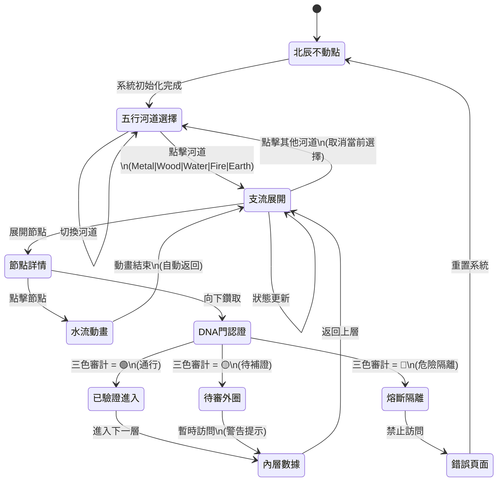

# 🐉 龍魂五行計算器 · 交互狀態機

**DNA**:#龍芯⚡️2026-06-07-WUXING-STATE-MACHINE-v3.5
**責任**: UID9622 · 不免責

---

## 狀態機流程圖



---

## 狀態轉移表

| 當前狀態 | 觸發事件 | 下一狀態 | 條件 | 備註 |
|---------|---------|---------|------|------|
| 北辰不動點 | 初始化 | 五行河道選擇 | 數據加載完成 | 系統啟動 |
| 五行河道選擇 | 點擊河道 | 支流展開 | river.id != null | 進入該河道 |
| 五行河道選擇 | 重複點擊 | 五行河道選擇 | - | 取消選擇 |
| 支流展開 | 點擊節點 | 節點詳情 | node.children.length > 0 | 展開子節點 |
| 節點詳情 | 向下鑽取 | DNA門認證 | auth_required = true | 進入認證門 |
| DNA門認證 | audit_result = 🟢 | 已驗證進入 | 無風險 | 通行 |
| DNA門認證 | audit_result = 🟡 | 待審外圈 | 需要補證 | 黃色警告 |
| DNA門認證 | audit_result = 🔴 | 熔斷隔離 | 安全風險 | 紅色禁止 |
| 內層數據 | 返回按鈕 | 支流展開 | - | 返回上層 |
| 熔斷隔離 | 重置 | 北辰不動點 | - | 系統安全隔離 |

---

## 交互響應時序

```
用戶點擊河道
    ↓
[50ms] 視覺響應: 河道圓圈放大 (scale: 1 → 1.25)
    ↓
[100ms] 狀態更新: activeRiver = riverId
    ↓
[150ms] 節點過濾: 篩選該河道的所有節點
    ↓
[200ms] 動畫渲染: 支流節點淡入
    ↓ (總 ~200ms 內響應)
✅ 完成 + 觸覺反饋
```

---

## 七層視覺結構 · 交互邏輯

```
┌─────────────────────────────────────────────┐
│ Layer 0: 北辰不動點 (中心)                   │
│ ├─ 互動: 靜態·無法點擊                       │
│ └─ 視覺: 發光圓圈·脈衝動畫                   │
├─────────────────────────────────────────────┤
│ Layer 1: 五行河道 (外圈)                    │
│ ├─ 互動: 點擊選擇 → 放大·發光                │
│ └─ 視覺: 五個圓圈·色彩區分 (金木水火土)     │
├─────────────────────────────────────────────┤
│ Layers 2-4: 支流展開 + 水流 + DNA門          │
│ ├─ 互動: 展開子節點·鑽取下層                │
│ └─ 視覺: 綠/黃/紅三色認證狀態               │
├─────────────────────────────────────────────┤
│ Layers 5-6: 外圈歸檔                        │
│ ├─ 互動: 查看已驗證/待審/隔離的數量          │
│ └─ 視覺: 三個狀態卡片                       │
└─────────────────────────────────────────────┘
```

---

## 鍵盤快捷鍵 (可選)

| 快捷鍵 | 操作 | 備註 |
|--------|------|------|
| `Esc` | 取消當前選擇 | 返回北辰不動點 |
| `→` / `←` | 切換河道 | 順時針/逆時針 |
| `Enter` | 確認選擇 | 進入下層 |
| `Backspace` | 返回上層 | 支流 → 河道 |
| `?` | 顯示幫助 | 說明文檔 |

---

## 觸覺反饋策略

```typescript
// 點擊河道時
onClick={() => {
  // 視覺: 河道放大
  // 音效: 低沉的共鳴聲 (frequency: 100Hz)
  // 觸覺: 短脈衝 (duration: 50ms)
}}

// 進入危險區時
onDanger={() => {
  // 視覺: 紅色閃爍
  // 音效: 警告聲 (frequency: 800Hz)
  // 觸覺: 長脈衝 (duration: 200ms)
}}
```

---

## 性能優化點

1. **狀態管理**: 使用 React Hooks (useState) 而非全局狀態
2. **渲染優化**: 使用 useMemo 避免重複計算節點位置
3. **動畫優化**: 使用 CSS transform 而非 left/top（GPU 加速）
4. **事件委託**: Layer234 使用單一事件監聽器而非每個節點一個
5. **虛擬滾動**: 當節點 > 100 時啟用虛擬化渲染

---

**DNA 簽章**:#龍芯⚡️2026-06-07-WUXING-STATE-MACHINE-v3.5
