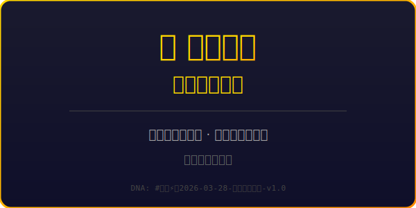
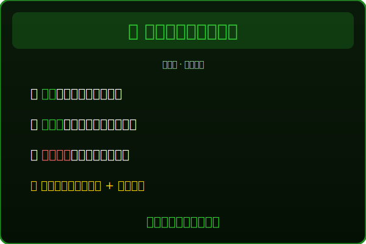
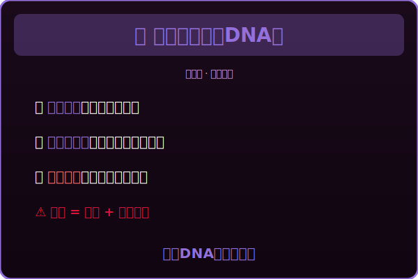
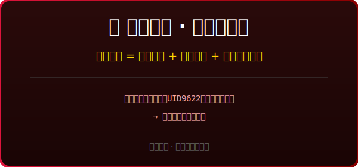

# 🛠️ 龍魂系統 · 运行指令大全

> 所有代码、命令、脚本，一个文件找全  
> DNA: #龍芯⚡️2026-03-28-运行指令大全-v1.0

---

## 📁 目录

1. [图片格式转换](#1-图片格式转换)
2. [SVG小卡片生成预览](#2-svg小卡片生成预览)
3. [星辰记忆备份](#3-星辰记忆备份)
4. [Git操作（一仓策略）](#4-git操作一仓策略)
5. [文件加密（age）](#5-文件加密age)
6. [DNA追溯码生成](#6-dna追溯码生成)
7. [日常维护脚本](#7-日常维护脚本)

---

## 1. 图片格式转换

### SVG → PNG（桌面壁纸用）
```bash
# 方法1：用ImageMagick（已安装）
convert -background none -density 300 龍魂安全符_双层架构.svg 安全贴.png

# 方法2：用rsvg-convert（更清晰）
rsvg-convert -w 1920 -h 1080 龍魂安全贴_桌面版_1920x1080.svg > 桌面壁纸.png

# 方法3：用Inkscape（矢量保真）
inkscape 龍魂安全符_双层架构.svg --export-png=安全贴.png --export-width=1920
```

### SVG → PDF（打印店用）
```bash
# Inkscape转换
inkscape 龍魂安全符_双层架构.svg --export-pdf=安全贴_打印版.pdf

# 或者用rsvg-convert
rsvg-convert -f pdf 龍魂安全符_双层架构.svg > 安全贴.pdf
```

### 批量转换所有小卡片
```bash
#!/bin/bash
# 保存为: convert_all.sh
# 用法: bash convert_all.sh

echo "🎨 开始批量转换小卡片..."

for svg in 小卡片_*.svg; do
    if [ -f "$svg" ]; then
        filename=$(basename "$svg" .svg)
        echo "转换: $svg → ${filename}.png"
        rsvg-convert -w 1200 "$svg" > "${filename}.png"
    fi
done

echo "✅ 完成！"
echo "📁 生成的文件："
ls -lh 小卡片_*.png 2>/dev/null || echo "没有生成PNG文件"
```

### 设置Mac桌面壁纸（命令行）
```bash
# 设置桌面壁纸
osascript -e 'tell application "Finder" to set desktop picture to POSIX file "/Users/zuimeidedeyihan/星辰记忆助手_CNSH龙魂系统/桌面壁纸.png"'

# 或者设置SVG（如果系统支持）
osascript -e 'tell application "Finder" to set desktop picture to POSIX file "/Users/zuimeidedeyihan/星辰记忆助手_CNSH龙魂系统/龍魂安全贴_桌面版_1920x1080.svg"'
```

---

## 2. SVG小卡片生成预览

### 浏览器预览所有卡片
```bash
# 用Python启动简单HTTP服务器
cd /Users/zuimeidedeyihan/星辰记忆助手_CNSH龙魂系统
python3 -m http.server 8000

# 然后在浏览器打开
open http://localhost:8000
```

### 合并所有卡片为一个HTML画廊
```bash
# 创建快速预览HTML
cat > 卡片画廊.html << 'EOF'
<!DOCTYPE html>
<html>
<head>
    <meta charset="UTF-8">
    <title>龍魂安全贴 · 卡片画廊</title>
    <style>
        body { background: #0a0a1a; color: #fff; font-family: sans-serif; padding: 20px; }
        .card { margin: 20px 0; border: 1px solid #333; border-radius: 10px; overflow: hidden; }
        .card img { width: 100%; height: auto; }
        .label { padding: 10px; background: #1a1a2e; }
    </style>
</head>
<body>
    <h1>🐉 龍魂安全贴 · 五卡连珠</h1>
    <div class="card"><div class="label">卡片1：标题卡</div></div>
    <div class="card"><div class="label">卡片2：公开层</div></div>
    <div class="card"><div class="label">卡片3：DNA层</div></div>
    <div class="card"><div class="label">卡片4：熔断机制</div></div>
    <div class="card"><div class="label">卡片5：道德经</div></div>
</body>
</html>
EOF

# 打开预览
open 卡片画廊.html
```

---

## 3. 星辰记忆备份

### 手动备份整个星辰记忆
```bash
#!/bin/bash
# 保存为: backup_star_memory.sh

BACKUP_DIR="$HOME/星辰记忆备份"
DATE=$(date +%Y%m%d_%H%M%S)
BACKUP_NAME="star_memory_backup_${DATE}"

echo "🌟 开始备份星辰记忆..."

# 创建备份目录
mkdir -p "$BACKUP_DIR"

# 压缩备份
cd "$HOME"
zip -r "$BACKUP_DIR/${BACKUP_NAME}.zip" "星辰记忆助手_CNSH龙魂系统/"

# 同时创建tar备份（保留权限）
tar -czf "$BACKUP_DIR/${BACKUP_NAME}.tar.gz" "星辰记忆助手_CNSH龙魂系统/"

# 保留最近10个备份，删除旧的
cd "$BACKUP_DIR"
ls -t star_memory_backup_*.zip | tail -n +11 | xargs -r rm
ls -t star_memory_backup_*.tar.gz | tail -n +11 | xargs -r rm

echo "✅ 备份完成: $BACKUP_DIR/${BACKUP_NAME}.zip"
echo "📊 备份列表："
ls -lh "$BACKUP_DIR"
```

### 自动备份（加到crontab）
```bash
# 编辑crontab
crontab -e

# 添加每天凌晨3点自动备份
0 3 * * * /bin/bash /Users/zuimeidedeyihan/星辰记忆助手_CNSH龙魂系统/backup_star_memory.sh >> /tmp/star_memory_backup.log 2>&1
```

---

## 4. Git操作（一仓策略）

### 一仓策略核心原则
```bash
# 唯一主仓
git remote add origin git@github.com:UID9622/CNSH-Editor.git

# 祖国备份
git remote add gitee git@gitee.com:uid9622/CNSH-Editor.git

# 查看所有远程
git remote -v
```

### 日常提交流程
```bash
#!/bin/bash
# 保存为: git_push_dual.sh
# 双仓同步推送

echo "🐉 龍魂一仓策略 · 双仓同步"
echo "============================"

# 检查是否有变更
if [ -z "$(git status --porcelain)" ]; then
    echo "⚠️ 没有要提交的变更"
    exit 0
fi

# 添加所有变更
git add -A

# 提交（使用标准格式）
read -p "输入提交信息: " msg
if [ -z "$msg" ]; then
    msg="📝 星辰记忆更新 | $(date +%Y-%m-%d)"
fi

git commit -m "$msg"

# 推送到GitHub（主仓）
echo "📤 推送到 GitHub..."
git push origin main || git push origin master

# 推送到Gitee（祖国备份）
echo "📤 推送到 Gitee..."
git push gitee main || git push gitee master

echo "✅ 双仓同步完成！"
echo "🔗 GitHub: https://github.com/UID9622/CNSH-Editor"
echo "🔗 Gitee: https://gitee.com/uid9622/CNSH-Editor"
```

### 带DNA追溯码的提交
```bash
# 快速生成DNA追溯码
DNA="#龍芯⚡️$(date +%Y-%m-%d)-$(git rev-parse --short HEAD)-$(date +%s | tail -c 5)"

git add -A
git commit -m "📝 星辰记忆更新 | DNA: ${DNA} | UID9622"
git push origin main
git push gitee main

echo "🧬 本次DNA: ${DNA}"
```

---

## 5. 文件加密（age）

### 安装age
```bash
# Mac
brew install age

# 或者下载二进制
curl -LO https://github.com/FiloSottile/age/releases/download/v1.1.1/age-v1.1.1-darwin-amd64.tar.gz
tar -xzf age-v1.1.1-darwin-amd64.tar.gz
sudo mv age/age /usr/local/bin/
sudo mv age/age-keygen /usr/local/bin/
```

### 生成密钥对
```bash
# 生成密钥
age-keygen -o ~/龍魂密钥.txt

# 查看公钥（可以公开）
cat ~/龍魂密钥.txt | grep "public key"
```

### 加密文件
```bash
# 加密单个文件
age -r $(cat ~/龍魂密钥.txt | grep "public key" | cut -d: -f2 | tr -d ' ') \
    -o 星辰主記憶庫.json.age \
    星辰主記憶庫.json

# 加密整个目录
tar -czf - 星辰记忆助手_CNSH龙魂系统/ | \
    age -r $(cat ~/龍魂密钥.txt | grep "public key" | cut -d: -f2 | tr -d ' ') \
    -o 星辰记忆备份.tar.gz.age
```

### 解密文件
```bash
# 解密文件
age -d -i ~/龍魂密钥.txt -o 星辰主記憶庫.json 星辰主記憶庫.json.age

# 解密并解压目录
age -d -i ~/龍魂密钥.txt 星辰记忆备份.tar.gz.age | tar -xzf -
```

---

## 6. DNA追溯码生成

### 标准DNA格式生成器
```python
#!/usr/bin/env python3
# 保存为: dna_generator.py

import hashlib
import time
from datetime import datetime

def generate_dna(module, version="v1.0"):
    """生成标准DNA追溯码"""
    timestamp = int(time.time())
    date_str = datetime.now().strftime("%Y-%m-%d")
    
    # 核心组件
    dna = f"#龍芯⚡️{date_str}-{module}-{version}"
    
    # 生成确认码
    confirm_seed = f"UID9622{timestamp}{module}"
    confirm_hash = hashlib.sha256(confirm_seed.encode()).hexdigest()[:8].upper()
    confirm_code = f"#CONFIRM🌌9622-ONLY-ONCE🧬{confirm_hash[:4]}-{confirm_hash[4:8]}"
    
    return {
        "dna": dna,
        "confirm_code": confirm_code,
        "timestamp": timestamp,
        "creator": "UID9622",
        "gpg": "A2D0092CEE2E5BA87035600924C3704A8CC26D5F"
    }

# 使用示例
if __name__ == "__main__":
    result = generate_dna("星辰記憶更新", "v1.1")
    print(f"DNA追溯碼: {result['dna']}")
    print(f"確認碼: {result['confirm_code']}")
    print(f"創建者: {result['creator']}")
    print(f"GPG: {result['gpg']}")
```

### 运行
```bash
cd /Users/zuimeidedeyihan/星辰记忆助手_CNSH龙魂系统
python3 dna_generator.py
```

---

## 7. 日常维护脚本

### 星辰记忆状态检查
```bash
#!/bin/bash
# 保存为: check_status.sh

echo "🌟 星辰记忆状态检查"
echo "==================="
echo ""

# 检查文件完整性
echo "📁 核心文件检查："
files=(
    "README.md"
    "星辰主記憶庫.json"
    "星辰配置.json"
    "時間軸記憶.json"
)

for file in "${files[@]}"; do
    if [ -f "$file" ]; then
        size=$(ls -lh "$file" | awk '{print $5}')
        echo "  ✅ $file ($size)"
    else
        echo "  ❌ $file 缺失！"
    fi
done

echo ""
echo "📊 目录统计："
echo "  总文件数: $(find . -type f | wc -l)"
echo "  总大小: $(du -sh . | awk '{print $1}')"

echo ""
echo "📝 最近修改的文件："
ls -lt | head -6 | tail -5

echo ""
echo "🧬 DNA追溯码统计："
grep -r "#龍芯⚡️" . --include="*.json" --include="*.md" 2>/dev/null | wc -l | xargs echo "  文件中使用次数:"

echo ""
echo "✅ 检查完成"
```

### 一键运行所有检查
```bash
# 给所有脚本执行权限
chmod +x *.sh

# 运行状态检查
bash check_status.sh

# 运行备份
bash backup_star_memory.sh
```

---

## 📋 快捷命令汇总

| 需求 | 命令 |
|------|------|
| 备份星辰记忆 | `bash backup_star_memory.sh` |
| 双仓推送 | `bash git_push_dual.sh` |
| 生成DNA | `python3 dna_generator.py` |
| SVG转PNG | `rsvg-convert -w 1920 file.svg > file.png` |
| 设置壁纸 | `osascript -e 'tell app "Finder" to set desktop picture to POSIX file "/path/to/file"'` |
| 检查状态 | `bash check_status.sh` |
| 加密文件 | `age -r [公钥] -o file.age file` |
| 解密文件 | `age -d -i [密钥文件] -o file file.age` |

---

## 🧬 DNA追溯

- **本文档DNA**: `#龍芯⚡️2026-03-28-运行指令大全-v1.0`
- **确认码**: `#CONFIRM🌌9622-ONLY-ONCE🧬CMDS-7777`
- **创建者**: 💎 龍芯北辰｜UID9622
- **GPG**: `A2D0092CEE2E5BA87035600924C3704A8CC26D5F`
